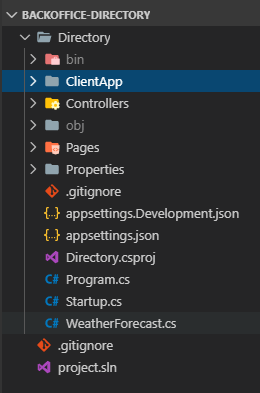
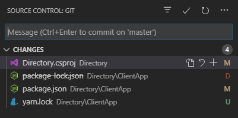

.NET Core 3.0 is out and it's chock full of new features to get your application off the ground faster. I'm working on a greenfield application for managing a small church that:

* Tracks community members and the mailing list
* Handles weekly checklists and tasks
* Links up with the accounting software to track donations
* Handles simple expense reporting for reimbursements
* And ... that's it for now (gotta start somewhere!)

As I work through these, I'll talk through the development process, the settings, take screen shots and point out any salient code snippets. I'm using this as my vehicle for learning more of the new ins and outs of .NET Core 3.0 and React 16.8+, along with demonstrating ways to manage infrastructure as code and deploy everything in Azure. All the code will be kept open (forcing me to make sure I don't commit anything dumb like passwords or my credit card number).

<!--truncate-->

## Getting Started

I've already got a development environment up and running, so I won't go into the gory details there. Make sure you've got the following:

* [.NET Core 3.0 SDK](https://dotnet.microsoft.com/download/dotnet-core/3.0)
* [Visual Studio Code](https://code.visualstudio.com/)
* [Git](https://git-scm.com/)
* [Node JS (LTS) (currently 12.x)](https://nodejs.org/en/about/releases/) (include `npm`)
* [PowerShell Core 6.x](https://github.com/PowerShell/PowerShell)

My intention is to host this on an [Azure AppService](https://azure.microsoft.com/en-us/services/app-service/) for starters. I'll go through more of the cost analysis later, but this will help me get things moving the most quickly while we build up features and decide on what direction to go.

First, I'm going to work on the community member tracking (more or less a simple people directory), in this article, I'll go through the initial solution setup and get it building and running locally.

From the command line, setup your initial solution structure:

```powershell
mkdir backoffice-directory
cd backoffice-directory
dotnet new sln -n project
git init
dotnet new gitignore
```

You'll have a shiny little empty solution folder and git repo.

```powershell
dotnet new react --help
```

This will give you some hints as to what levers you can mess with when creating the project.

```
ASP.NET Core with React.js (C#)
Author: Microsoft
Options:
  -au|--auth                 The type of authentication to use
                                 None          - No authentication
                                 Individual    - Individual authentication
                             Default: None

  --exclude-launch-settings  Whether to exclude launchSettings.json from the generated template.
                             bool - Optional
                             Default: false / (*) true

  --no-restore               If specified, skips the automatic restore of the project on create.
                             bool - Optional
                             Default: false / (*) true

  --no-https                 Whether to turn off HTTPS. This option only applies if Individual, IndividualB2C, SingleOrg, or MultiOrg aren't used for --auth.
                             bool - Optional
                             Default: false / (*) true

  -uld|--use-local-db        Whether to use LocalDB instead of SQLite. This option only applies if --auth Individual or --auth IndividualB2C is specified.
                             bool - Optional
                             Default: false / (*) true

  -f|--framework             The target framework for the project.
                                 netcoreapp3.0    - Target netcoreapp3.0
                                 netcoreapp2.2    - Target netcoreapp2.2
                             Default: netcoreapp3.0
```

We want to create a .NET Core application with React, but we'll dump authentication onto the Azure App Service for now. It already supports multiple social login providers as well as allowing login with our Azure Active Directory domain accounts.

```powershell
dotnet new react -n Directory
```

It will do some work, restore the NuGet packages it needs, then exit. Next, add this to the solution file and build everything (this will take a bit for NPM to download the Internet):

```powershell
dotnet sln add Directory
dotnet build
dotnet run -p Directory
```

Your new application is now running. Navigate to https://localhost:5001/ to see what's going on. Two things to note:

1. The console will tell you about a server on port 51866, this is the port the frontend is listening on. For the "Fetch Data" screen to work properly, you'll need to use port 5000 or port 5001 instead.
2. Because the certificate is self signed, you will get a nastygram from your browser telling you that you are kicking puppies. Just click through anything that looks like "trust me, I'm a developer". (Don't do this if you're visiting an important site like your bank or email, then you'll be in a world of hurt).

Press CTRL+C to stop running the app.

## Let's Look at the Code

If you allowed Visual Studio Code to add itself to the path during install time, you can do this:

```powershell
code .
```

Otherwise, you'll have to do some clicking and open up the folder in Visual Studio Code.

When you first launch, if you don't have any extensions installed, head over to the left side and pick up a few of the recommended ones. You'll need these are minimum:

* [C#](https://marketplace.visualstudio.com/items?itemName=ms-vscode.csharp)
* [Debugger for Chrome](https://marketplace.visualstudio.com/items?itemName=msjsdiag.debugger-for-chrome) or [Debugger for Firefox](https://marketplace.visualstudio.com/items?itemName=firefox-devtools.vscode-firefox-debug) (why not both?)

We'll add a few more as we go through these posts.

This is a good starting point, so stage all the file and do a git commit in your favorite method. It should be around 32 files. If you're seeing a ton more, then you may have missed creating the top level `.gitignore` file step above.



The project folder at the root is the C# part of the site while the `ClientApp` directory is the React part of the site. When the project is compiled using `dotnet build`, it will build both parts and run them together by chaining to the `npm` tool.

We have a problem here, the React project structure is a bit old and doesn't follow the latest `create-react-app` template. I want to start clean (since this is a green field application) and also use `yarn` instad of `npm` because it tends to run faster. From your solution folder, run these commands:

```powershell
npm install -g create-react-app yarn
create-react-app new-clientapp
```

Now, we're going to do some surgery.

1. Delete the `Directory/ClientApp/node_modules` folder (hold SHIFT before you right click on the folder to allow you to delete bypassing the recycle bin or trash can)
2. Delete the `new-clientapp/node_modules` folder
3. Copy `new-clientapp/package.json` and `new-clientapp/yarn.lock`  files into the `Directory/ClientApp` folder (overwriting `package.json`)
4. Delete `Directory/ClientApp/package-lock.json`
5. Delete the entire `new-clientapp` directory (we don't need it anymore)

The end effect is that we got a new `package.json` and `yarn.lock` that will be used to build the new project structure.

```powershell
cd Directory/ClientApp
yarn install
yarn add bootstrap reactstrap react-router-dom react-router-bootstrap
```

This should get your application back to where it needs to be. Make one last edit to `package.json` and change the `"name"` value from `"new-clientapp"` to `"directory"`, and save your changes.

Next, we'll need to edit the `.csproj` file to use `yarn` instead of `npm` to run everything. Open the `Directory.csproj` file, and find the two lines that reference `npm` and change `npm` to `yarn`. Save your changes, and jump back to a terminal.

```powershell
cd ../..
# you should be back in the solution root now
dotnet build
dotnet run -p Directory
```

The application will build and run and you can access it on https://localhost:5001/ again and verify that everything still runs and looks sensible.

COMMIT!



In the end, only a few things got truly changed. The rest remained the same for now.

If you want to see the result, here it is:  https://github.com/garoyeri/bonmon-backoffice-directory/tree/blog/00-getting-started. As more is added, then `master` will get upgraded, but at least this branch will remain constant as a reminder.

## Today I Learned

.NET Core 3.0 has a nice default template for React, but still needs some tender loving upgrade care before we start really using it.

.NET Core's build system (`msbuild`) lets you chain to a JavaScript build system (`npm `or `yarn`) to pull everything together and run it from one place.

Visual Studio Code is nice and lightweight, but I need to learn some more keyboard shortcuts to boost my productivity even further.