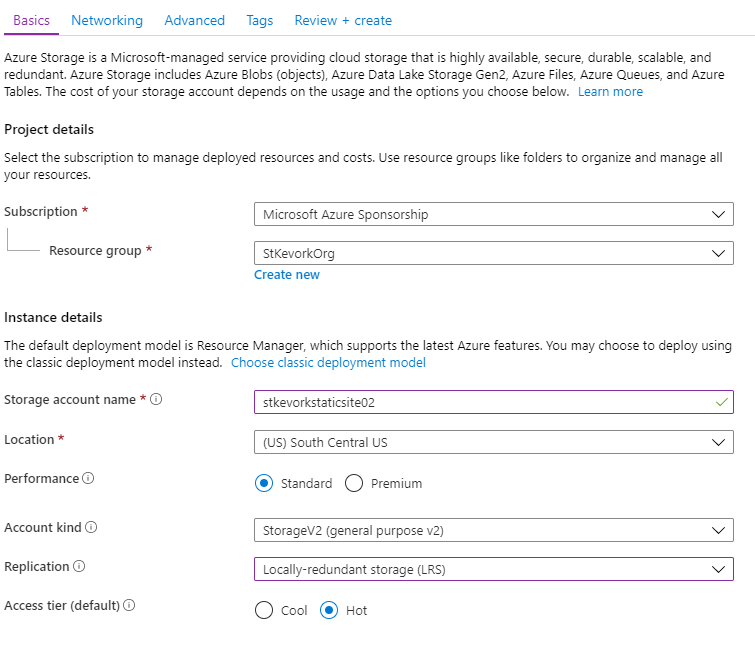
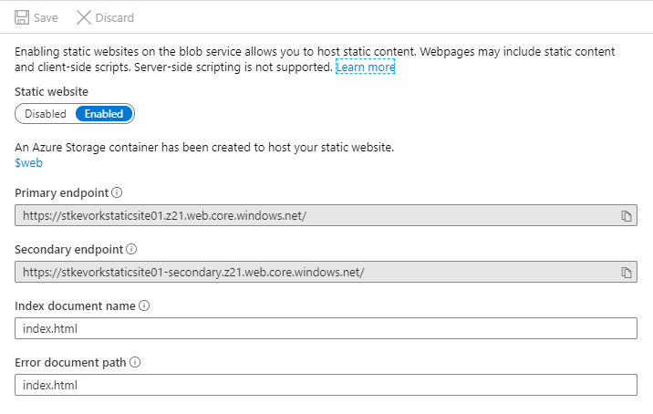
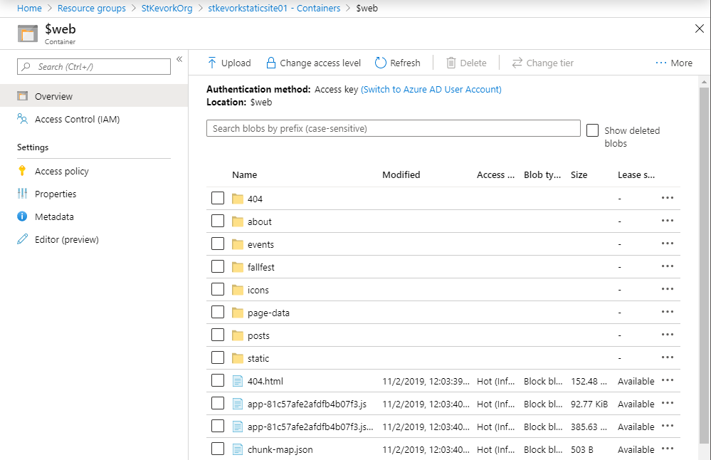
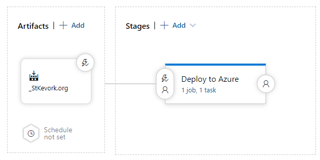
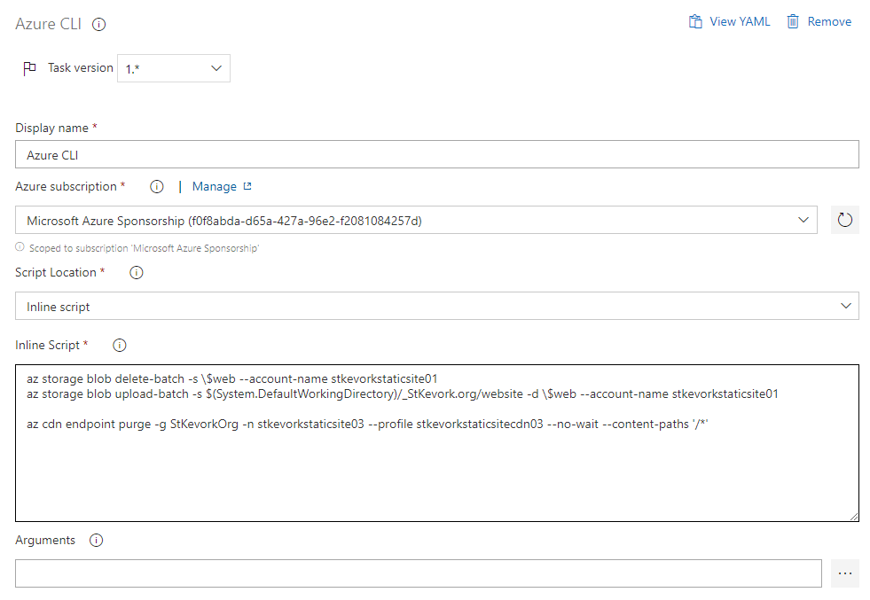
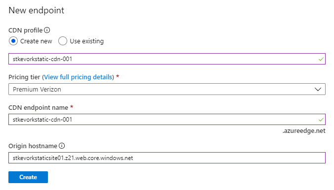

I've been super excited lately about building JAM stack sites using [GatsbyJS](https://gatsbyjs.org), and I recently setup a way for our church website to be updated from Facebook, Office 365 calendar, and static content automatically, hosting them on Azure simply.

<!--truncate-->

## Background

I am the primary IT support for St. Kevork Armenian Church in Houston, TX. As a non-profit, we apply for grants from Microsoft for Office 365 E1 and Microsoft Azure credits. Our church website https://stkevork.org used to run on [WordPress](https://wordpress.org) on a shared [DreamHost](https://www.dreamhost.com/) account.  While a "free" solution (for non-profits), it was far from reliable and was a potential single point of failure. Also, the performance wasn't great and as WordPress was upgraded and new plugins were added, we more frequently ran into memory issues. Further, I had to be sure to upgrade the plugins and ensure WordPress was kept up to date to avoid any security concerns. DreamHost is a great company for hosting and their customer service is very responsive and helpful. I still use them as a personal account for domain name purchases and some simpler static hosting.

## Architecture

Here's an overview of the architecture (spoiler: it's pretty simple):


The code is hosted on an Azure Repo (it's private right now because I was lazy and ended up statically storing some credentials for Facebook that I definitely shouldn't). But when I make some adjustments, I'll move it to public hosting on GitHub.

## Storage Account

The runtime architecture relies on [Azure Storage](https://azure.microsoft.com/en-us/services/storage/), keeping the files in a Blob Container in a Storage Account.



When adjusting these settings, keep in mind that you won't be hitting the storage account directly. Instead, you'll be hosting the data in the CDN and infrequently hitting the storage account.

- For "Performance", selecting "Standard" is good enough (the CDN just has to read through the files once).
- For "Account kind", always pick "StorageV2" (until V3 comes out, then pick that).
- For "Access tier (default)", select "Hot" (you'll be doing more reads than writes).
- Accept the rest of the defaults and create the account. Remember that the public needs to read the data from the account.

The Storage Account has an option called "Static website" that you need to turn on:



It will create a container called `$web` for your site files to be stored, and will setup two endpoints. Gatsby JS projects are [React]( https://reactjs.org/)-based and so you need to define the Index and Error document paths to be `index.html` which will allow the client-side routing to behave.



Once your data is uploaded, it will look like the above screenshot.

While the endpoints are HTTPS and I could host the site on those safely, I can't redirect a custom domain to these properly (it's the same issue with AWS S3 buckets and static sites). We'll talk about that soon, don't you worry.

## Azure DevOps

I use Azure DevOps to host source code and run my build and release pipelines for the site. Whenever I commit changes to the source repository, or when my daily schedule triggers, the build pipeline will pull down the latest source code changes, download the remote content, rebuild the static site, and publish it as a pipeline artifact.

Whenever the build pipeline is done, it will trigger a release which will run my release pipeline. The release pipeline will push the build artifact data into the Azure Storage Account Blog Container `$web`, then tell the Azure CDN endpoint to purge its cache to reload data from the newly created site.

The build pipeline uses `azure-pipelines.yml` to keep the build logic alongside the code.

```yml
# Trigger whenever the master branch changes
# Note: I also setup a schedule trigger so the site automatically updates daily
trigger:
- master

pool:
  vmImage: 'ubuntu-latest'

steps:
- task: Npm@1
  displayName: Install NPM Modules
  inputs:
    command: 'install'

- task: Npm@1
  displayName: Build Website
  inputs:
    command: 'custom'
    customCommand: 'run build'

- task: PublishBuildArtifacts@1
  displayName: Publish Build Artifacts
  inputs:
    PathtoPublish: 'public'
    ArtifactName: 'website'
    publishLocation: 'Container'
```

This pipeline does three things:

1. Download the internet into `node_modules`
2. Run the Gatsby Build tool which compiles the static site into the `public` folder
3. Copy the static site files into an artifact called `website` and publish it so we can use it later

In general, it is a best practice to split up your build and release pipelines where the "build" part of the pipeline is responsible for compiling and testing the code, ultimately outputting build artifacts. The "release" part of the pipeline then deploys these artifacts into various destinations. This allows you to setup multiple target environments that can be optionally deployed to.

The release pipeline here only has one destination area (there is only PROD):



In the "Deploy to Azure" stage, there is only one simple task:



Here, I've setup my Azure subscription so it will use my credentials when running the Azure CLI tasks. And instead of setting up multiple separate tasks, I just explicitly call the lines of the script I need:

```cmd
> az storage blob delete-batch -s \$web --account-name stkevorkstaticsite01
> az storage blob upload-batch -s $(System.DefaultWorkingDirectory)/_StKevork.org/website -d \$web --account-name stkevorkstaticsite01

> az cdn endpoint purge -g StKevorkOrg -n stkevorkstaticsite03 --profile stkevorkstaticsitecdn03 --no-wait --content-paths '/*'
```

The first line will delete all the files in the destination.

The second line will upload the new files to the destination.

The third line will trigger the CDN endpoint to purge its cache and refetch everything from storage. The Azure CDN cache entries have a TTL set for 1 hour typically. However, when I reset everything like this, there's a change that a client will access the site and pull partly old data and partly new data. The static site may not like that and might end up showing a weird combination of old and new content. To be safe, I go ahead and burn everything and force a refetch.

## A Note About Caching

Purging your CDN on every build is not a good idea if you're doing a blog site where only the new content changes. It will defeat the entire purpose of doing a CDN and will result in cache misses for all the old content on your site. Purging your cache in that case is only helpful if you make a big structural change that would benefit from a full reset.

The [St. Kevork Armenian Church](https://stkevork.org) site has a "Community News" page that is generated from Facebook posts, and an "Events Calendar" page that is generated from an Office 365 calendar. I found that when I don't purge the cache, there are some weird transitionary points where the client gets (and caches) old data for an hour. When I rebuild the site, I intend for the content to be available immediately don't want to run the risk of someone seeing a "weird" page and complaining.

## Setting up the CDN

The Azure Storage account is super straight forward to setup, the CDN ... not so much. Azure has several CDN options and it is not entirely obvious which you should take. If you plan on attaching a custom domain with SSL support to a CDN, then you will require the "Premium" CDN option. Look at the table comparing [Azure CDN Features](https://docs.microsoft.com/en-us/azure/cdn/cdn-features). You'll find that the "Standard" options seem to do everything you need, except for one crucial thing: the "[rules engine](https://docs.microsoft.com/en-us/azure/cdn/cdn-verizon-premium-rules-engine)". The rules engine allows you to modify the headers, perform CDN-side redirects, and enforce HTTPS for your site.

To setup the CDN, first you access your storage account in the Azure Portal.

Click on "Static website" and copy the "Primary endpoint" URL, you'll need this later.

Click on "Azure CDN" and enter the details for the CDN:



For the "CDN profile", select "Create new" and enter a name for your CDN Profile.

For the "Pricing tier", select "Premium Verizon".

For the "CDN endpoint name", enter a name for your CDN Endpoint (this will become the URL on ``*.azureedge.net`).

For the "Origin hostname", the text will reference the blob storage. Instead, paste the URL from the "Static website" page you copied before, and get rid of the `https://` and the trailing `/`. This will force the CDN to use the web link to mirror the content rather than trying to access the blob storage directly. I ran into a lot of error messages when I didn't do it this way, and I don't want to wish that bad juju on any of you.

Click "Create" for great justice, then go take a walk, grab a coffee, check your email. It claims to take 10 minutes to propagate the settings and it is absolutely correct.  There's nothing useful you can do in the meantime while you wait for the CDN to do its thing. When the help desk usually tells you it takes 10 minutes and you should call back if it doesn't work, you're getting brushed off. In the case of Azure CDN, the advertising is true, and you will not anything useful for 10 minutes.

## 10 Minutes Later

An eternity later, your site should be up and running on both URLS:

The URL from the Azure Storage Static Website:  https://stkevorkstaticsite01.z21.web.core.windows.net/

The URL from the Azure CDN Endpoint: https://stkevorkstaticsite03.azureedge.net/

Make sure both URLs work. If something went horribly wrong, wait 10 minutes (I am serious here). And try again. Call me back if you have any problems.

If the Static Website link fails, everything is bad and nothing else will work. You most likely either didn't upload your code into the `$web` container or your storage account isn't setup properly.

If the CDN Endpoint link fails, then you most likely didn't setup the origin properly. Make sure the origin hostname is the Static Website link hostname.

## Custom Domain and HTTPS Redirection

Setting up the custom domain is straightforward, you can follow the on-screen instructions, make the necessary changes in your DNS, and it will "do the right thing". There are instructions here: [Tutorial: Add a custom domain to your Azure CDN endpoint](https://docs.microsoft.com/en-us/azure/cdn/cdn-map-content-to-custom-domain).

Pay special attention to the section entitled "Map the temporary cdnverify subdomain". This will save you a ton of headache if you're migrating an existing site into the CDN. You can setup "cdnverify" prefixed subdomains to at least move forward on generating the certificates and verifications until you're ready to migrate the DNS records to point to Azure CDN.

The Premium Verizon Rules Engine also has some documentation: [Override HTTP behavior using the Azure CDN from Verizon Premium rules engine](https://docs.microsoft.com/en-us/azure/cdn/cdn-verizon-premium-rules-engine). It's not *great* but it will at least show you the basics. These rules also take 10 minutes to propagate so you won't be able to test things out easily.

## Today I Learned

Azure Storage Accounts + Azure CDN can get you a super flexible static site deployment on top of your existing Azure investment.

When using a CDN, purging the whole thing on every build of the site is an "it depends" moment that you need to put some thought into.

If you want the static website to work properly, make sure you actually deploy all the content into the `$web` container and not somewhere else.

When the IT person tells you to wait 10 minutes and try again, call them a dirty liar to their face (unless they are configuring your Azure CDN, then they are telling the truth).