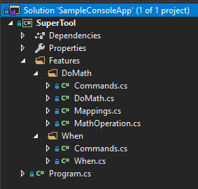

When I first started using .NET Core, all the examples online for applications were for web applications using ASP.NET Core. However, I wanted to start simpler and build a simple command line tool. This required a LOT of trial and error in manually setting up configuration, logging, dependency injection, and tearing everything down appropriately so that all the logging output would properly get flushed. I kept that example around ... somewhere ... and had to refer my coworkers to it a few times over the year. Now with .NET Core 3.1 and the new [Generic Host](https://docs.microsoft.com/en-us/aspnet/core/fundamentals/host/generic-host?view=aspnetcore-3.1), we can get a simple (but fully featured) command line application built up following Vertical Slice Architecture.

<!--truncate-->

You may ask, "why a command line application?" And for those of you who didn't ask, modern software applications could need some one-off (or regular) utilities that can take advantage of being close to the original source code, but be launched in an entirely separate security context from the main web application. The [Admin Processes](https://12factor.net/admin-processes) factor of The Twelve-Factor App lays out the reasoning succinctly: having a [REPL](https://en.wikipedia.org/wiki/Read%E2%80%93eval%E2%80%93print_loop) or similar function for your application allows you to move some sensitive operations out of the way of the end users.

## What makes a useful command line application?

The most useful part of a command line application is flexibility. I want to add new commands, modes, settings, and anything else I can think of quickly without colliding with what is already in place. I worked on a migration project where we needed to transition data from one company's systems into another, performing some transformations along the way. This required access to production databases which weren't accessible due to separation of concerns. I could, however, request the production team to run a few specially crafted commands (after reviewing them of course) that would perform specific queries and produce spectacularly detailed spreadsheets that I could then use to better understand the production systems and work around strange situations that I wouldn't see in the testing environments.

I would like to say "low ceremony", but my idea of "low ceremony" can be different from yours. I don't want the command line tooling to be quick and dirty because I know that a useful tool will continue to be useful and upgraded, not thrown away (a common excuse for cutting corners). I want to follow the same patterns I'm using in the production code to avoid a context switch, but the magic of setting up command line parameters and configuring them should be "low ceremony". 

## Sample Console Application: SuperTool

I built up a shiny new console application called [SuperTool](https://github.com/garoyeri/sample-console-app-net-core-01) (the source code is up on GitHub) to demonstrate an extensible console application that can withstand the test of time and the demands of the development team.

```shell
git clone https://github.com/garoyeri/sample-console-app-net-core-01 supertool
cd supertool
dotnet build
dotnet run -p src/SuperTool -- math -l 2 -r 2 -o add
```

At this point, you should see glorious output:

```
2 Add 2 = 4
```

**MATHEMAGICAL!**

There's a lot going on under the hood and we're going to take a look at it. Here's the Solution structure:



As we do with Vertical Slice Architecture, I've added Feature Folders for each of the main functions of the console application. This helps us organize all the necessary files for each feature into a single folder and separate concerns. If a new piece of code only affects a particular feature, it belongs in that folder. However, if it affects more than one feature, it should go into a higher level folder.

We have two features: When and DoMath. At the top level, we've consolidated everything into a single Program class. All the heavy lifting is done by the libraries we've imported, particularly [CommandLineUtils](https://natemcmaster.github.io/CommandLineUtils/index.html), [Mediatr](https://github.com/jbogard/MediatR/wiki), [AutoMapper](https://automapper.org/), and [Microsoft Extensions Hosting](https://docs.microsoft.com/en-us/aspnet/core/fundamentals/host/generic-host?view=aspnetcore-3.1).

## Program.cs

Let's examine the entry code first and see how it works: [Program.cs](https://github.com/garoyeri/sample-console-app-net-core-01/blob/master/src/SuperTool/Program.cs)

```csharp
[Command(Name = "SuperTool",
         Description = "Run helpful utilities for my application")]
[HelpOption]
[VersionOptionFromMember(MemberName = "GetVersion")]
[Subcommand(
    typeof(Features.When.Commands.WhenCommand),
    typeof(Features.DoMath.Commands.DoMathCommand))
]
```

### [Command]

These attributes are all provided by CommandLineUtils to generate the actual command line parser. A `Command` represents a "command" (go figure) that has "options" and "arguments". Any class that is decorated with `[Command]` must also implement a method called `OnExecute()` or `OnExecuteAsync()`. The return type must be either `void` or `int` (`Task` or `Task<int>` in the case of the async variant), and the parameters will be injected from your dependency injection container (Microsoft Extensions Dependency Injection in this case).

### [HelpOption]

There are a number of attributes with the word "Option" in them. These all augment the command line options that a command will accept. In this case, we want the top level command to provide help using the default `-h` or `--help` options. Once you do this, subcommands will also provide help in a similar fashion.

### [VersionOptionFromMember]

This attribute provides a `--version` option that you have to override to provide a nice looking version number. In this case, we designate a method name called `GetVersion` that will return the version number.

```csharp
private string GetVersion()
{
    return typeof(Program).Assembly
        ?.GetCustomAttribute<AssemblyInformationalVersionAttribute>()
        ?.InformationalVersion;
}
```

This will look for the Informational Version of an Assembly. These don't have to follow strict `System.Version` numbering conventions and can be full [SemVer](https://semver.org/) version designations.

### [Subcommand]

This part of the library is a little grating. The `[Subcommand]` attribute is necessary to indicate which commands will be subcommands of the current command. I say this is grating because needing to know all the subcommands in the code at compile time feels ripe for convention-based optimization. However, choosing to organize in the current way allows us to reuse subcommands across commands which can be quite useful.

### Main

Main is the entry point for the application and will be executed first.

```csharp
private static async Task Main(string[] args)
{
    await CreateHostBuilder()
        .RunCommandLineApplicationAsync<Program>(args);
}

public static IHostBuilder CreateHostBuilder()
{
    return Host.CreateDefaultBuilder()
        .ConfigureServices((hostContext, services) =>
                           {
                               services
                                   .AddMediatR(typeof(Program).Assembly)
                                   .AddAutoMapper(typeof(Program).Assembly);
                           });
}
```

Here we use the `CreateHostBuilder()` method to setup a "default" builder, add Mediatr and AutoMapper, then return it. The `Main` method will then use `RunCommandLineApplicationAsync()` which is provided by CommandLineUtils to host the application.

There's a LOT going on under the covers here, so we should take a peek.

`Host.CreateDefaultBuilder()` is creating a lot of things. You may not want this, but it's useful in case you have some environment variables or secrets you need to configure, the parts are already brought in.

https://github.com/aspnet/Extensions/blob/v3.1.0/src/Hosting/Hosting/src/Host.cs#L56

* Set the `ContentRootPath` to the current directory
* Map environment variables prefixed with DOTNET_ into the Microsoft.Extensions.Configuration options
* Map appsettings.json into the Microsoft.Extensions.Configuration options
* Setup .NET Core User Secrets when the environment name is set to "Development"
* Setup defaults for logging to trace, event log, console and debug (useful in case something goes horribly wrong and you would like to see what's happening)

If you're using the default settings for your web application (spoiler: you probably are), then these settings will surprise you the least if you assume they'll be there.

https://github.com/natemcmaster/CommandLineUtils/blob/v2.4.4/src/Hosting.CommandLine/HostBuilderExtensions.cs#L32

By default, generic hosted services (and web ones) will start, then wait for a signal to stop. This doesn't make sense for console applications, so the CommandLineUtils library will override these using a `IHostLifetime` service that will run once and close the application gracefully.

The `RunCommandLineApplicationAsync()` method sets up an unhandled exception handler, configures the lifetime of the hosted service to allow for running one shot through the application, and configures some internal state services. Most of the injection is done when the command is invoked and not here at startup.

Finally, the Mediatr and AutoMapper services are configured as per their regular instructions.

### Non-Static Methods on Program.cs

The `Program` class has two non-static methods that are used when the `Program` class is instantiated (when the user doesn't pass a subcommand to the argument list).

```csharp
private int OnExecute(CommandLineApplication app, IConsole console)
{
    console.WriteLine("You must specify a command");
    app.ShowHelp();
    return 1;
}
```

This is an example execution method that is invoked by the CommandLineUtils library. Keep in mind that the method signature is injected at runtime from your container, so you can include any parameters you want that you know are available in the container.

## Mathematics Feature

The math feature provides the following parts to the application:

* Commands.DoMathCommand: specify command line options and provide an execution method for the command line utils to invoke.
* DoMath: request, response and handler following the basic Mediatr patterns to provide a message-based design. It also performs the math operations, but doesn't write to the console.
* Mappings: An AutoMapper map created that maps from the options model to the Mediatr request model. In case either side changes, the mapping adjustments can be conifgured in the Mappings class. As-is, since the property names are the same, AutoMapper can just handle all the details for us.

### DoMathCommand

```csharp
[Command("math", Description = "Perform feats of mathematics")]
public class DoMathCommand
{
    [Option("-o|--operation", CommandOptionType.SingleValue,
            Description = "Operation to perform")]
    public MathOperation Operation { get; set; }

    [Option("-l|--left", CommandOptionType.SingleValue,
            Description = "Left side operand")]
    public double Left { get; set; }

    [Option("-r|--right", CommandOptionType.SingleValue,
            Description = "Right side operand")]
    public double Right { get; set; }

    private async Task OnExecute(
        IMediator mediator, IMapper mapper, IConsole console)
    {
        var command = mapper.Map<DoMath.Request>(this);
        var response = await mediator.Send(command);
        console.WriteLine($"{Left} {Enum.GetName(typeof(MathOperation), Operation)} {Right} = {response?.Result}");
    }
}
```

The CommandLineUtils library finds this command class and processes all the attributes. It will perform validation automatically to ensure that `--left` and `--right` are proper doubles, and that `--operation` is a valid enumeration type: `add`, `subtract`, `multiply` and `divide` (as a bonus, the conversion is case-insensitive).

The `OnExecute()` method is invoked by the CommandLineUtils library if this command is executed. It makes a simple call to Mediatr to send the hydrated message. This method is responsible for actually displaying the result as well, the console interaction is its primary concern, and the Mediatr handler for mathematics should only be concerned with mathematics. This makes it possible to later test the Mediatr handler on its own without needing to setup a complex console harness.

When we execute our first example:

```
dotnet run -p src/SuperTool -- -l 2 -r 2 -o add
```

Here's what happens:

1. The default host is created
2. The command line application is created and started
3. The attributes are scraped and a CommandLineApplication is created behind the scenes.
4. Mediatr and AutoMapper gather all their handlers and profiles, respectively
5. The attributes are checked for validity and an error message is shown if needed.
6. The appropriate [Command] class is instantiated (using the container) and its OnExecuteAsync method is is examined, injected, and invoked
7. The Mediatr message is sent, the handler returns
8. The console is informed of the computational results

## Today I Learned

I actually tried using [System.CommandLine](https://github.com/dotnet/command-line-api) first, but found that it didn't have all the convention-based niceties and I would've had to implement the generic host lifetime magic myself. In the end, I really like the approach that [CommandLineUtils](https://natemcmaster.github.io/CommandLineUtils/index.html) is using, and am looking forward to further reducing how much ceremony is needed to run things.

Vertical Slice Architecture can be applied to things as simple as a command line tool. A command based tool aligns nicely with the feature folders and we can include everything related to command line options in the same folders. This helps keep all the relevant parts together and reduce the amount of trouble navigating the codebase.

I didn't get around to implementing unit tests in this sample, but I can see that it would not be different from the usual approach in testing web applications. We would create the generic host, but instead of running it, we use its service provider with our unit tests. A big area of concern though would be to create scopes in the dependency injection container for each unit test and ensure that the services are setup to work in those conditions.

You can see all the source code for this sample in GitHub: https://github.com/garoyeri/sample-console-app-net-core-01. Please reach out if you have any questions, comments, queries or concerns.

This blog post was part of [C# Advent 2019](https://crosscuttingconcerns.com/The-Third-Annual-csharp-Advent)! You can hop there to read a LOT of C# related articles from a LOT of talented people!