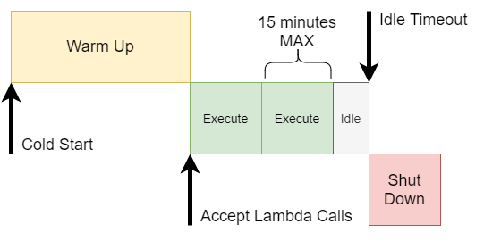
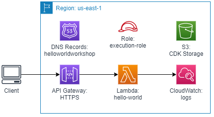
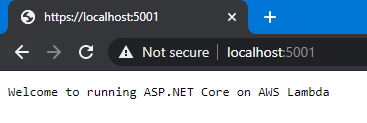

## C# Advent 2020

This article is part of the [C# Advent 2020](https://www.csadvent.christmas/), if you're interested in more articles about C# from some great authors, please go check it out! The previous year advents are also available and some alternatives too.

ASP.NET Core applications can be run serverless in AWS Lambda as-is and still be run locally or in a container.

## Introduction

Since [AWS Lambda](https://aws.amazon.com/lambda/) functions are lightweight containerized [Amazon Linux](https://aws.amazon.com/amazon-linux-ami/) runtimes that can run .NET Core 3.1, you can run a mostly regular ASP.NET Core workload on them just the same.

<!--truncate-->

A Lambda has a simple lifecycle:



* Warm Up: the startup period where the ASP.NET Core startup occurs and your services and defined and started
* Execute: a single request is executed in series for a Lambda instance, with a single scope (15 minutes max, however, an API Gateway will timeout after 30 seconds)
* Idle: if there are no executions for sometime, the Lambda will shut down

When there are multiple requests, they'll be queued for execution. If the queue gets too long, then a new instance will be spun up. If you provision reserved concurrency, then a certain number of instances will be kept warm for you to use (for a price, of course). The "Cold Start" time could take a few seconds (ASP.NET Core isn't necessarily built for startup speed). In this setup, the more traffic you get, the better it will perform. If your traffic is spotty, then some clients will hit the "Cold Start" and wait a few seconds for their initial response.

## What does this solution look like?

The simplest architecture looks like this:



To handle HTTP requests, the Lambda must sit behind an API Gateway that will route the requests and terminate the HTTPS connection.

The Lambda would execute the API requests and scale out as needed.

The S3 storage is used if you plan on deploying using CDK (optional).

The Lambda by default writes logs to CloudWatch.

## Why would I run ASP.NET Core in Lambda?

This is a valid question. Since .NET Core 3.1 and now with .NET 5, the .NET runtime and ASP.NET Core stack have made significant improvements in reducing memory usage and increasing speed. Depending on the benchmark and the target, .NET 5 outperforms some native web frameworks (of course, your mileage may vary). I tend to be more productive in C#, so I favor ASP.NET Core for my projects.

But coming back to the question, running ASP.NET Core in Lambda gives me several benefits:

1. Route matching and serialization are already solved problems that I don't need to mess with
2. I can test and debug the whole application running locally without needing any special tools
3. I'm already familiar with the library
4. I can make it only as complicated as I need: turning on CORS, authentication, different database connections

## What's the downside?

I'd love to say "there is no downside!" but I'd be lying.

The Lambda runtime only lets you execute a single request at a time, so you won't be able to take advantage of the asynchronous nature of modern web requests. However, most of your requests will end up waiting for a database transaction or other network communication, causing you to wait anyway. The tradeoff is that you can probably handle more transactions with a single high-end compute running ASP.NET Core in a container, but the Lambda approach will let you scale up and down as your application needs it rather than looking for the right metric to spin up a second or third container instance.

Any in-process caching will be wasted since most of the Lambda instances will be running in parallel in times of high load and spread across many runtimes instead of only a few.

Like I said before, if your application starts to idle, it could go completely dark, and your next client would hit a "Cold Start" and take a few seconds to warm up.

Connecting Lambda to a relational database like SQL Server, PostgreSQL or MySQL requires a Virtual Private Cloud (VPC) and a NAT Gateway which has a flat base cost around $40/month per instance. Without the NAT Gateway, the Lambda would not be able to call out to any AWS services (including CloudWatch for logging). However, if you're using DynamoDB or an AWS API-driven data store, then you won't need this.

## A Quick note on .NET 5 / .NET Core 3.1 in Lambda

As of today, AWS Lambda natively supports .NET Core 3.1 as a runtime. However, with the latest changes to the Lambda service, it supports deploying Lambda images as containers instead of just as zipped binaries. Currently, .NET 5 is supported only using the container images.

## Let's deploy the code!

There's a great sample project in the AWS Lambda tooling. But first, a few things need to be installed:

* [.NET 5 SDK](https://dotnet.microsoft.com/download/dotnet/5.0)
* [Docker for Desktop](https://www.docker.com/products/docker-desktop) (or just Docker if you're on Linux)

Install the Amazon Lambda templates:

```powershell
dotnet new -i Amazon.Lambda.Templates
```

Next, let's use one of the .NET 5 templates:

```powershell
mkdir LambdaAspNetCore5
cd LambdaAspNetCore5
dotnet new serverless.image.AspNetCoreWebAPI
```

To build and deploy the solution, you must first make sure you've got an AWS profile setup. If you've already got an AWS IAM user configured, you can setup the profile using:

```powershell
aws configure --profile my_profile
```

Then follow the prompts to enter your access key and secret key.  For the subsequent commands, I'll assume you've got a profile setup called `my_profile`, in your case, substitute your own profile instead.

We'll need to install the Amazon Lambda tools for .NET (this will install or update your version):

```powershell
dotnet tool update -g Amazon.Lambda.Tools
```

Next, let's deploy the new solution. To do this, we'll need to pick a few nice names:

1. CloudFormation Stack Name: this is a name to identify your application in CloudFormation, it just has to be unique in your account, try: `LambdaAspNetCore5`
2. S3 Bucket Name: this has to be globally unique, so when you pick a name, add some randomness to it: `lambda-aspnetcore5-yournamehere` (if the bucket doesn't exist, you'll need to create it)
3. Region: your target region (in this case, I'm using `us-east-1`, but you can pick any AWS region).

```powershell
cd src/LambdaAspNetCore5
aws s3api create-bucket --bucket lambda-aspnetcore5-yournamehere --profile my_profile --region us-east-1
dotnet lambda deploy-serverless --profile my_profile --region us-east-1 -sn LambdaAspNetCore5 -sb lambda-aspnetcore5-yournamehere
```

It will start building the Docker image and deploying the application.

> As an aside: I ran into a problem with Docker on Windows related to how it logs into ECR. This is the bug link: https://github.com/docker/docker-credential-helpers/issues/190. There is a solution here: https://github.com/docker/docker-credential-helpers/issues/190#issuecomment-729027522, but it's not a great solution. Basically, it creates an insecure credential store for your Docker credentials that doesn't have a character limit. However, the instructions for targeting AWS only didn't work for me. Your mileage may vary. If you're on Mac or Linux, this may be a non-issue, and some versions of Docker for Desktop on Windows don't have this problem.

If everything goes well, you'll get a message that everything was deployed successfully and you'll see the URL that was created to hosted your application:

```powershell
Output Name  Value
------------ --------------------------------------------------
ApiURL       https://j7d1gi0ylg.execute-api.us-east-1.amazonaws.com/Prod/
```

Open up that URL in a browser to see the example running:


If you access the API, you'll see the response too, try navigating to `/api/values`


To see what resources were deployed in your account, log into your AWS account and navigate to the Lambda service, then click "Applications": https://console.aws.amazon.com/lambda/home?region=us-east-1#/applications


When you click on the "LambdaAspNetCore5" application, you'll see a list of resources (expand the + icons to see more details):


These are all the resources deployed as part of your serverless application. Most of them are there to support the API Gateway and the permissions for the Lambda.

## What about the code?

Finally, the code! Open up the folder in Visual Studio Code (or your other favorite code editor) and let's take a quick tour of the useful bits.

The most interesting bit is the entry point where the Lambda is called. If you recall the architecture diagram above, the API Gateway calls the Lambda function, so we need to have an entry point that takes the request from the API Gateway and translates it into an ASP.NET request. This is handled by a NuGet package called: `Amazon.Lambda.AspNetCoreServer` that is part of the [Amazon Lambda .NET](https://github.com/aws/aws-lambda-dotnet) repository.

Find `src/LambdaAspNetCore5/LambdaEntryPoint.cs`, this is where the Lambda function is started. The base class is `Amazon.Lambda.AspNetCoreServer.APIGatewayProxyFunction` which handles setting up the ASP.NET Core libraries and the Web Host. Instead of hooking up Kestrel to listen for requests, it will listen for Lambda invocations and run the request pipeline.

```csharp
public class LambdaEntryPoint :

// The base class must be set to match the AWS service invoking the Lambda function. If not Amazon.Lambda.AspNetCoreServer
// will fail to convert the incoming request correctly into a valid ASP.NET Core request.
//
// API Gateway REST API                         -> Amazon.Lambda.AspNetCoreServer.APIGatewayProxyFunction
// API Gateway HTTP API payload version 1.0     -> Amazon.Lambda.AspNetCoreServer.APIGatewayProxyFunction
// API Gateway HTTP API payload version 2.0     -> Amazon.Lambda.AspNetCoreServer.APIGatewayHttpApiV2ProxyFunction
// Application Load Balancer                    -> Amazon.Lambda.AspNetCoreServer.ApplicationLoadBalancerFunction
// 
// Note: When using the AWS::Serverless::Function resource with an event type of "HttpApi" then payload version 2.0
// will be the default and you must make Amazon.Lambda.AspNetCoreServer.APIGatewayHttpApiV2ProxyFunction the base class.

Amazon.Lambda.AspNetCoreServer.APIGatewayProxyFunction
{
    /// <summary>
    /// The builder has configuration, logging and Amazon API Gateway already configured. The startup class
    /// needs to be configured in this method using the UseStartup<>() method.
    /// </summary>
    /// <param name="builder"></param>
    protected override void Init(IWebHostBuilder builder)
    {
        builder
            .UseStartup<Startup>();
    }

    /// <summary>
    /// Use this override to customize the services registered with the IHostBuilder. 
    /// 
    /// It is recommended not to call ConfigureWebHostDefaults to configure the IWebHostBuilder inside this method.
    /// Instead customize the IWebHostBuilder in the Init(IWebHostBuilder) overload.
    /// </summary>
    /// <param name="builder"></param>
    protected override void Init(IHostBuilder builder)
    {
    }
}
```

The class gives you some hints on how to use it and extend it. The startup code for ASP.NET is in the `Startup` class, exactly like a "regular" ASP.NET Core application.

Next, look at the `src/LambdaAspNetCore5/LocalEntryPoint.cs`, this is the entry point called when you run the application locally:

```csharp
/// <summary>
/// The Main function can be used to run the ASP.NET Core application locally using the Kestrel webserver.
/// </summary>
public class LocalEntryPoint
{
    public static void Main(string[] args)
    {
        CreateHostBuilder(args).Build().Run();
    }

    public static IHostBuilder CreateHostBuilder(string[] args) =>
        Host.CreateDefaultBuilder(args)
        .ConfigureWebHostDefaults(webBuilder =>
                                  {
                                      webBuilder.UseStartup<Startup>();
                                  });
}
```

To try it out locally, just navigate a terminal to the `src/LambdaAspNetCore5` folder and run:

```powershell
dotnet run
```



You can debug the code locally and run it just like any other ASP.NET Core application. The only difference is the `LocalEntryPoint` versus the `LambdaEntryPoint`. The controllers, pipeline, filters, and services all operate the same way (for the most part).

## Other relevant files?

There are a few more useful files to get to know. One is the `serverless.template` which is a CloudFormation template in JSON format that deploys the API Gateway and the necessary permissions. For more information on this file and its uses, look into the [AWS Serverless Application Model](https://docs.aws.amazon.com/serverless-application-model/latest/developerguide/sam-resource-function.html). This is one of the native deployment tools in AWS and you can easily script it in your CI/CD environment.

The `Dockerfile` is used to build the container image, it is fairly basic and you won't need to change it.

## Wrapping up

Once you're done trying out the application, you should delete the application (even though it will scale down to zero when not in use):

```powershell
dotnet lambda delete-serverless -sn LambdaAspNetCore5 --profile my_profile --region us-east-1
```

If you don't want to use the bucket anymore, you can delete that too:

```powershell
aws s3 rm s3://lambda-aspnetcore5-yournamehere --recursive profile my_profile --region us-east-1
aws s3api delete-bucket --bucket lambda-aspnetcore5-yourname --profile my_profile --region us-east-1
```

Now you've got an idea of how to build ASP.NET Core applications that will run in Lambda behind an API Gateway. This isn't a good idea for every application, but if you have applications with bursts of traffic, then Lambda may be a good fit. If you realize that the performance is not what you wanted, then you can instead host the ASP.NET Core application in Elastic Container Service or Elastic Beanstalk instead (both of which are great alternatives). As with any technology, you'll need to try it out in your situation and see if it's a good fit. With all the performance improvements in .NET 5, I feel that Lambda will be more and more of a valid deployment target for performant code that you can take to market quickly.