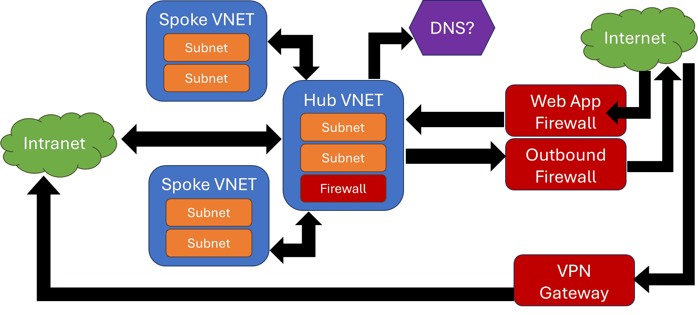

## Getting Cloud Networking into your Head

This year I had the privilege of presenting my perspective on cloud networking to two conferences: [DevOpsDays Austin 2024](https://devopsdays.org/events/2024-austin/welcome/) and [KCDC 2024](https://kcdc24.sessionize.com/). This talk is an analysis of a LOT of [psychic debugging](https://devblogs.microsoft.com/oldnewthing/20050321-00/?p=36123) situations I had resolved where the onlookers were genuinely surprised that I was able to diagnose the problem and suggest a solution that usually worked (or at least got them closer to working). Most of the time, especially in cloud environments, the issue was networking related. Even in non-cloud environments, it was usually a network issue that the developer hadn't considered. What I was doing was "software whispering" and for the uninitiated, it felt like magic. However, I don't like being a magician (or an illusionist) so I thought this talk would help codify some of my thinking to make it easier for others to peek behind the curtain.

<!-- truncate -->

The story goes like this: a developer is working in a cloud environment and something goes horribly wrong. It's probably a [`502 Bad Gateway`](https://developer.mozilla.org/en-US/docs/Web/HTTP/Status/502) or something similar. The developers throws up their hands and says "it's broken, what do I do?" and tries to get some help. If they had a better working knowledge of their cloud network environment, they could do some initial troubleshooting to nail down the problem a little better and get some more logs or hints as to the culprit. Then, they can submit a ticket to the correct queue to start getting it solved. If they didn't, they would wait two days for the response to come back from the firewall team: configuration looks good here, closing ticket.

In my talk last year about getting the cloud in your head, I introduced the idea of "mental models" that built on [Bloom's Taxonomy](https://bloomstaxonomy.net/) (a framework for learning used by teachers for almost 70 years: published in 1956). The simpler, revised taxonomy was published in 2001 and is what I referenced in that presentation and this one. To learn something new, you must first "remember": recall facts and basic concepts using vocabulary, and then "understand": explain ideas or concepts in your own words.

Slides are here: [Garo Yeriazarian: Getting Cloud Networking into your Head](getting-cloud-networking-into-your-head.assets/Garo%20Yeriazarian%20-%20Getting%20Cloud%20Networking%20into%20your%20Head.pdf).

## Networking Mental Model

Developers need to learn the foundations of cloud networking: Virtual Networks, Virtual Private Cloud, Subnets, Routes, Firewalls and so on for their environment. A typical cloud network environment may look like this:

This model is applicable to both AWS and Azure, and likely GCP as well (I asked some people in the audience at KCDC who were using Google Cloud and this was not unheard of).

In this model, your developer code runs on one of the "Spoke" subnets and either needs to receive incoming requests or make outgoing requests. For each request, here's the model I like to use:

Each network request has a source (where the request originates from), routing (the path the request takes through the network diagram), and a target (the ultimate target of the network request that will process it and possibly send a response).

### Source

The Source is where the request originates from.

- **Local Network:** the subnet where your developer code is running.
- **Virtual Network:** somewhere in the wider virtual network in your cloud environment (but not the same virtual network where your code is running).
- **Cloud Service:** from a public cloud service. This one is a little tricky because some cloud services will use compute that's attached to your network to send requests, but others will send requests from the public side that you need to allow into your network. You should look into the documentation for the cloud services you use to see which ones may require some special firewall rules to use.
- **Intranet:** from some other network outside the cloud, but in your corporate environment. This could be a datacenter, another cloud provider, or an office for the company.
- **Internet:** the public Internet, and maybe through a VPN (Virtual Private Network) used to allow employees to access internal networks from their remote machines.

Here's what you should watch out for:

- **Identify Source Location:** sometimes the network request is coming from a place you don't expect (like a cloud service). Or as part of the "normal" operation of a cloud service, a request comes from the public internet hosted cloud service that has to be allowed in.
- **DNS Resolution:** almost every request will start with a DNS resolution. This is its own hairy topic, but the important thing to know is that it will be another "regular" request that goes through the same steps to get your DNS result. I'll have a section about this below since DNS deserves its own special attention.
- **Firewall Rules or Network Security Groups:** usually, most traffic is allowed to leave a network. However, there are situations in the name of "zero trust" that have explicit rules on what you can access from a subnet. Check your outbound firewall rules just in case.

### Routing

The Routing is the path the request takes through the networks. Sometimes more than one of these can apply to a request. For example, in a network where all Internet access needs to go through an outbound firewall, then all Internet bound traffic will route across the hub to a firewall endpoint, then hit the Internet.

- **Local Route:** when the request is in the same virtual network, it's a local route that is usually universally allowed. If your company doesn't like to make a lot of virtual networks and some of these are shared between many different teams, then you MAY have more stringent routing rules between subnets. This is generally a "pain in the butt" but it is something to be checked juuuuuuuuust in case.
- **Across Hub Route:** the request needs to traverse virtual networks and will take a hop through the "hub" network. This means it will be subject to routing rules in the source and hub virtual networks as the request is routed to the correct place. Special consideration is needed if the request needs to cross cloud regions and go from regional hub to regional hub.
- **Firewall:** the request needs to be routed through a firewall. This could be a hub network firewall that has rules for allowing certain ports, or a outbound firewall for filtering Internet-bound traffic. A firewall is an opportunity for rules to be applied to block traffic on certain ports. It is usually setup to only allow port 443 across the hub, which is commonly a fair assumption to make. Check with your firewall team to see how these are configured and what the constraints are.
- **Private Endpoint:** the request is going to a cloud service, but it will remain on your virtual network and go through a private endpoint. This is a special tunnel managed by your cloud service that allows you to interact with an endpoint on your own subnet and communicate with a service hosted on the public cloud. This is important because it keeps your private traffic private and removes the need to have a public endpoint that needs a bunch of firewall rules to be configured securely.
- **Internet:** the request is going along Internet routes to the destination. When you are talking to a public cloud service, this may be the case unless you have a private endpoint configured.

Here's what you should watch out for:

- **Misconfigured Routes:** network routes are usually managed centrally, and sometimes the teams responsible may decide on making changes. If these changes are only done manually, there's an opportunity for human error. If these changes are automated, there's also an opportunity for human error, but one that is avoidable through peer review. Misconfigured routes will end up either shifting your traffic to the wrong place, resulting in timeouts due to lack of response, or nowhere at all resulting in the same timeouts.
- **IP Address Overlaps:** most corporate networks are still using IPv4 which allows for 4 billion-ish (2^32^) possible IP addresses. However, corporations will only have 16.7 million-ish (2^24^) addresses allocated for their internal use. For example, a company may reserve the `10.x.x.x` IP range for their internal systems with the goal that any of these `10.x.x.x` IP addresses may be addressable or reachable by anyone else in the corporate network. This corporate network could extend to multiple datacenters and cloud providers, and suddenly 16.7 million doesn't seem like that big a number.
  - Watch out for scripts provided by vendors that setup IP ranges and networks for you. They will usually claim some IP range they feel is correct, but may overlap with a corporate network range.
  - Watch out for manually configured networks, these could have issues of human error. Your cloud provider may not be able to detect IP overlap issues across virtual networks, regions, or across other cloud providers.
  - If you have an IP address overlap, you'll end up with weird routing issues. Your source may miss responses as the response ends up routing to the overlapped IP. Your target may be the wrong one entirely and reject your requests. Or, even worse, a ["Heisenbug"](https://en.wikipedia.org/wiki/Heisenbug) appears and your request is routed correctly half the time.
- **Firewall Rules:** if you have to pass through a firewall, the rules will check your request for correctness. The thing I've seen the most is port filtering: only port 443 is allowed through the firewalls by default, which is fine about 99% of the time. However, if you are trying to do something special or have some reason that you can't use port 443, then you'll need to request the filters to be updated and go through some dreaded "business justification" exercises.
  - A legitimate issue I've seen with this is when you want to communicate across the virtual network to another cloud service for integration using a message or queue type protocol. Sometimes this can only be done using AMQP protocol on port 5671 or MQTT on port 1883. Sometimes you will want to use UDP even, which is likely to be blocked (except for DNS requests). One resolution is to try to use a "over websockets" type wrapper to encapsulate the request securely. This will ensure a TLS handshake first, then secure communication later. It will also behave better with firewalls by not trying to use "weird" ports.
  - If you are running using virtual machines (VMs) and are hosting things on Linux using different services, you may run into some port issues. You could solve these using a service that owns the port and forwards requests based on path names or host names, but only if the services you are hosting support this.
  - If you are running Windows virtual machines (VMs), then you can either run everything through IIS (Internet Information Services) or through some other proxy web server.
- **SSL Proxying:** a lot of companies have outbound Internet traffic filtering that allows companies to unpack and inspect secure traffic. This is effectively a ["man in the middle" attack](https://en.wikipedia.org/wiki/Man-in-the-middle_attack) done on purpose against the users of the corporate network. Usually, this looks transparent to the end users who are accessing websites using corporate-sanctioned browsers, but to developers running software services in the cloud, it can get challenging to ensure that the correct certificates are deployed to all the running services.
  - SSL Proxying adds an extra step of unpacking and repacking secure traffic. It does this by offering a new, corporate-trusted, set of certificates that are unique to the instance of the SSL Proxy. When your browser trusts these certificates, it trusts all traffic secured by certificates issued by certificate authorities identified by these trusted certificates.
  - Corporate network policies push the certificates to your computer's trusted area automatically, and may take the extra step of adding a Firefox policy to ensure Firefox users are not hindered. If your browser is not setup to trust these certificates, then you'll get a scary "this page is not secure" warning from your browser and it will advise you to run away.
  - When you are running software in the cloud, the operating system running your software may not have these certificates trusted, and you'll need to add them yourself in the software build process. I've started a website to give hints on how to handle it here: [SSL Yes Verify (ssl-yes-verify.dev)](https://ssl-yes-verify.dev/). I've added a few articles there, and plan to add more over time. If you're interested in contributing some guides there, please let me know.

### Target

The Target is the final destination of your network request, from which a response may be issued.

- **Local Network:** the subnet where your developer code is running.
- **Virtual Network:** somewhere in the wider virtual network in your cloud environment (but not the same virtual network where your code is running).
- **Cloud Service:** to a public cloud service. These can be routed through a private endpoint or directly to the public endpoint.
- **Intranet:** to some other network outside the cloud, but in your corporate environment. This could be a datacenter, another cloud provider, or an office for the company.
- **Internet:** the public Internet.

Here's what you should watch out for:

- **Firewall Rules or Network Security Groups:** on the receiving side of a network request, the filters are more stringent. The default rules in Azure are to allow all traffic from your wider virtual network, but these are likely to be overridden to be more intentional and secure. Check your virtual network firewall rules to be sure that the expected traffic is allowed.
  - Some subnets need to be setup to allow traffic from the entire corporate network as well as the local networks. For example, if you are setting up the main web endpoint for your application either directly in an application gateway service, API management service, or a self-managed endpoint, then this subnet (and endpoint) will need to allow all traffic.
  - Public endpoints meant for public Internet traffic will have their own custom, reserved IP address from your cloud provider, and you can add the necessary filters according to the documentation in your cloud provider's website. Corporate networks usually have their own rules for how to expose public Internet services, so be sure to follow the instructions and don't just create a public IP address on your own.
  - Internal endpoints meant for internal corporate traffic will have an IP address reachable by most of the corporate network (remember the discussion on `10.x.x.x` IPs above?) but will need to have a filter that allows all the internal corporate IP ranges. Check with your network team to see what this IP range would look like, and save the link where the ranges may be published internally for reference. If you notice that some clients are able to access and others are not, look at the IP filter ranges to make sure the traffic would be allowed. Additionally, you'll need to review the routing to make sure that the virtual network is reachable from all over the wider area network.
- **Permission Issues:** if your target is a secured service (it usually is) then there are permission issues to consider. Cloud services will need to be called using authenticated requests and will reject your request silently if you forget to pass it or don't have the right permissions. Don't take this too personally as it minimizes the information leaked to threat actors who are probing for valid resources to try and infiltrate.
  - Check the Identity Access Management (IAM) part of your cloud services to ensure that the permissions are what you expect. You can do a what-if test as well to validate if a particular request should work and what permissions that identity would have.
  - In the case of AWS and GCP, check the source permissions as well as you can restrict what API calls are allowed by a service.
  - When accessing other types of services, check that the authorization headers are being constructed and passed correctly. This is tricky as you don't want to log your authorization headers since it would leak valid tokens into your logs. Instead, you'll need to log things like the effective identity identifiers (which isn't useful on its own to break into a service). I ran into an issue where the identity assigned to the compute wasn't what I expected due to the way that `DefaultAzureCredential` worked. It was pulling a System Assigned Managed Identity for the virtual machine instead of the OIDC credentials I had explicitly added.

### Resolving Issues

You won't usually have all the permissions you need to resolve all your issues unless you are somehow the Global Administrator of your cloud account, in which case you shouldn't be touching ANYTHING. Mere mortals need to submit tickets to the help desk to get the ball rolling.

Consider that each area where things could go wrong has a different ticket queue to handle it. If your ticket system supports linking tickets, then you can more easily get teams to collaborate.

- **Your Code:** the problem exists between the keyboard and the chair ([PEBKAC](https://en.wikipedia.org/wiki/User_error)). Submit a bug report to your usual work management system and commit to buy donuts (or whatever your team likes) for the next in-person get-together. These are the most likely and least impact issues.
- **Local Network:** the issue lies inside the configuration of your local network, either in firewall rules, routing, or some other settings. These are usually handled by a cloud operations or platform team, depending on how your environment is setup. The impact of these is usually still low as it mainly touches your application environment and not many others.
- **Shared Network:** the issues lies inside the hub network, inter-hub communications, or DNS. This is where things can get dicey and affect multiple applications. Changes here may be controlled by freeze periods to avoid making changes during end-of-month processes, and around common holidays. If you can prove that customers are impacted materially, you can ask to break the freeze, but this is usually a politically challenging issue and will require some follow-up paperwork to explain why this happened and how it won't happen again.
- **Cloud Availability Zone:** the issues lies with your cloud provider and affects services in an availability zone. This could be one or more services impacted, and it will impact not just your applications, but other customers of the cloud provider as well. These events are rare, but still happen. If you have a more precious metal level of support with your cloud provider, then you will get more timely updates and preferential resources when they become available. However, if your support level is non-metallic, you'll just have to wait.
- **Cloud Region:** things have gone horribly wrong. Cloud vendors will absolutely refuse to accept a region failure except in the most dire of cases (mainly due to contractual concerns of needing to refund customers impacted and doing a lot of digital paperwork). This is where your disaster recovery will need to kick in, and most of your services may be affected.

When resolving issues, remember that everyone is human and wants to get to a favorable outcome. That means be kind, dammit. [Be excellent to each other.](https://www.youtube.com/watch?v=N_yJFLvmjJY)

Finally, make sure to write everything down when things go wrong. Bug reports or issue notes are extremely helpful to search through when trying to figure out how to solve something. With the advent of newer GenAI driven tools, all these delicious notes are tasty morsels for the large language models to consume and quote when asked to come up with solutions.

### Domain Name System (DNS)

DNS is extremely important to your networks and applications, it helps you find where services are hosted so you don't have to remember a bunch of numbers. However, DNS is implemented differently in every corporation. I don't have a good link handy to learning DNS, so if someone finds one, please let me know and I'll review it and update here if it's a good one.

- DNS is part of almost every network request. When you look for a particular URI, it will need to resolve the hostname and DNS is the usual way that works.
- Kubernetes uses DNS internally to locate services.
- DNS can be different for public (external initiated requests) and internal (inside the corporate network). Depending on the source of the network request, a different DNS may be consulted first.

In any of these cases, ensure you understand how DNS works in YOUR corporate environment, as it will help you troubleshoot a lot of issues.

DNS uses ports as well, so make sure that UDP 53 and UDP 9053 are allowed on paths where DNS requests may traverse (sometimes used for DNS proxying, check your network team and cloud provider for details). This is typical for calls within Kubernetes when communicating within a subnet between nodes.

## Software Whispering and Psychic Debugging

Knowing your cloud network is a not-so-secret superpower. This knowledge should be spread far and wide in your teams to make everyone more effective in understanding what could go wrong and how to troubleshoot it. When the problem solving feels like "magic", then people don't think they can understand it and will continue to lean on the "magicians" to solve the problems, ruining everyone's day. ["When everyone is super, then no one is"](https://scatteredquotes.com/when-everyones-super-no-one/), and we can all be better cloud engineers.
