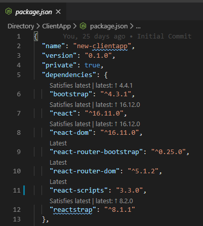
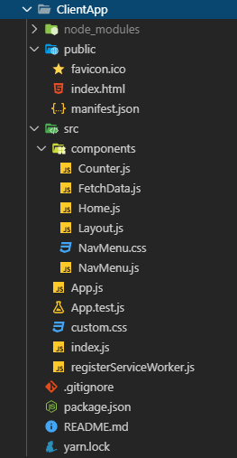

Previous Post in Series: [Upgrading the .NET Core 3.0 React SPA Template to Celery Architecture](/2019-11/setting-up-celery-net-core-3-csharp)

In the previous post, we refactored the backend of the template application into a "Celery" (or "Vertical Slice") architecture with feature folders. For the frontend single-page application (SPA), we'll refactor in a few simple ways.

This post assumes you are familiar with the basics of React and can follow along. If this isn't the case, you should run through some of the tutorial materials first. The ones on the React site are a great starting point to get you moving, and you can probably follow along by reading my code in GitHub as well.

1. Since we started, there's a new upgrade to the `create-react-app` scripts template that adds some new language features and some better testing features. Release note are here: [Create React App v3.3.0 Release Notes](https://github.com/facebook/create-react-app/releases/tag/v3.3.0)
2. Reorganize the components into feature folders that separate the functionality and mirror the backend feature folders. If we were using Razor Pages for our frontend, we could put all the feature specific view components into the feature folders and keep them all together. In the Single-Page-Application model, the frontend code all resides in the `ClientApp` folder and is compiled separately.
3. Refactor the existing components to use [React Hooks](https://reactjs.org/docs/hooks-intro.html) instead of the [React Component Model](https://reactjs.org/docs/react-component.html). The primary reason is to reduce the complexity of the code and make it more functional and more "Javascripty".

## Upgrade Create React App

The upgrade instructions for Create React App are quite simple (you can find the instructions at the bottom of the release notes page, but are reproduced here for convenience):

```shell
cd Directory/ClientApp
yarn add --exact react-scripts@3.3.0
```

Make sure you run the `yarn` command in the right folder, otherwise you'll wonder why nothing really changed and you've got another huge chunk of files in your solution. If you mess up, just undo the changes using Git and manually delete the top-level `node_modules` folder.

Test that everything is still working:

```shell
cd ../..
dotnet build
dotnet run -p Directory
```

Then navigate to https://localhost:5001/ to ensure everything still runs (spoiler: it should). Press `CTRL+C` to stop the website.

Looking at `package.json`, I see that there are some package upgrades available. Thanks to the [Version Lens](https://marketplace.visualstudio.com/items?itemName=pflannery.vscode-versionlens) extension in Visual Studio Code, I see a little lens on each package to indicate which version is available and what this one is resolving to.



I can see that `bootstrap`, `react`, `react-dom`, and `reactstrap` have pending upgrades. I'll just click `latest` on each one to upgrade them, and rerun the build and application to make sure nothing broke. We need to run `yarn install` again to install / upgrade the new packages as msbuild won't do it on a regular build. However, the default msbuild script in the .csproj file will only reinstall packages if there is no `node_modules` folder, and, by default, it will use `npm` and not `yarn` (we'll fix this when we get everything building automatically in Azure DevOps).

```shell
cd Directory/ClientApp
yarn install
cd ../..
dotnet build
dotnet run -p Directory
```

Again navigate to https://localhost:5001 to make sure things still run (sorry to break it to you, but it still works). Press `CTRL+C` to end the program and let's continue!

## Reorganize Components into Feature Folders

I feel Feature Folders are a clean organizational tool to allow your code to age gracefully in the face of progress. Let's refresh on what the frontend project structure looks like in the `Directory/ClientApp` folder:



At the top level (at the bottom of the tree) are our `index.js` and `App.js` files that are the starting point for our application. The root level scripts will remain as they are, and we'll move the other components around.

Our application so far is organized as such (as a component tree):

* App
  * Layout
    * Route: Home
    * Route: Counter
    * Route: Fetch Data

We use the React Router to switch between the top level pages, and each "Page" is a single component. While we only have three pages and a few more components, the application is not terribly complicated. However, as things progress, we'll want to compartmentalize and organize code. Once we start adding custom stylesheets for each component and splitting functionality out to make them more testable, we'll quickly start outgrowing the `components` folder.

The new structure is suspiciously similar to the old one in that we will continue to use a folder called `components` as the top level. This is a convention in React and while we can call them "Feature Folders", we don't have to call the folder `features`. Everything that is a component will go into `components`, and everything that is a route target will go into `routes`. This article by Charles Stover has a detailed justification for this method: [Optimal file structure for React components](https://medium.com/@Charles_Stover/optimal-file-structure-for-react-applications-f3e35ad0a145) and also discusses why we'll need to create index.js files for everything.

The new folder structure will look like this:

* components
  * App
    * App.js
    * App.test.js
    * index.js
  * Layout
    * Layout.js
    * index.js
    * NavMenu
      * NavMenu.js
      * NavMenu.css
      * index.js
* routes
  * Home
    * Home.js
    * index.js
  * Counter
    * Counter.js
    * index.js
  * FetchData
    * FetchData.js
    * index.js

Just moving the files into new folders will not work without some extra modifications. We need to ensure that:

1. Each component has an `index.js` added to the folder that exports the default top level component like this:

   ```js
   export { default } from './App';
   ```

2. Each component must export a default class (the template had some components exporting a default and some not):

   ```js
   export default class Counter extends Component {
   	/* ... */
   }
   ```

3. The imports for all the components need to be updated and shifted to use `default` imports (see this article [Named Export vs Default Export in ES6](https://medium.com/@etherealm/named-export-vs-default-export-in-es6-affb483a0910) by Alankar Anand. Ensure the imports are shifted like this:

   ```js
   // old import style (named export)
   import { Counter } from '../../routes/Counter';
   // new import style (default export)
   import Counter from '../../routes/Counter';
   ```

   The combination of the `index.js` and the default export make this notation possible. There are cases where you won't want to setup default exports, and you can modify your `index.js`:

   ```js
   export { ComponentOne, ComponentTwo } from './MyComponents';
   ```

We haven't finished reorganizing the contents of these components, but at least we can have the files in the right places to start a good pattern. You can examine the completed code in this branch: [blog/03-reorganize-frontend](https://github.com/garoyeri/bonmon-backoffice-directory/tree/blog/03-reorganize-frontend). 

## Refactor Components Using React Hooks

I will openly admit that when I first heard / read about React Hooks, I had no clue what it was or how to use it. I was still comfortable creating component classes and using the lifecycle to do what I needed, and modify state in a nice way. After I attended a session of the [Improving Code Meetup](https://www.meetup.com/Improving-Code) in Houston entitled [Clean React Code with Hooks](https://www.meetup.com/Improving-Code/events/265548895/), I was ... hooked. [Eric Siebeneich](https://devzeebo.github.io/) (I thought I had issues with people pronouncing my name properly) presented React Hooks in a clean simple way and it suddenly struck me how simple and clean it was. The component lifecycle tries to bring a similar model from other user interface tooling into the web arena, but it feels like I have to fight it each time. Using `this` and needing to `bind` and other strange behaviors echo strange ceremonies that are only there to work around the way JavaScript works. React Hooks cut through that and sing to the functional strengths of JavaScript.

If you haven't already, stop right now and read [Introducing Hooks](https://reactjs.org/docs/hooks-intro.html) on the React site. I won't wait around for you to read, this is a website and I've moved onto the next thing. But come back and see how we refactor what we've got here.

I'll refactor the `Counter` component first because it's easy. Here's what it looks like right now:

```jsx
import React, { Component } from 'react';

export default class Counter extends Component {
  static displayName = Counter.name;

  constructor(props) {
    super(props);
    this.state = { currentCount: 0 };
    this.incrementCounter = this.incrementCounter.bind(this);
  }

  incrementCounter() {
    this.setState({
      currentCount: this.state.currentCount + 1
    });
  }

  render() {
    return (
      <div>
        <h1>Counter</h1>
        <p>This is a simple example of a React component.</p>
        <p aria-live="polite">
            Current count: <strong>{this.state.currentCount}</strong>
        </p>
        <button className="btn btn-primary"
            onClick={this.incrementCounter}>Increment</button>
      </div>
    );
  }
}
```

The big red flag for me here is the call to `bind`. I would LOVE to get rid of that because I will usually forget to set it and I will always need to look for it in pull request reviews with my team. Let's refactor this component to use hooks and see what sort of damage we cause.

```jsx
import React, { useState } from 'react';

export default function Counter() {
  const [currentCount, setCount] = useState(0);

  return (
      <div>
        <h1>Counter</h1>
        <p>This is a simple example of a React component.</p>
        <p aria-live="polite">Current count: <strong>{currentCount}</strong></p>
        <button className="btn btn-primary"
            onClick={() => setCount(currentCount + 1)}>Increment</button>
      </div>
  );
}
```

You'll notice the "after" code is much simpler and less error prone.

1. The call to `bind` is completely gone, as is the `incrementCounter` function
2. We don't use `setState` anymore, but use the function that was returned by the `useState()` hook
3. We don't need to bind to `this.state.currentCount`, we just use the local `currentCount` variable
4. The only goofy syntax is with the `onClick` handler for the button for people who aren't familiar with the lambda syntax.
5. Testing this component has become dirt-simple, no need to setup a component lifecycle or dance around initialization: you just call the function and see what it does.

Next, we'll refactor the `FetchData` component. Here's the initial code:

```jsx
import React, { Component } from 'react';

export default class FetchData extends Component {
  static displayName = FetchData.name;

  constructor(props) {
    super(props);
    this.state = { forecasts: [], loading: true };
  }

  componentDidMount() {
    this.populateWeatherData();
  }

  static renderForecastsTable(forecasts) {
    return (
      <table className='table table-striped' aria-labelledby="tabelLabel">
        <thead>
          <tr>
            <th>Date</th>
            <th>Temp. (C)</th>
            <th>Temp. (F)</th>
            <th>Summary</th>
          </tr>
        </thead>
        <tbody>
          {forecasts.map(forecast =>
            <tr key={forecast.date}>
              <td>{forecast.date}</td>
              <td>{forecast.temperatureC}</td>
              <td>{forecast.temperatureF}</td>
              <td>{forecast.summary}</td>
            </tr>
          )}
        </tbody>
      </table>
    );
  }

  render() {
    let contents = this.state.loading
      ? <p><em>Loading...</em></p>
      : FetchData.renderForecastsTable(this.state.forecasts);

    return (
      <div>
        <h1 id="tabelLabel" >Weather forecast</h1>
        <p>This component demonstrates fetching data from the server.</p>
        {contents}
      </div>
    );
  }

  async populateWeatherData() {
    const response = await fetch('weatherforecast');
    const data = await response.json();
    this.setState({ forecasts: data, loading: false });
  }
}
```

Here's the red flags I can think of:

1. The loading state feels "weird" and the whole pattern feels very ceremony-like (it's not that I'm not a fan of ceremonies, just not in my code if I can avoid it)
2. The `componentDidMount()` state always makes me go back to the React documentation and re-examine when these callbacks occur.
3. The ID `tabelLabel` is misspelled in the template (easy fix!)

Let's see the hooky (in a good way) version:

```jsx
import React, { useState, useEffect } from "react";

export default function FetchData() {
  const [forecasts, setForecasts] = useState([]);
  const [loading, setLoading] = useState(true);
  useEffect(() => {
    (async () => {
      const response = await fetch("weatherforecast");
      const data = await response.json();
      setForecasts(data);
      setLoading(false);
    })();
  }, []);

  function renderForecastsTable(forecasts) {
    return (
      <table className="table table-striped" aria-labelledby="tableLabel">
        <thead>
          <tr>
            <th>Date</th>
            <th>Temp. (C)</th>
            <th>Temp. (F)</th>
            <th>Summary</th>
          </tr>
        </thead>
        <tbody>
          {forecasts.map(forecast => (
            <tr key={forecast.date}>
              <td>{forecast.date}</td>
              <td>{forecast.temperatureC}</td>
              <td>{forecast.temperatureF}</td>
              <td>{forecast.summary}</td>
            </tr>
          ))}
        </tbody>
      </table>
    );
  }

  function renderLoadingMessage() {
    return (<p><em>Loading...</em></p>);
  }

  return (
    <div>
      <h1 id="tableLabel">Weather forecast</h1>
      <p>This component demonstrates fetching data from the server.</p>
      {loading ? renderLoadingMessage() : renderForecastsTable(forecasts)}
    </div>
  );
}
```

Changing to hooks didn't help out the length of the code, but it did keep things fairly linear. The component will execute top to bottom and there's no lifecycle to figure out. Here's what I think is good:

1. Everything is spelled correctly and all is right in the world
2. All the state logic is at the top of the screen and easy to see
3. The rendering code didn't change at all
4. Any memories of the component lifecycle can be dumped and space made for more important knowledge

Some negative issues to note:

1. Calling an `async` function from within a hook doesn't work unless you use an [IIFE](https://developer.mozilla.org/en-US/docs/Glossary/IIFE) to trigger it. However, if your code just uses straight Promises, it *should* work without the IIFE.
2. The loading indicator is a bit of a smell for me. Spider sense tells me that it can be done better, but I'm not being as picky at the moment.

There's nothing useful to change on the `Home` component that would provide any benefit, so I'll leave it alone.

The code after the refactoring is here: [blog/04-refactor-template-to-hooks](https://github.com/garoyeri/bonmon-backoffice-directory/tree/blog/04-refactor-template-to-hooks).

## Today I Learned

Upgrading to new minor versions of JavaScript libraries and tools didn't cause me any grief ... this time. However, there are so many libraries involved. I noticed that GitHub flagged a library as having a vulnerability as well as some audit failures from `yarn`. However, those were all related to dependencies from `react-scripts` and only affect compile time, not run time.

Reorganizing your frontend code base to use folder structures and make the imports look nice requires a lot of goofy `index.js` files. Luckily once you create the files, there's no need to change them unless your top level component changes.

React Hooks can dramatically simplify and clarify a React Component (maybe not always decimate the code, but at least make it more readable). While it does have some quirks, like when you try to call an `async` function, I feel like it's definitely going to be my first choice for how to add components into my application.


