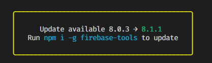
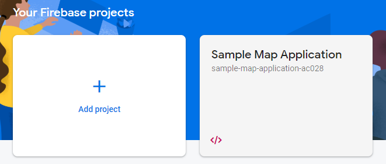
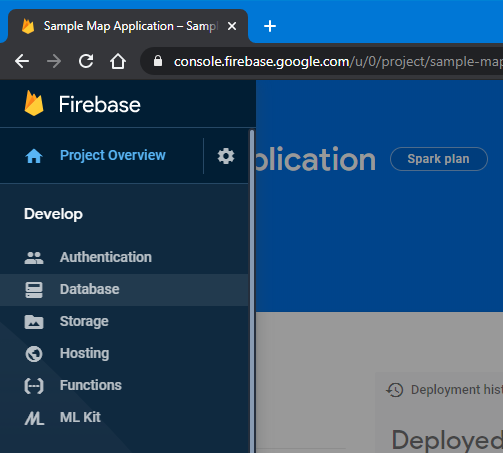
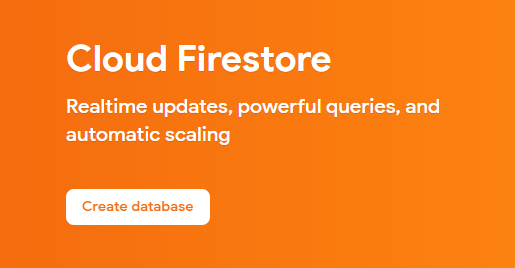
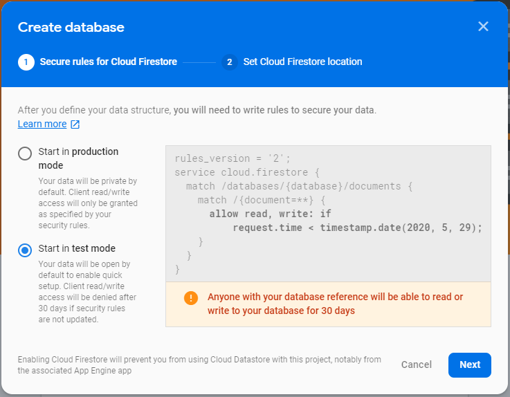
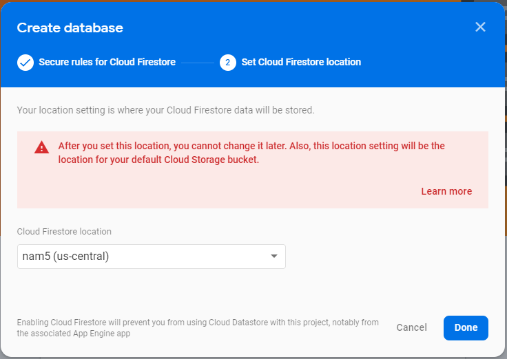
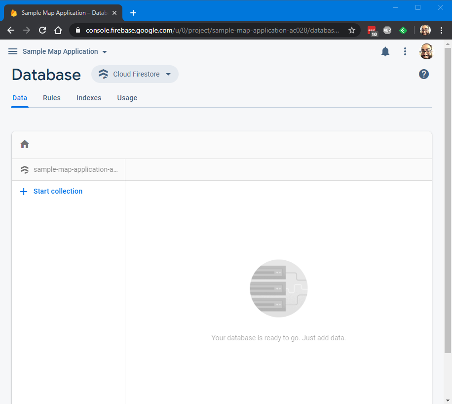
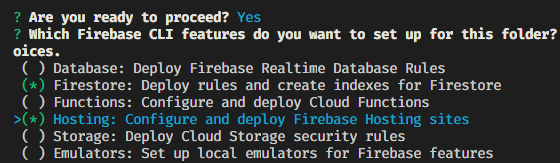

# Overview #

In the last segment, we discussed how we should do data modeling and arrived at a possible data model to use with the database. This segment, we'll walk through how to setup the database and connect your frontend to it to start saving data about the map.

If you're just seeing this, you should start with the first article in the series instead: [Sample JavaScript Application Introduction](sample-javascript-application-introduction).

These instructions assume you're starting from the application we setup in the previous article: [Sample JavaScript Application Frontend Part 2](sample-javascript-application-frontend-2). If you don't have that handy, you'll need to follow the instructions in the previous articles to get a project configured that points to your own Firebase project on Google Cloud.

# Updating Firebase Tools

If you've been following along since the beginning for a few weeks now, your Firebase tools have probably gone out of date and you'll see a message like this asking you to upgrade:



You can go ahead and run that command as-is to upgrade Firebase tools:

```sh
npm i -g firebase-tools
```

It will grind away for a bit, then you'll end up with a new version. As I mentioned before, `npm` likes to log a LOT of messages that can look frightening and erroneous, but don't worry. Unless you see some red `ERR` type messages, it's probably ok. If you want to make sure it's all right, run this command:

```sh
firebase --version
```

You'll see the new version displayed (in my case, it was upgraded even further than 8.1.1)

```sh
8.2.0
```

# Versioning

A quick word about version numbering. Most modern software tries to follow "semantic versioning". This strategy separates version numbers into four parts:

MAJOR . MINOR . PATCH - SUFFIX

* MAJOR: when this number changes, it is a "breaking" change, meaning that some things that used to work might not work anymore. Major changes could include architectural overhauls, removal of old functions or commands that are no longer supported, or changes to a file or configuration format. Take care when there is a MAJOR version change in a tool or library, it means that you should review the release notes on the website to see what exactly has changed, and if you need to perform any migration steps when upgrading. When the MAJOR version changes, it typically resets the other two numeric parts of the version to `0`. This change could also include MINOR or PATCH changes, but the MAJOR change is the most important concern for the consumer.
* MINOR: when this number changes, it is a "feature" change, meaning that something new was added to the software without breaking any existing functionality. The release notes should indicate the new features. This change could also include PATCH changes, but there was enough of a new feature to require a MINOR change increment.
* PATCH: when this number changes, it is a "bugfix" change, meaning that a defect in the software was resolved with no addition of functionality, and no breaking changes to the way the software is expected to run. This change is the most common and software will make frequent releases to address defects and incremening the PATCH version.
* SUFFIX: this is the non-numeric part of the version, it is optional and can be used to designate special conditions on this version of the software. For example, if this is a bleeding edge build that hasn't been tested much, it might end in `-dev` or `-edge` to indicate it's nature. More tested builds that are ready for feedback could be `-beta` or `-testing`. Numbers can also be mixed in like: `-beta.3` to indicate that it is the third beta.

Version numbers are flags to the consumers that something is different with this version and gives the developer some guidance on what sort of changes to expect. In my case, I upgraded from `firebase-tools-8.1.1` to `firebase-tools-8.2.0`. This was a MINOR version change, so I can expect some new features and maybe some bugfixes. Looking up the source code for `firebase-tools`, I see this: https://github.com/firebase/firebase-tools/releases. You can read up on the changes and see what might be useful (doesn't look like there was anything that affects us).

Take a look around the code for the Sample Map Application you have, see if you can find version numbers for the libraries that we're using, then look up their websites to see if there is a newer version we should be using.

# Creating the Database

Let's swing back around to the database! Before we can get started, we have to tell Google Cloud which datacenter to put our database. With the "hosting" feature, our HTML and JavaScript is distributed automatically all around the world, but for the data, we need to pick a location for it to live.

1. Access the Firebase Console in your web browser here: https://console.firebase.google.com/
2. Click on your application:
   
3. Click on the pullout menu on the left, then click "Database"
   
4. It will say "Cloud Firestore", click "Create database"
   
5. For now, we'll start in "test" mode, this will allow anyone to write to our database, and it will be sufficient to get started:
   
6. Click "Next"
7. For the location, select whatever the default "Cloud Firestore location" is set to (in my case, it was `us-central`, but for people on the west or east coast, or different countries, it may be different:
   
8. Click "Done", watch the twirling icon, and wait for the database to be created
9. Once you see the empty database screen, you're done:
   

# Setup the Database in the Project

Head back to your Visual Studio Code console, open your project folder from the previous segment, and then open the Terminal. (You can do it by clicking the "View" menu, then "Terminal").

Run this command (while shaking off the seemingly unshakeable feeling of deja vu):

```sh
firebase init
```

You'll see a warning that you are initializing in an existing Firebase project directory (which you are). Press "Enter" to continue.

Use your arrow keys and press the "Space" key to select "Firestore" and "Hosting", then press "Enter".



Press "Enter" to accept `firestore.rules` as the filename for where rules should be stored. (We'll talk about what rules are later.)

Press "Enter" to accept `firestore.indexes.json` as the filename for where indexes should be stored. (We'll talk about indexes later too!)

Accept all the defaults by pressing "Enter" through all the prompts for hosting as well. By default, it will not destroy anything you've setup already.

Once completed, your project will have some new files that you can use to configure the database. For now, you can hide the "Terminal" section of Visual Studio Code and focus on the code windows.

# Add Necessary Scripts

To actually start using the Cloud Firestore functions, we need to first add the Cloud Firestore scripts. In the code, find this section of the `index.html` file:

```javascript
<!-- update the version number as needed -->
<script defer src="/__/firebase/7.14.0/firebase-app.js"></script>
<!-- include only the Firebase features as you need -->
<!-- <script defer src="/__/firebase/7.14.0/firebase-auth.js"></script> -->
<!-- <script defer src="/__/firebase/7.14.0/firebase-database.js"></script> -->
<!-- <script defer src="/__/firebase/7.14.0/firebase-messaging.js"></script> -->
<!-- <script defer src="/__/firebase/7.14.0/firebase-storage.js"></script> -->
<!-- initialize the SDK after all desired features are loaded -->
<script defer src="/__/firebase/init.js"></script>
```

Change this segment of code to look like this:

```javascript
<!-- update the version number as needed -->
<script defer src="/__/firebase/7.14.2/firebase-app.js"></script>
<script defer src="/__/firebase/7.14.2/firebase-firestore.js"></script>
<!-- include only the Firebase features as you need -->
<!-- <script defer src="/__/firebase/7.14.2/firebase-auth.js"></script> -->
<!-- initialize the SDK after all desired features are loaded -->
<script defer src="/__/firebase/init.js"></script>
```

We will remove the other libraries that we're not using (but keep the `auth` library commented out, we'll use that later). Notice that the PATCH version for the scripts was bumped to `7.14.2` from `7.14.0`. If you want to see what was changed, you can find it here: https://firebase.google.com/support/release-notes/js.


