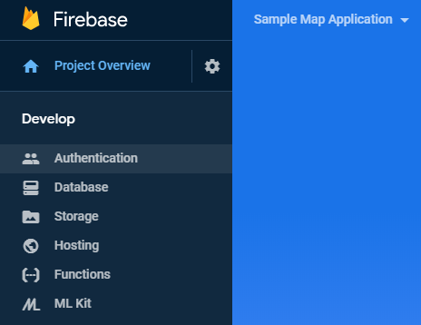
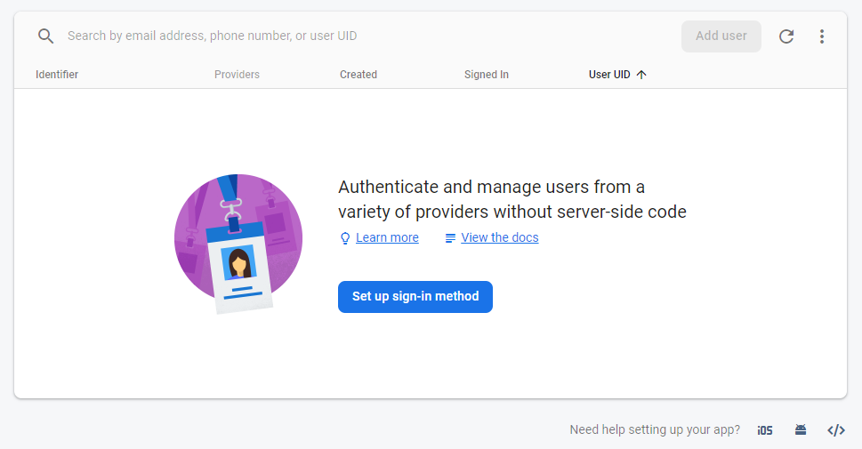
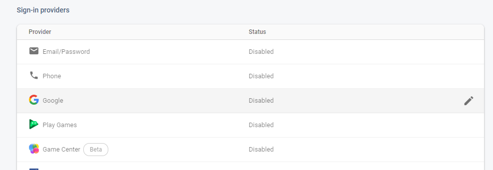
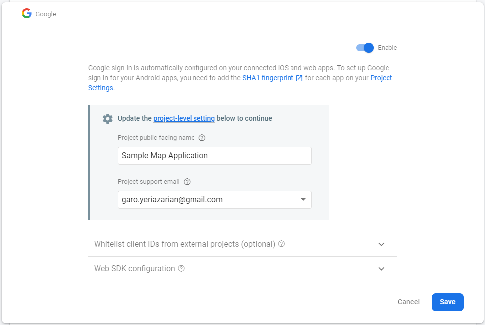
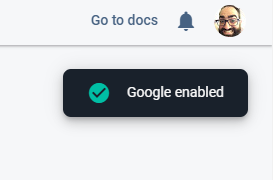
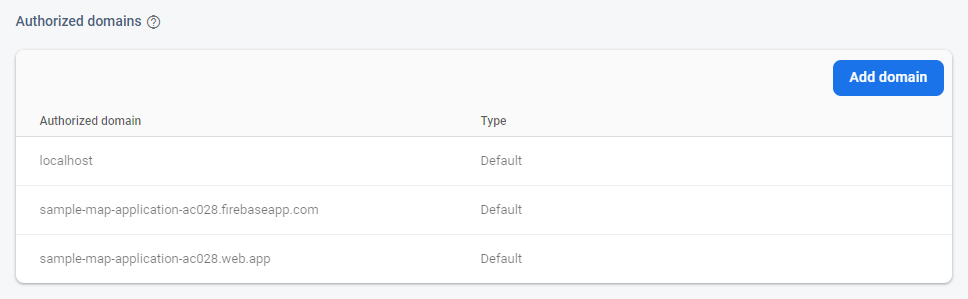

## Overview

In the last segment, we setup a database and reviewed all the code that interacts with it. This time, we'll setup authentication so we can lock down the security of the system and the database, and add a few user-centric capabilities like editing and deleting comments.

If you're just seeing this, you should start with the first article in the series instead: [Sample JavaScript Application Introduction](/2020-04/sample-javascript-application-introduction).

These instructions assume you're starting from the application we setup in the previous article: [Sample JavaScript Application Part 3 - The Database](/2020-04/sample-javascript-application-database). If you don't have that handy, you'll need to follow the instructions in the previous articles to get a project configured that points to your own Firebase project on Google Cloud.

## Authentication and Authorization

Most non-trivial software services include authentication and authorization. While these two terms sound similar, they are actually quite different:

* **Authentication:** Who I am
* **Authorization:** What I can do

For example, I can log into my account in Google using my email address and password (Authentication), but it will only allow me to access the services and resources that I am allowed to see, such as my email, my online storage, and my contact list (Authorization). Similarly, students who use Google Classroom will Authenticate with their email address and password and are only Authorized to see the classrooms for the classes they are enrolled in. Furthermore, they can only perform those actions of a "student" and not a "teacher".

Sometimes Authentication requires a second factor (known as Two-Factor Authentication) where you combine something you know (a password) with something you have (a specific phone that can receive text messages). Your banks, social network accounts, and other important services will urge you to setup a second factor to better identify who you are, so that unauthorized people will be kept out of those accounts.

Google offers a solid Authentication solution that other services can use to log customers in. You may have seen a lot of places other than Google.com where you can log in using your Google account. When this happens, the websites establish a way to trust Google, then redirect the customer to log into Google's site with a specific "reply URL" which tells Google where to call back once the login is complete. When it calls back, a special bit of code is added that the service can then use to identify the user.

Software services can create their own Authentication solution, or they can leverage the big ones that are available: Microsoft, Google, Facebook (to name a few). It is rarely useful to setup your own authentication solution because it ends up being one more account that your users have to remember the password for and you have to be extra careful with how you store those passwords. If you want to see the dangers of improperly storing passwords or personal information, look no further than here: [Have I Been Pwned](https://haveibeenpwned.com/).

## Setting Up Google Authentication

Just like with the Cloud Firestore database, we add Authentication to our Firebase application using the Firebase Console: https://console.firebase.google.com/. Click on your application, then find the "Authentication" option on the menu.

You'll see this screen:

Click "Set up sign-in method".

Click "Google".

Set a "public-facing name" for the project, this will show up when you try and authenticate.

Choose your "Project support email" from the dropdown (it will be your email address).

The rest of the settings you won't need to change.

Click "Save".

SUCCESS!

Scroll down and look for "Authorized Domains":

These are the websites that will use your Google Authentication and that Google trusts with sending the information back. You'll see three items here:

* `localhost`: this is used for local testing, you'll remember accessing your web application using `localhost` whenever you launch your site using `firebase serve`.
* `sample-map-application-ac028.firebaseapp.com`: After using `firebase deploy`, you app will show up here (and one more place)
* `sample-map-application-ac028.web.app`: After using `firebase deploy`, you app will show up here (and one more place)

These settings are defined automatically. If you added your own custom domain name, you would add it here.

## Adding Authentication to the Application

