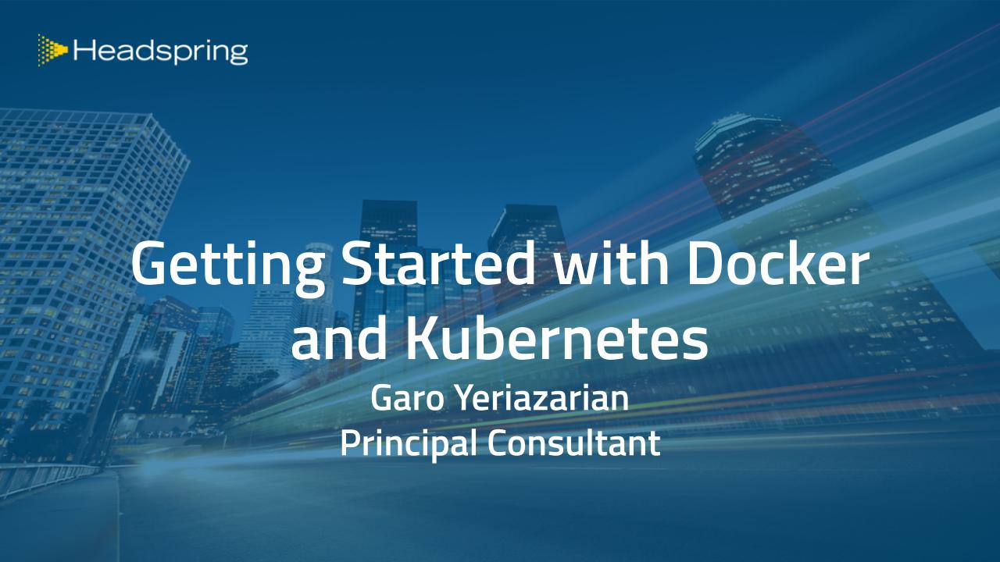

Down in Monterrey, Mexico, I did a talk for [Headspring Talks](https://www.meetup.com/Headspring-Talks/events/265159101/) entitled "Getting Started with Docker and Kubernetes". The goal was to help people who are starting to learn these incredibly powerful technologies a good kick-off point. When I was learning about these things, I knew that there were certain concepts that helped me internalize the way that Docker and Kubernetes work. I tend to not memorize facts or details very well. Instead, I focus on the core concepts of how something works, then derive back to detailed knowledge from there. I make an educated guess at how something *should* work, and that helps me solve problems more effectively.

<!--truncate-->

I had the most fun distilling down containers and Kubernetes into a few small definitions:

> A container is a process tree running in an immutable sandbox on the host machine.

> Kubernetes is an extensible container scheduler with a rule-based configuration.

With these two main definitions, you can build the foundations of your own understanding of these topics. Everything else flows from these two basic facts, and you can derive knowledge about containers and Kubernetes from them.

In any case, you must first learn about containers and Docker and become comfortable in using it. Even if you don't plan on learning or implementing Kubernetes at all, you should still understanding Docker containers and start using them in your development teams. The immediate effect is that your Dev team starts thinking like an Ops team and asking questions about how the application will run in production and what the key system requirements are.

The presentation will be posted somewhere soon (I'll include more posts about my Kubernetes learning process and more details about the presentation). I'll close with my favorite meme about Docker:

