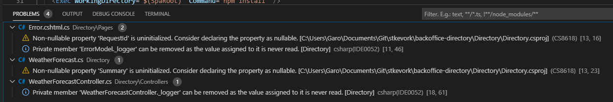
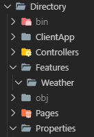

Previous Post in Series: [Getting Started with .NET Core 3.0 and React SPA Template](/2019-11/dotnet-new-react-app-getting-started/)

Last time, we upgraded the React part of the template to use the newest patterns and React scripts. This time, we'll upgrade the C# side and prepare the Celery Architecture so we can build up services quickly.

<!--truncate-->

## Celery Architecture

Vertical Slice Architecture (which I like to call Celery) is a method of organizing your application into feature slices rather than role layers. For a more thorough examination of the merits of this architecture, I defer to Jimmy Bogard's great blog post on it: [Vertical Slice Architecture](https://jimmybogard.com/vertical-slice-architecture/).

While we won't get to a full feature slice today, I'll make all the placeholders for the necessary parts and you can see how it comes together.

## Reorganizing the Codebase

First and foremost, we need to get tidy and pretty. This means setting up some rules that will automatically reformat the code into the style that I want. Coincidentally, this will affect the JavaScript side of the pool as well, but I would call that a happy little accident.

We are going to lean on two tools: [EditorConfig](https://editorconfig.org/) and [Prettier](https://prettier.io/).

EditorConfig lets you define a style for your code that IDEs will adhere to when formatting. We'll review the default style guide from Microsoft's article: [.NET coding convention settings for EditorConfig](https://docs.microsoft.com/en-us/visualstudio/ide/editorconfig-code-style-settings-reference?view=vs-2019)

Create a default `.editorconfig` file by copying the contents of the file from the Microsoft article and adding the file to your root solution folder.

I make one change to add:

```
# Usings inside of namespace
csharp_using_directive_placement = inside_namespace:silent
```

Because I like my `using` statements inside of my `namespace`.

Next, we need to install a tool that will actually listen to our files and make the formatting happen. We will use `dotnet format`. But we can't presume that everyone has it installed on their machines. Let's take advantage of a new .NET Core 3.0 feature and create a tool manifest and add it.

```powershell
dotnet new tool-manifest
dotnet tool install dotnet-format
```

This will install the dotnet format tool locally, and you can restore it next time using:

```powershell
dotnet tool restore
```

For now, we'll run the dotnet format tool and see what we get.

```powershell
dotnet format
```

It doesn't make any changes since the code is already in a nice style. The piece I want though (moving usings inside of the namespaces) is not supported... yet. So we have to make those changes manually. Make those changes and save everything and commit.

## Nullable References

One of the new C# language features is [Nullable References](https://docs.microsoft.com/en-us/dotnet/csharp/nullable-references). This seems rather strange because reference types by nature can be null. When you turn this feature on, you will break things, but it will help you better understand your code and express your intention of nullability. Again, this is greenfield work, so why not stack the deck in our favor?

Pop open your `Directory.csproj` file and add this element into the end of the first `<PropertyGroup>` in your file:

```xml
<Nullable>enable</Nullable>
```

If you did it wrong, OmniSharp in VSCode will immediately complain. Fix it, and we can run a build to see what went wrong.



We can easily fix two measly warnings. If we did this on a mature codebase, we would definitely have a hard time of it.

In `Error.cshtml.cs`, we received a warning that `RequestId` is not initialized in the constructor and could be null. Seeing that we have a guard condition on the `ShowRequestId` property, I'm sure we intended this to happen.

```csharp
public string RequestId { get; set; }
public bool ShowRequestId => !string.IsNullOrEmpty(RequestId);
```

To resolve it, we change the type of `RequestId` from `string` to `string?`. This marks it as a nullable reference type.

The next issue is a little more vague:

```csharp
public class WeatherForecast
{
    public DateTime Date { get; set; }
    public int TemperatureC { get; set; }
    public int TemperatureF => 32 + (int)(TemperatureC / 0.5556);
    public string Summary { get; set; }
}
```

The `Summary` property is uninitialized. This being a data transfer object (DTO), I suspect there's a good chance it will be null and we'll have to work around that. Let's mark it as nullable to be safe.

When you run the build in Visual Studio Code, you'll see these errors:

```
Warning CS8632 The annotation for nullable reference types should only be used in code within a '#nullable' context.
```

When you first setup `<Nullable>true</Nullable>` in your project, you have to exit VSCode and restart it to clear the issue.

## Feature Slices

Our next step is to organize the code base into feature slices so we can easily add new features and organize them.

Right now, we have one notable feature, the Weather fetching. It generates fake weather data when the API is called and returns it to the caller. We want to consolidate all the parts here into its own `Feature` folder.

Create the folder for `Features` and add a subfolder called `Weather`.



Move `WeatherController.cs` into the `Weather` folder and adjust its namespace.

Move `WeatherForecast.cs` into the `Weather` folder and adjust its namespace.

The rule of thumb is anything that is used only by a feature should go into the feature folder.

Delete the `Controllers` folder.

Ensure everything still compiles (spoiler: it does).

## MediatR and AutoMapper

One of the things you'll notice in the `WeatherForecastController` is that it has application logic in it that generates the random weather object. This makes things hard to test and makes the controller take on extra work. The controller should map data from the HTTP request and pass it onto the application logic, then take the application logic response and map it back into an HTTP response.

MediatR and AutoMapper are two libraries that help us to scale up our feature slices by helping us establish a pattern of how features work. Before I do that, I'll save our progress in a branch so far: [01-organize-code-feature-folder](https://github.com/garoyeri/bonmon-backoffice-directory/tree/blog/01-organize-code-feature-folder).

Open a terminal and lets add the packages we need:

```powershell
dotnet add Directory package MediatR.Extensions.Microsoft.DependencyInjection
dotnet add Directory package AutoMapper.Extensions.Microsoft.DependencyInjection
```

Since we're using Microsoft Extensions Dependency Injection in our application, we reference the MediatR and AutoMapper extension packages instead of the root packages which don't include any preference for a Dependency Injection container.

Open `Startup.cs` so we can configure these two libraries.

At the top of the file, add the following `using` statements:

```csharp
using AutoMapper;
using MediatR;
```

Then at the end of the `ConfigureServices` method, add the following statements:

```csharp
services.AddMediatR(typeof(Startup).Assembly);
services.AddAutoMapper(typeof(Startup).Assembly);
```

Each of these startup methods takes an Assembly reference. They will use that reference to look for patterns that are used in creating the feature slices.

MediatR is looking for `IRequestHandler` implementations primarily which it will dispatch to whenever a message is sent. With this, we abstract the functionality of the system into messages which have a request and a response (optionally). When we use these features of the application, we don't depend on explicit interfaces, but instead on a message contract that can be fulfilled by just about anything. This grants us the freedom to architect the feature and refactor however we wish without needing to refactor client code as long as the message contract is respected.

AutoMapper is looking for `Profile` implementations that describe how objects are mapped from one to another. It gets tedious translating objects from the HTTP request into MediatR messages and responses back into HTTP responses by hand. AutoMapper allows you to declare which types should map and describe any exception cases or "interesting" mapping strategies between objects. If a MediatR message is upgraded to a new version, then AutoMapper can convert between versions. When working with a database model and an API model that are similar but different enough to warrant translation, then the AutoMapper profile provides a type-safe way to map between the two. It also includes a handy assertion method called [AssertConfigurationIsValid()](http://docs.automapper.org/en/stable/Configuration-validation.html).

Let's convert the Weather feature to use MediatR. We don't have a reason to setup AutoMapper for it, but we'll definitely be using it later.

There's a clean way to organize your Features into single files using a static class on the outside. This keeps your models and handlers altogether and allows you to keep your naming conventions less wordy.

We'll modify `WeatherForecast.cs` to become our feature slice.

```csharp
namespace Directory.Features.Weather
{
    using System;
    using System.Collections.Generic;
    using System.Linq;
    using System.Threading;
    using System.Threading.Tasks;
    using MediatR;

    public static class WeatherForecast
    {
        private static readonly string[] Summaries = new[]
        {
            "Freezing", "Bracing", "Chilly", "Cool", "Mild", "Warm", "Balmy", "Hot", "Sweltering", "Scorching"
        };

        public class Query : IRequest<Response>
        {
            public Query(int numberOfDays = 5) => NumberOfDays = numberOfDays;
            public int NumberOfDays { get; set; }
        }

        public class Response
        {
            public Response() => Days = new List<Day>();
            public Response(IEnumerable<Day> days) => Days = days.ToList();
            public List<Day> Days { get; set; }
        }

        public class Day
        {
            public DateTime Date { get; set; }
            public int TemperatureC { get; set; }
            public int TemperatureF => 32 + (int)(TemperatureC / 0.5556);
            public string? Summary { get; set; }
        }

        public class Handler : IRequestHandler<Query, Response>
        {
            public Task<Response> Handle(Query request, CancellationToken cancellationToken)
            {
                var rng = new Random();
                return Task.FromResult(new Response(
                    Enumerable.Range(1, request.NumberOfDays)
                        .Select(index => new Day
                        {
                            Date = DateTime.Now.AddDays(index),
                            TemperatureC = rng.Next(-20, 55),
                            Summary = Summaries[rng.Next(Summaries.Length)]
                        })
                    )
                );
            }
        }
    }
}
```

This construct lets us refer to the query as `WeatherForecast.Query` and the response as `WeatherForecast.Response`. When the `WeatherForecast.Query` message is sent, a new `WeatherForecast.Handler` is created in the current scope as a transient, meaning that a new instance is created every time the message is sent. This is useful as the handler should not carry any useful state within it.

The `WeatherForecastController` can now be simplified:

```csharp
namespace Directory.Features.Weather
{
    using System.Collections.Generic;
    using System.Threading.Tasks;
    using MediatR;
    using Microsoft.AspNetCore.Mvc;
    using Microsoft.Extensions.Logging;

    [ApiController]
    [Route("[controller]")]
    public class WeatherForecastController : ControllerBase
    {
        private readonly ILogger<WeatherForecastController> _logger;
        private readonly IMediator _mediator;

        public WeatherForecastController(ILogger<WeatherForecastController> logger, IMediator mediator)
        {
            _logger = logger;
            _mediator = mediator;
        }

        [HttpGet]
        public async Task<ActionResult<IEnumerable<WeatherForecast.Day>>> Get()
        {
            var response = await _mediator.Send(new WeatherForecast.Query());
            return Ok(response.Days);
        }
    }
}
```

As more actions are added to the controller, the pattern will be the same:

1. Capture the request into a MediatR message
2. Send the message and capture the response
3. Return an appropriate response

In the feature slices, the query or command and the handler will take on a common pattern as well. The goal here is to establish easily understandable patterns to organize your code into usable slices. As you grow your application, you'll find that these slices help you stay within a folder in your IDE and not jump around between layers as much.

## Today I Learned

C# code formatting outside of Visual Studio and Resharper is challenging. I thought for sure that Prettier+EditorConfig would solve all my issues, but it seems they all only support a subset. Even OmniSharp (the C# plugin for VSCode) doesn't support all the settings (or won't resolve them). When I figure it out, I'll make a post about it for sure. I also realized I didn't actually dig into Prettier just yet, but I WILL for the JavaScript side of the pool.

Nullable Reference Types in C# are a great defensive mechanism and while I haven't used them much yet, I have a feeling I'm going to appreciate them going forward. I am mostly looking forward to getting rid of all the null checks and uses of the "Elvis" operator (as much as I like it).

I've uploaded the code so far into its own branch so you can follow along: [02-setup-mediatr-feature-slice](https://github.com/garoyeri/bonmon-backoffice-directory/tree/blog/02-setup-mediatr-feature-slice).
