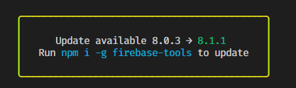
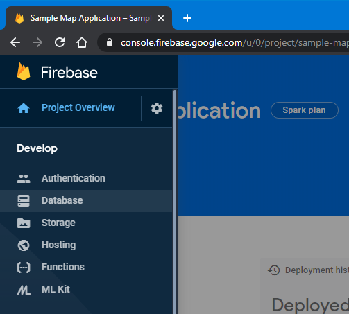
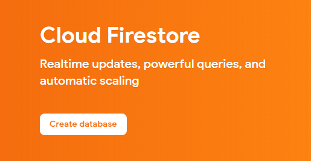
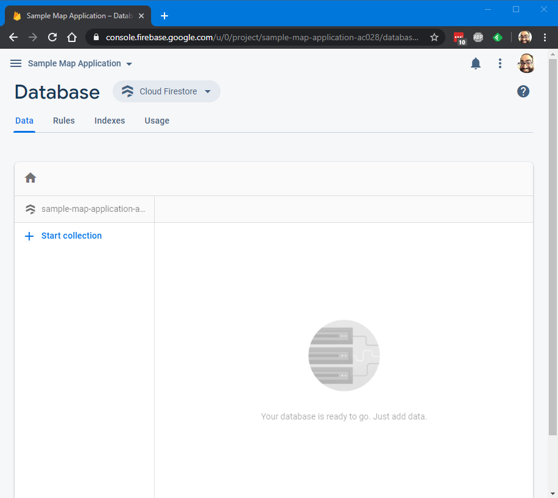

## Overview

In the last segment, we discussed how we should do data modeling and arrived at a possible data model to use with the database. This segment, we'll walk through how to setup the database and connect your frontend to it to start saving data about the map.

If you're just seeing this, you should start with the first article in the series instead: [Sample JavaScript Application Introduction](/2020-04/sample-javascript-application-introduction).

These instructions assume you're starting from the application we setup in the previous article: [Sample JavaScript Application Frontend Part 2](/2020-04/sample-javascript-application-frontend-2). If you don't have that handy, you'll need to follow the instructions in the previous articles to get a project configured that points to your own Firebase project on Google Cloud.

<!--truncate-->

## Updating Firebase Tools

If you've been following along since the beginning for a few weeks now, your Firebase tools have probably gone out of date and you'll see a message like this asking you to upgrade:



You can go ahead and run that command as-is to upgrade Firebase tools:

```sh
npm i -g firebase-tools
```

It will grind away for a bit, then you'll end up with a new version. As I mentioned before, `npm` likes to log a LOT of messages that can look frightening and erroneous, but don't worry. Unless you see some red `ERR` type messages, it's probably ok. If you want to make sure it's all right, run this command:

```sh
firebase --version
```

You'll see the new version displayed (in my case, it was upgraded even further than 8.1.1)

```sh
8.2.0
```

## Versioning

A quick word about version numbering. Most modern software tries to follow "semantic versioning". This strategy separates version numbers into four parts:

MAJOR . MINOR . PATCH - SUFFIX

- MAJOR: when this number changes, it is a "breaking" change, meaning that some things that used to work might not work anymore. Major changes could include architectural overhauls, removal of old functions or commands that are no longer supported, or changes to a file or configuration format. Take care when there is a MAJOR version change in a tool or library, it means that you should review the release notes on the website to see what exactly has changed, and if you need to perform any migration steps when upgrading. When the MAJOR version changes, it typically resets the other two numeric parts of the version to `0`. This change could also include MINOR or PATCH changes, but the MAJOR change is the most important concern for the consumer.
- MINOR: when this number changes, it is a "feature" change, meaning that something new was added to the software without breaking any existing functionality. The release notes should indicate the new features. This change could also include PATCH changes, but there was enough of a new feature to require a MINOR change increment.
- PATCH: when this number changes, it is a "bugfix" change, meaning that a defect in the software was resolved with no addition of functionality, and no breaking changes to the way the software is expected to run. This change is the most common and software will make frequent releases to address defects and incremening the PATCH version.
- SUFFIX: this is the non-numeric part of the version, it is optional and can be used to designate special conditions on this version of the software. For example, if this is a bleeding edge build that hasn't been tested much, it might end in `-dev` or `-edge` to indicate it's nature. More tested builds that are ready for feedback could be `-beta` or `-testing`. Numbers can also be mixed in like: `-beta.3` to indicate that it is the third beta.

Version numbers are flags to the consumers that something is different with this version and gives the developer some guidance on what sort of changes to expect. In my case, I upgraded from `firebase-tools-8.1.1` to `firebase-tools-8.2.0`. This was a MINOR version change, so I can expect some new features and maybe some bugfixes. Looking up the source code for `firebase-tools`, I see this: https://github.com/firebase/firebase-tools/releases. You can read up on the changes and see what might be useful (doesn't look like there was anything that affects us).

Take a look around the code for the Sample Map Application you have, see if you can find version numbers for the libraries that we're using, then look up their websites to see if there is a newer version we should be using.

## Creating the Database

Let's swing back around to the database! Before we can get started, we have to tell Google Cloud which datacenter to put our database. With the "hosting" feature, our HTML and JavaScript is distributed automatically all around the world, but for the data, we need to pick a location for it to live.

1. Access the Firebase Console in your web browser here: https://console.firebase.google.com/
2. Click on your application:
   
3. Click on the pullout menu on the left, then click "Database"
   
4. It will say "Cloud Firestore", click "Create database"
   
5. For now, we'll start in "test" mode, this will allow anyone to write to our database, and it will be sufficient to get started:
   
6. Click "Next"
7. For the location, select whatever the default "Cloud Firestore location" is set to (in my case, it was `us-central`, but for people on the west or east coast, or different countries, it may be different:
   
8. Click "Done", watch the twirling icon, and wait for the database to be created
9. Once you see the empty database screen, you're done:
   

## Setup the Database in the Project

Head back to your Visual Studio Code console, open your project folder from the previous segment, and then open the Terminal. (You can do it by clicking the "View" menu, then "Terminal").

Run this command (while shaking off the seemingly unshakeable feeling of deja vu):

```sh
firebase init
```

You'll see a warning that you are initializing in an existing Firebase project directory (which you are). Press "Enter" to continue.

Use your arrow keys and press the "Space" key to select "Firestore" and "Hosting", then press "Enter".


Press "Enter" to accept `firestore.rules` as the filename for where rules should be stored. (We'll talk about what rules are later.)

Press "Enter" to accept `firestore.indexes.json` as the filename for where indexes should be stored. (We'll talk about indexes later too!)

Accept all the defaults by pressing "Enter" through all the prompts for hosting as well. By default, it will not destroy anything you've setup already.

Once completed, your project will have some new files that you can use to configure the database. For now, you can hide the "Terminal" section of Visual Studio Code and focus on the code windows.

## Add Necessary Scripts

To actually start using the Cloud Firestore functions, we need to first add the Cloud Firestore scripts. In the code, find this section of the `index.html` file:

```javascript
<!-- update the version number as needed -->
<script defer src="/__/firebase/7.14.0/firebase-app.js"></script>
<!-- include only the Firebase features as you need -->
<!-- <script defer src="/__/firebase/7.14.0/firebase-auth.js"></script> -->
<!-- <script defer src="/__/firebase/7.14.0/firebase-database.js"></script> -->
<!-- <script defer src="/__/firebase/7.14.0/firebase-messaging.js"></script> -->
<!-- <script defer src="/__/firebase/7.14.0/firebase-storage.js"></script> -->
<!-- initialize the SDK after all desired features are loaded -->
<script defer src="/__/firebase/init.js"></script>
```

Change this segment of code to look like this:

```javascript
<!-- update the version number as needed -->
<script defer src="/__/firebase/7.14.2/firebase-app.js"></script>
<script defer src="/__/firebase/7.14.2/firebase-firestore.js"></script>
<!-- include only the Firebase features as you need -->
<!-- <script defer src="/__/firebase/7.14.2/firebase-auth.js"></script> -->
<!-- initialize the SDK after all desired features are loaded -->
<script defer src="/__/firebase/init.js"></script>
```

We will remove the other libraries that we're not using (but keep the `auth` library commented out, we'll use that later). Notice that the PATCH version for the scripts was bumped to `7.14.2` from `7.14.0`. If you want to see what was changed, you can find it here: https://firebase.google.com/support/release-notes/js.

Note: since we are hosting in Firebase, there is a reference to `/__/firebase/init.js` in the scripts that are executed. The documentation for Google Cloud Firestore will ask you to initialize the library with your access token and some other details. However, Firebase Hosting will create these automatically once you have the database created in your application's account.

## Review the Complete Example

So far, we talked through the steps that you would take once you had to modify your application to add hosting. Now we'll pull the complete example and walk through the changes in the code.

You can access the whole new project from here: https://github.com/garoyeri/sample-javascript-map-app. You can either clone the repository or just download the ZIP file:


Copy it into a new folder, then right click on the folder and click "Open with Code" to open the folder in Visual Studio Code.

Since the project is setup with my account and project, you'll need to edit `.firebaserc` to point it to your own project identifier in Firebase. When you access the [Firebase Console](https://console.firebase.google.com/), your project identifier will be in gray text under the name of your project.


In this case, the project name is "Sample Map Application" and the project identifier is `sample-map-application-ac028`. Copy the identifier name (`sample-map-application-ac028`) (yours WILL be different), and replace it in the `.firebaserc` file. For example, if your project identifier is `my-map-application-1234`:

Original File:

```json
{
  "projects": {
    "default": "sample-map-application-ac028"
  }
}
```

Modified file:

```json
{
  "projects": {
    "default": "my-map-application-1234"
  }
}
```

This will point the Firebase tooling to the project that you have permission to update (you don't have permission on my project, I guarantee it). If you do ... you should report that issue to Google Security.

Once you're done, you can deploy the new application to Firebase:

```sh
firebase deploy
```

You'll see the URL for your deployment show up:


You can access the web interface using the address next to: "Hosting URL:". In this case, it will be here: https://sample-map-application-ac028.web.app/. If you run locally using:

```sh
firebase serve
```

It will host the HTML and JavaScript locally, but the database used will be the one in Google in your Firebase account. This way, you can rapidly cycle and test changes locally, but you should be aware that you could affect the global database. In modern software development, we would create multiple applications: one for Development (developer-centric alpha testing), one for Testing (stabilization / beta testing), and one for Production (what the customers see).

## Walking through the Example

The new example application does a bit more than its predecessor. It's got some issues (don't we all) but we'll work on addressing those in future segments. We'll go through the salient points of the example and talk through how some things are done, and what changes were made after trying to operationalize the data model.

When you access the site, you'll see the map:


Depending on when you access my version, you'll see some data points added already. If you are running your own version, it will be blank.

Click anywhere on the map to set a new marker:


Click "Add Comment" to add a comment, then press "Enter" or click "OK":


(To keep things simple, I didn't add a separate input screen and used the browser's `prompt` mechanism which we would NEVER do in a real application, but works for these illustrative purposes).

Your new comment will be added to the list:


Click the "X" to close the popup.

Right now, all users share the same comment space, and no one can edit or delete comments (yet). We're not enforcing logins yet either.

Let's work through how these bits work. Go into the `index.html` file in the project and let's look around. We'll go top to bottom to discuss all the changes.

## Header Scripts

As we discussed earlier, we've upgraded the header scripts to v7.14.2, and added the new script for `firebase-firestore.js` to allow us to use the Cloud Firestore functions.

```javascript
<!-- update the version number as needed -->
<script defer src="/__/firebase/7.14.2/firebase-app.js"></script>
<script defer src="/__/firebase/7.14.2/firebase-firestore.js"></script>
<!-- include only the Firebase features as you need -->
<!-- <script defer src="/__/firebase/7.14.0/firebase-auth.js"></script> -->
<!-- initialize the SDK after all desired features are loaded -->
<script defer src="/__/firebase/init.js"></script>
```

The initialization of Leaflet remains the same.

We added a new library called `latlon-geohash`, more details here: https://www.movable-type.co.uk/scripts/geohash.html.

```javascript
<!-- geohash (note, for browser support, we need v1.1.0, not 2.0.0) -->
<script src="https://unpkg.com/latlon-geohash@1.1.0/latlon-geohash.js"
        integrity="sha384-AheDVXvZ/hJ0JCdwRU6qC7j3oVoXtgSEI+dd9WDTZ+OrSr1nqNSmqlRKl2Nfz1fG"
        crossorigin="">
</script>
```

It implements a commonly used algorithm to easily find locations that are nearby latitude / longitude coordinates. If you are interested in reading more about how Geohashing works, you can start here: https://en.wikipedia.org/wiki/Geohash. The basic thing you need to know is that geohashed coordinates that are South-y and West-y are strings that are sorted to come before geohashed coordinates that are North-y and East-y. This means that if you compare the geohashed coordinates like you were sorting strings, you could find all the coordinates inside of a box if you checked that the geohashed coordinates were greater than or equal to the Southwest coordinate and less than or equal to the Northeast coordinate (more on this later).

Note: we are using the v1.1.0 version instead of the v2.0.0 version of this library. This is because the v1.1.0 still has the older style of initialization that is simpler to use here in plain JavaScript. In a full application, I would be using some other helpers that would allow us to use v2.0.0 fully, but in our case, v1.1.0 is sufficient.

## Styles

Two new styles were added:

- `map-popup-block ul` : for the unordered list in the map-popup-block, make sure the bullets are aligned further left. The `padding-inline-start` directive removes the extra space to the left of the bullet points that's there by default.
- `map-popup-block p` : for the paragraph tag that's in the map-popup-block, remove the bottom margin between the location text and the bulleted list of comments. This makes the text more compact and looks a little nicer.

## Body Layout

The `<body>` layout is largely unchanged. A new button was added temporarily that will allow us to find all the markers with comments on the currently displayed map:


A logical next step will be to trigger finding of new comments on when the map dragging is complete. But we can deal with that later. For now, this button will call the `showComments()` function that we'll discuss in this article below.

## Firebase Initialization

In the code that was added by the Firebase tool, there's an initialization section:

```javascript
<script>
    document.addEventListener("DOMContentLoaded", function () {
        try {
	        let app = firebase.app();

    	    showComments();
        } catch (e) {
        	console.error(e);
        }
    });
</script>
```

The function inside the call to `addEventListener` is called after all the scripts and HTML have loaded for the page. A call to `showComments();` was added here so that when the page is loaded, it will look for all the comments in the default map area and show them.

## Flow of the Example Code

Before we get into the individual functions, let's quickly discuss how these functions are called in the application. This will help you get a better feel for what each function is doing. We can express these in terms of the user flows that we discussed last time.

- Given that the user is not logged in
  - When the map is first shown
    - Then the markers in the default map area with comments will be shown.
      - `showComments()`
        - `removeMarkers()`
        - `addMarkerToMap()`
  - When the user clicks or taps on a blank location on the map
    - Then the user is shown the location popup with no comments and is allowed to add a comment.
      - `onMapClick()`
        - `showPopup()`
  - When the user clicks or taps on an existing marker on the map
    - Then the user is shown the location popup with the existing comments, and is allowed to add a comment.
      - `onMapClick()`
        - `getComments()`
        - `showPopup()`
  - Given that the user is looking at the comment list popup for a location
    - When the user click "Add Comment"
      - Then the user is allowed to enter and confirm a comment to add to that location.
        - `addComment()`
          - `addCommentToMarker()`
          - `addMarker()` / `addMarkerToMap()` / `addCommentToMarker()`
          - `getComments()`
          - `showPopup()`

### showComments()

This function will check the database for markers in the current map area and display them to the user.

We start by checking the zoom level. There's an arbitrary limit of `9` for the zoom so that we are not too far zoomed out when we request map information to avoid pulling back too much data.

Next, we'll get the map bounds and encode the Southwest and Northeast corners as geohashes:

```javascript
const bounds = mymap.getBounds()
const lower = bounds.getSouthWest()
const upper = bounds.getNorthEast()
const lowerHash = Geohash.encode(lower.lat, lower.lng, 9)
const upperHash = Geohash.encode(upper.lat, upper.lng, 9)
```

You can read more on `getBounds()` here: [Leaflet Map getBounds()](https://leafletjs.com/reference-1.6.0.html#map-getbounds). It returns a `LatLngBounds` object that has methods for getting the various coordinates represented by the bounds. The bounds are the rectangle that the map is showing on the screen.

The geohash library we are using ([latlong-geohash](https://www.movable-type.co.uk/scripts/geohash.html)) provides the `Geohash` global object to let us perform the hash calculations. With the Southwest and Northeast coordinates, we can now look for a range of markers in the database within this geographical boundary.

There is a "magic" number when calculating the geohash: `9`. This is the number of digits of precision we are using to calculate the geohash which correlates to how much of an area the coordinate covers geographically. A value of `9` means that the coordinate covers approximately a 5 meter by 5 meter area. You can see the whole table on the page for [latlong-geohash](https://www.movable-type.co.uk/scripts/geohash.html).

Next, we will see our first taste of database code:

```javascript
// get the database helper object
const db = firebase.firestore()
// find all the markers that are within our bounds
db.collection("markers")
  .where("geohash", ">=", lowerHash)
  .where("geohash", "<=", upperHash)
  .limit(100)
  .get()
  .then(querySnapshot => {
    removeMarkers()

    querySnapshot.forEach(marker => {
      const data = marker.data()
      addMarkerToMap(data.latitude, data.longitude, "Location", marker.id)
    })
  })
```

Let's pull this apart and see what is going on. First, we need to get the database helper object so we can call the Cloud Firestore functions:

```javascript
const db = firebase.firestore()
```

The `firebase` object is already set globally by the Firebase initialization code. We call the `firestore()` function to get the database functions. For convenience and to keep conventions, we'll assign that to a variable `db` everywhere we need it. This will signal that any call that starts with `db.` is related to a database call. You can read more about the functions that the `db` instance contains here: [Firestore documentation](https://firebase.google.com/docs/reference/js/firebase.firestore.Firestore).

Next, we have the actual database query. This will make a call to the Cloud Firestore database and return the information requested. Keep in mind that the data is organized into collections and documents. The "markers" collection contains the map markers. And each marker has these properties:

- `latitude`
- `longitude`
- `geohash`

When we make a query, we need to establish the base context for the query first. Think of it as telling the database where to start looking. In our case, we want to start looking in the collection of "markers" to find a set of markers that fit our criteria (in this case, that fit within the bounding box).

```javascript
db.collection("markers")
```

This line will get a Cloud Firestore [CollectionReference](https://firebase.google.com/docs/reference/js/firebase.firestore.CollectionReference) you can use to access the markers data. However, we don't want to get ALL the markers, we only want the ones that fit our criteria:

```javascript
db.collections("markers")
  .where("geohash", ">=", lowerHash)
  .where("geohash", "<=", upperHash)
  .limit(100)
  .get()
```

The `where()` function calls allow us to provide extra criteria on the markers to narrow the search. In this case, we want to find the markers that are greater than or equal to the lower hash (the southwest corner) and less than or equal to the upper hash (the northeast corner).

The `limit(100)` function will allow us to set a limit on how many markers to return. If we list too many markers, it will overfill the map and make it hard to use, but also it will reduce the performance of the system pulling back too much data at once.

Finally, the `get()` function will initiate the query and return a Promise that will resolve to a [QuerySnapshot](https://firebase.google.com/docs/reference/js/firebase.firestore.QuerySnapshot) that will be used to access the query results:

```javascript
	.get()
	.then((querySnapshot) => {
		removeMarkers();

		querySnapshot.forEach((marker) => {
			const data = marker.data();
			addMarkerToMap(
				data.latitude,
				data.longitude,
				"Location",
				marker.id
			);
		});
	});

```

If you are still unfamiliar with Promises in JavaScript, read more on them here: [MDN JavaScript Promise](https://developer.mozilla.org/en-US/docs/Web/JavaScript/Reference/Global_Objects/Promise).

The callback function in the `then()` block will execute once the database query is completed. The QuerySnapshot will contain a list of the query results that you need to access using the `forEach()` function. The `forEach()` function will take a callback function as a parameter that lets you access the data for each marker. To access the actual marker data, we need to use the `data()` function to extract it. Finally, we'll take the extracted data and call our `addMarkerToMap()` function that will add the marker point to the map.

At this point, you should be asking yourself why it seems so complicated. If you're not asking yourself that question ... ask yourself that question anyway. The answer lies in wanting to keep the user interface responsive as the slower operation of going to the database is executing. The same goes for when you are accessing an API over the network: the call to the database is exactly the same thing: a request to a remote API over the network. When this happens, we always follow the same pattern:

1. Start the remote request and return a Promise immediately
2. Resolve the Promise (call the `then()` function) when the remote request has a response
3. Start to convert the response data into a JavaScript object (potentially an expensive operation if the response is BIG: we don't really know how big it will be, so we need to remain defensive), return a Promise immediately
4. Resolve the Promise (call the `then()` function) when the conversion is completed
5. Do something with the response object

In a web API request (like when we search the Nominatum service for the map locations), it looks like this:

```javascript
// 1. start the remote request
fetch(url)
  // 2. resolve the promise when responded
  .then(response =>
    // 3. start to convert the response
    response.json()
  )
  // 4. resolve the promise when converted
  .then(data =>
    // 5. do something with the response object
    doSomething(data)
  )
```

For the database call, the pattern is similar:

```javascript
// 1. start the remote request
db.collection("markers")
  .where(/* ... */)
  .get()
  // 2. resolve the promise when responded
  .then(querySnapshot => {
    querySnapshot.forEach(marker => {
      // 3. start to convert the response
      const data = marker.data()
      // 4. (skipped)
      // 5. do something with the response object
      doSomething(data)
    })
  })
```

The only difference is that converting the data, while not a Promise operation, is still an explicit function call to avoid converting data unnecessarily.

### onMapClick(e)

This function is called whenever an empty area on the map is clicked. The purpose is to generate a popup that can be used to enter comments for that location. The parameter is a [MouseEvent](https://leafletjs.com/reference-1.6.0.html#mouseevent) fired from the Leaflet library (you can read more about what is contained there on the Leaflet documentation site).

```javascript
function onMapClick(e) {
  // the MouseEvent e contains a location of where it was clicked
  const location = e.latlng
  // if the event has a "title", then it's a marker
  // we can use this chaining to ensure that the target is there and
  //  has an options and the options has a title. Otherwise, use "Location"
  const title =
    (e.target && e.target.options && e.target.options.title) || "Location"
  const markerId = e.target && e.target.options && e.target.options.markerId

  // if a marker was passed, fetch the comments for
  //  that marker and show the data
  if (markerId) {
    getComments(markerId).then(comments =>
      showPopup(location, title, comments, markerId)
    )
  } else {
    // since no marker ID was passed, assume it's
    //  a new location and don't check the database
    showPopup(location, title)
  }
}
```

The first part of this function performs some normalization of the input data. In JavaScript, you can use the logical `&&` and `||` operators to do interesting things when the left side operand is `undefined` or "false-y" in JavaScript terms.

- `left && right` : if the `left` is `undefined`, return `undefined`, otherwise, return `right`
  - This is useful when you want to perform some action on `left` using the expression on `right`. In our case, we want to see if the `e.target.options` is an accessible property.
- `left || right` : if the `left` is NOT `undefined`, return `left`, otherwise, return `right`
  - This is useful when you want to use the value of `left` unless it isn't defined. In our case, if we tried to resolve the `e.target.options.title` from the `MouseEvent` but it ended up not being available, then we want to use the constant string `"Location"` instead.

In the second half of the function, we check for a valid `markerId`. If one exists, then that means that this click was on a marker that was created from a marker in the database, and that we should make sure that any comments added are created on that marker specifically. Also, since it is an existing marker, we need to make sure to pull the comments for that marker from the database. If no marker was passed, it is a new marker and we don't need to check for any comments (there won't be any) and can just show it as a new marker with no comments.

### getComments(id)

This function will fetch a single marker using its identifier, and the top 5 most recent comments. This function takes one parameter `id` that represents the marker identifier to fetch.

```javascript
function getComments(id) {
  // find all the comments for this marker
  const db = firebase.firestore()

  return db
    .collection("markers")
    .doc(id)
    .collection("comments")
    .orderBy("timestamp", "desc")
    .limit(5)
    .get()
    .then(snapshot => {
      const comments = []
      snapshot.forEach(doc => {
        comments.push({
          message: doc.data().message,
          timestamp: doc.data().timestamp,
        })
      })

      return comments
    })
}
```

What's interesting here is that we see the structure of the database:

```javascript
// start with the "markers" collection
db.collection("markers")
  // find a specific marker by id
  .doc(id)
  // access all its comments
  .collection("comments")
```

Cloud Firestore structures data in this way: collection => document => collection => document

In this application, we are using it like this: markers => marker => comments => comment

The root collection is full of markers, then each marker has its own "comments" collection that contains "comment" documents. This gives us a few nice results:

1. We don't need to explicitly associate a comment with a marker by adding a property that references the marker identifier (id)
2. Our querying always gets comments for a particular marker, we don't have a need to go to all the comments to look for everything
3. If we need to delete a marker, all its comments will be deleted automatically

We see a new function here: `orderBy("timestamp", "desc")`. This reads as: sort the comments by their timestamp in descending order. In the case of timestamps, "ascending" order is oldest to newest and "descending" order is newest to oldest.

The next function in the query is `limit(5)`. We saw this when querying the list of markers too. We only want to see the 5 most recent comments, so we sort the comments in descending order, then only pick the first 5 comments.

Finally, we create an array and populate it with the comment text:

```javascript
.then((snapshot) => {
	const comments = [];
	snapshot.forEach((doc) => {
		comments.push({
			message: doc.data().message,
			timestamp: doc.data().timestamp,
		});
	});
	return comments;
});
```

This feels like it could be made to be less kludgy, but the Cloud Firestore `forEach()` function doesn't return anything (like an array). So we need to construct an array as we go. We initialize the array (list) of comments to an empty array, then push a new item to the end each time.

We do a "funny" thing at the end, we return a value from the `then()` callback. This will make the `then()` function return a Promise that resolves to whatever you return in the `then()` callback (in this case, an array of comment data). The result here is that we return the Promise to the caller, which can then do something interesting with the list of comments.

If you look back at the `onMapClick()` function, you'll see how we end up calling `getComments()`:

```javascript
getComments(markerId).then(comments =>
  showPopup(location, title, comments, markerId)
)
```

After the comments are loaded from the database and extracted, they'll be passed to the `showPopup()` function to display.

### showPopup(location, title, comments, markerId)

This function will show the popup on the map with the current list of comments and a button to allow the user to add new comments.

```jsx
function showPopup(location, title, comments, markerId) {
  comments = comments || []
  comments = comments.map(c => `<li>${cleanText(c.message)}</li>`)

  // Create a new popup with a dynamically generated HTML component
  //  the `` string can stretch multiple lines of code and can be
  //  used with the ${} for substitutions
  L.popup()
    .setContent(
      `
        <div style="width:200px; height: 200px;">
            <div class="map-popup-block">
                <p>${title}</p>
                <ul>
                	${comments.join("\n")}
                </ul>
                <button onClick="addComment(${location.lat}, ${location.lng} ${
        markerId ? `, '${markerId}'` : ""
      })">
                Add Comment
                </button>
            </div>
        </div>
        `
    )
    .setLatLng(location)
    .openOn(mymap)
}
```

There's a few interesting patterns to unpack here, we'll start with the comment mapping.

```javascript
comments = comments || []
comments = comments.map(c => `<li>${cleanText(c.message)}</li>`)
```

The first line is just defensive code, if you pass an `undefined` comments list (which will happen when you don't pass one at all, which will happen when you click on an empty map location with no markers).

The second line uses the JavaScript `map()` function ([MDN Array.map](https://developer.mozilla.org/en-US/docs/Web/JavaScript/Reference/Global_Objects/Array/map)). It will take an array, call a function for each element, and combine the returned values back into an array. In this case, we'll get an array of comment objects, then we'll extract the comment text, clean it, and wrap it in a `<li></li>` element. Pay attention to the backtick `` ` `` used for the string. This is a "template" syntax in JavaScript and lets you use the `${whatever}` notation to execute JavaScript code inside your string template. What you'll see later in this function is that the template literal (backtick) strings can span multiple lines, making it super easy to create a big block of text.

Let's look at the popup generation code (without the template) first:

```javascript
L.popup()
  .setContent("(content goes here)")
  .setLatLng(location)
  .openOn(mymap)
```

We've seen this code in the original version of the code, it will create a popup at a particular location on the map that the user can interact with. However, the string in the `setContent()` function can be full HTML content that will be rendered in the browser. This is both super powerful but also a little dangerous. The danger comes from the fact that the comments are user-entered strings, and we want to render them directly into a component that outputs HTML. This means that if a malicious user entered some HTML tags or `<script>` tags, they would execute in the user context. We use the `cleanText()` function to resolve this:

```javascript
function cleanText(text) {
  return text
    .replace(/&/g, "&amp;")
    .replace(/</g, "&lt;")
    .replace(/>/g, "&gt;")
}
```

This will find the offensive `&`, `<`, and `>` characters in the user-entered text and replace them with the HTML entities equivalent that will make sure they don't have any undesirable effects. In modern software application, you must always be careful about how you render user-entered text. All users are terrible people who will try and enter mean things into your application to see what happens. Case in point:


[xkcd: Exploits of a Mom](https://xkcd.com/327/)

This is a REAL problem (yes, it is). So, always sanitize your inputs, you've been warned.

Coming back to the template text:

```javascript
;`
<div style="width:200px; height: 200px;">
    <div class="map-popup-block">
        <p>${title}</p>
        <ul>
        	${comments.join("\n")}
        </ul>
        <button onClick="addComment(${location.lat}, ${location.lng} ${
  markerId ? `, '${markerId}'` : ""
})">
        	Add Comment
        </button>
    </div>
</div>
`
```

This will be rendered as HTML by the Leaflet popup, and will end up looking like this when we use it:


The spacing looks a bit strange, but you can safely disregard it. HTML will get rid of all the surrounding whitespace. What is interesting though, is that we've added an `onclick` event handler to a dynamically generated button on the popup that will call our JavaScript code when the user clicks on the "Add Comment" button.

### addComment(latitude, longitude, id)

This function will prompt the user for a comment and add it to the requested marker. However, if the marker doesn't exist yet in the database, it will need to create a new one then add the comment.

```javascript
function addComment(latitude, longitude, id) {
  const comment = prompt("What do you want to tell people about this place?")
  if (!comment) return

  // get the database helper object
  const db = firebase.firestore()

  // this uses the "ternary operator" or ? : to execute
  //  one path or the other.
  //  it's useful to reduce the need for a separate if / else block
  const operation = id
    ? // if the ID is valid, just add a comment to the marker
      addCommentToMarker(id, comment)
    : // if the ID was not valid, create a new marker, then add a comment
      addMarker(latitude, longitude).then(newMarker => {
        // since we added a new marker, make sure
        //  it shows up on the map
        addMarkerToMap(latitude, longitude, "Location", newMarker.id)
        return addCommentToMarker(newMarker.id, comment)
      })

  // we don't have to chain the promise immediately,
  //  we can wait and do it later (like here)
  operation.then(newComment => {
    // comment parent is collection of comments,
    //  then its parent is the marker
    const markerId = newComment.parent.parent.id

    getComments(markerId).then(comments =>
      showPopup(
        // make an object that smells like a Leaflet LatLng
        { lat: latitude, lng: longitude },
        "Location",
        comments,
        markerId
      )
    )
  })
}
```

This is a longer function, so let's break it down and see what's going on. First, we decide whether we need to just add a comment to an existing marker or first add a new marker, then add a comment to it. These situations are handled differently:

- If a new marker needs to be created, then we need to: (1) add the marker to the database, (2) add the comment to the new marker, and (3) add the marker to the map so that it shows up with a marker icon.
- If a new marker doesn't need to be created, then we just add a comment to the existing marker in the database.

In both cases, we proceed to the second half of the function, which is to get the updated list of comments from the database and display a new popup with the new comment list.

The only new thing in this function is this strange notation:

```javascript
const markerId = newComment.parent.parent.id
```

In this code snippet, `newComment` is the [Cloud Firestore DocumentReference](https://firebase.google.com/docs/reference/js/firebase.firestore.DocumentReference) that is returned from the `addCommentToMarker()` function. This object has a `parent` property that can be used to navigate up the object chain. Remember that a comment has this hierarchy:

markers => marker => comments => comment

However, if we start at the `comment` level, then we can use the `parent` properties to work from right-to-left:

1. `comment.parent` : `comments` collection
2. `comments.parent` : `marker` document
3. `marker.id` : the identifier for the marker that contains the comment that was just added

You'll notice that there is no Promise here. This means that the call is local and the data is already available to Cloud Firestore and the web page won't need to make a remote call to capture that information.

### addMarker(latitude, longitude)

This function adds a marker to the database.

```javascript
function addMarker(latitude, longitude) {
  // get the database helper object
  const db = firebase.firestore()

  return db.collection("markers").add({
    latitude,
    longitude,
    geohash: Geohash.encode(latitude, longitude, 9),
  })
}
```

The Firestore CollectionReference for the "markers" has an `add()` function that adds a new entry to the database and returns a Promise that resolves to the new entry.

### addCommentToMarker()

This function adds a comment to an existing marker in the database.

```javascript
function addCommentToMarker(id, comment) {
  // get the database helper object
  const db = firebase.firestore()

  return db
    .collection("markers")
    .doc(id)
    .collection("comments")
    .add({
      message: comment,
      timestamp: new Date(),
    })
}
```

Since we're wanting to add a comment to a marker, we need to identify the marker first, then dig down into the comment. This is why we do the dance of collection . document . collection.

Dates are funny in JavaScript (not funny, haha, but funny ... oh.). For this project, we're not manipulating the dates, only marking the current date / time to tell the database when a comment was made. The `new Date()` code will return a [Date](https://developer.mozilla.org/en-US/docs/Web/JavaScript/Reference/Global_Objects/Date) that represents the current date and time. For doing anything more that this triviality with dates in JavaScript, I recommend reading into the [JavaScript Moment](https://momentjs.com/) library, which is spectacular, but out of scope for this discussion.

## How do I know it's working?

Well, aside from running the application and seeing the markers appear and the comments appear, you can see all the data in the database by going into the Firebase console: https://console.firebase.google.com/, clicking on your application, then on the left side, click Database.

You can then browse all the data in your database in the web browser:


The collections are labeled, and you can edit the data as well in the browser, then reload the web page to see the new data appear. If you want to see the comments for a marker, select a marker document, then click "comments" to see the comments collection for that marker:


And that's it! What's still missing? Well, we need to authenticate users and setup the three different role levels: Readers, Writers, Superusers, then we need to add "Edit" and "Delete" functionality.

## Today I Learned

Manipulating the database in Cloud Firestore is fairly simple, we don't need to do a lot of ceremony or setup, and once we start adding data, the structures in the database are created automatically. The online console makes it easy to see if we're using it properly and to make tweaks to the data during the development process.

Now that we've been adding a lot more functions to the code, the `index.html` file is starting to get a bit unwieldy. It would be good to start to split some of this functionality apart so we can organize our application into logical parts better.

This version added some more structured documentation using the [JSDoc](https://jsdoc.app/) format. This format allows Visual Studio Code to give some more hints as you use the code to remember what values to pass to the functions and what sort of objects they return. As you mess around with the code, you'll find you get more hints that you did with the previous sample.

When developing real-world JavaScript applications, there are a LOT more things to consider like input validation, remote calls, and security that don't always show up in the classroom environment. Modern software projects tend to use bigger, more complex frameworks that increase the amount of code in the system you don't see, but also can simplify the common things that you do with code and help you organize your application better. There is a delicate balance between the complexity of the runtime application and the ease of adding new features at development time.
