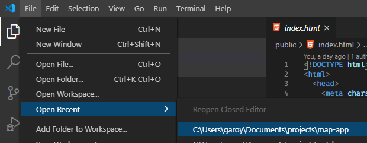
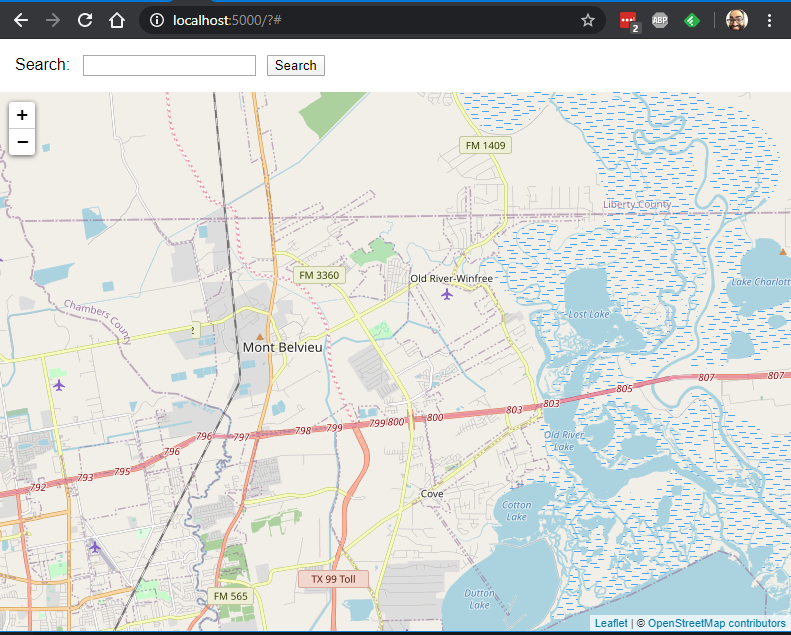
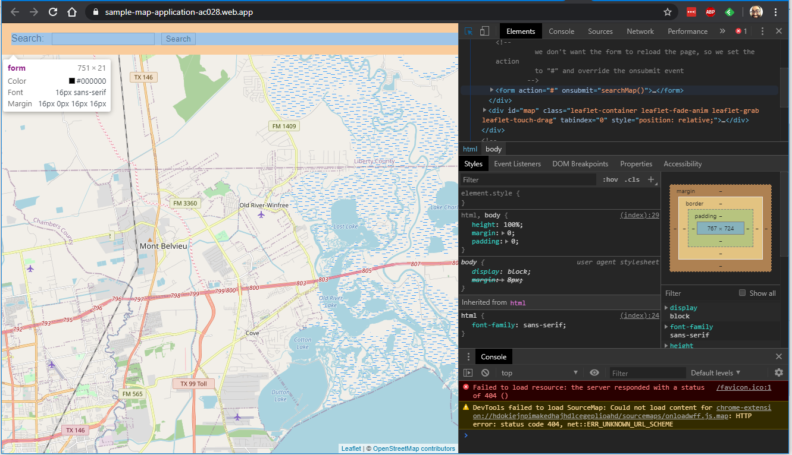
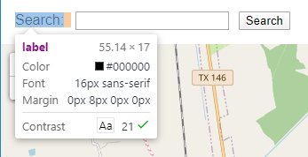
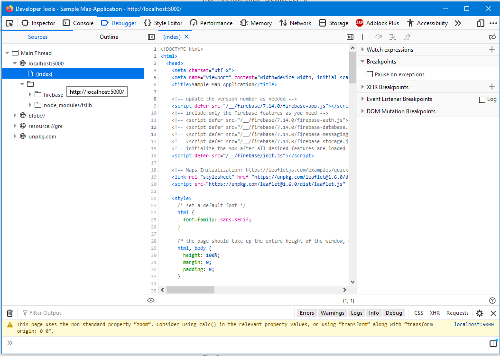
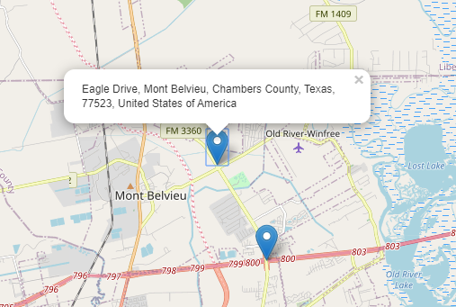

## Overview ##

In the last segment, we setup an initial empty Firebase application and got environment working. Now we'll add a new frontend to the application to show a simple map view and let us search for our current location and other useful things.

If you're just seeing this, you should start with the first article in the series instead: [Sample JavaScript Application Introduction](sample-javascript-application-introduction).

These instructions will walk through updating the frontend to add a free map control and have it do some searching for us.

<!--truncate-->

## Looking at our Project in Visual Studio Code ##

At the end of the previous article if you were following along, you would've launched Visual Studio Code to see the project folder. If you launch Visual Studio Code right now, you should either see that same folder, or you may need to find it in your recent items.



Once we have the folder open in Visual Studio Code, we can easily get to the terminal from within here, and we can manipulate the HTML files. Since this may be your first time using Visual Studio Code, we can do a quick tour.

On the left side, you'll see some icons that represent which left-side pane to show.


Your icons may look different from mine (I'm using a "Dark" mode theme and I have a few more extensions installed that add extra functionality to the environment).

The first icon is for your "Explorer" which shows the files that are available in your project.

The second icon (the magnifying glass) is a "Search" function that lets you search for words across all your files.

The third icon is for Source Control (Git specifically) which lets you save your work.

The rest you can read on your own through the [Visual Studio Code Documentation](https://code.visualstudio.com/docs).

## Adding Maps to the Frontend ##

Finally, we'll be adding a Map to the application. Make sure the "Explorer" pane is open (click on the first icon at the top left in Visual Studio Code), then expand the `public` folder by clicking on it, then double-click `index.html`.

You'll see the template that was generated by Firebase. We need to get rid of the Firebase message and add our Map instead. You can find the new map code here:

https://gist.github.com/garoyeri/54bbc513c21372e2002ece959d578ff1

The comments are posted within the code, and we'll talk about a few key sections. But for now, copy the whole contents, delete everything in your `index.html` and replace it with this file. Then save your changes.

In the Terminal view, run:

```sh
firebase serve
```

And navigate to: http://localhost:5000 to see the result.



This example uses a few useful libraries:

1. [Leaflet](https://leafletjs.com/): an open source mapping library that can use many different available mapping data sources ([BSD-2 License](https://github.com/Leaflet/Leaflet/blob/master/LICENSE))
2. [OpenStreetMap](https://www.openstreetmap.org/): open source map data that's available for fair use, attribution is required ([Open Data Commons Database License](https://opendatacommons.org/licenses/odbl/))

Open source libraries are freely available for just about any function you can imagine, however, you need to be careful of the license under which the software is offered. When in doubt, consult a legal professional (I'm not one). You can find a lot more information here: [Software Licenses in Plain English](https://tldrlegal.com/).

You can also deploy this to your Firebase account:

```sh
firebase deploy
```

and it will be accessible using your Firebase web address. For example: [https://sample-map-application-ac028.web.app/](https://sample-map-application-ac028.web.app/).

## Layout of the Page ##

When you think of a website or a web application, you must first consider the layout. This page has a fairly simple layout:

---

*Search Box and Header*

---


*Map Body*


---

And that's pretty much it.

To make this simple, we're using a tool in CSS called "[Flexbox](https://css-tricks.com/snippets/css/a-guide-to-flexbox/)". This allows us to setup a few simple rules for how each box should be laid out and resized.

```html
<div class="mapcontainer">
    <!-- search box and header -->
    <div>
        <!-- removed for simplicity -->
    </div>
    <!-- Map Body -->
    <div id="map"></div>
</div>
```

We want the search box to be a "normal" size and take the whole horizontal space, and we want the map to fill the rest of the vertical space. Here's what the main part looks like with the basic styles applied inline:

```html
<div class="mapcontainer"
     style="display: flex; flex-direction: column; min-height: 100vh;">
    <!-- search box and header -->
    <div>
        <!-- removed for simplicity -->
    </div>
    <!-- Map Body -->
    <div id="map" style="flex-grow: 1;"></div>
</div>
```

Here's the breakdown:

* `display: flex` => this will set the whole `<div>` to display in a "flexbox" mode for its immediate child elements (in this case, the two `<div>` tags)
* `flex-direction: column` => arrange the elements in the flexbox container vertically top to bottom (by default it means fill up the horizontal space)
* `min-height: 100vh` => take up all (100%) of the vertical height (vh) for the flexbox container
* The first `<div>` inside the container doesn't have any styles, by default it will just take up as much space as it needs.
* The second `<div>` has a style of `flex-grow: 1` which tells it to grow to fill up the space depending on how big the box is. Since the container is set to `flex-direction: column`, this means it will grow vertically.

The result is that the map will fill up all the space and go edge to edge. Instead of applying the styles inline, we use the CSS rules in a `<style>` block in the `<head>` to keep the main markup area clean.

Let's take a look at the `<style>` block and see what's in there:

This block will set a default sans-serif font for the page (I personally find it easier to read, but your style may differ, try taking this out to see the default font instead).

```css
html {
    font-family: sans-serif;
}
```

This block will set the page margins to go edge to edge:

```css
html, body {
    height: 100%;
    margin: 0;
    padding: 0;
}
```

This block will directly set the style for the `id="map"` component and set it to grow and fill the space:

```css
#map {
    flex-grow: 1;
}
```

This block will set the flex container settings. The `.name` notation will match a `class="name"` attribute on the element.

```css
.mapcontainer {
    display: flex;
    flex-direction: column;
    min-height: 100vh;
}
```

This block will set margins for any `<form>` that sits inside any `<div>` inside the `class="mapcontainer"` element:

```css
.mapcontainer div form {
    /* margin: top, right, bottom, left */
    margin: 1em 0 1em 1em;
    /* note: 'em' is the size of the letter 'm' in the current font */
}
```

And this block will set the margins for all elements inside the `<form>` inside the `class="mapcontainer"`, allowing those items to be spaced out. The `*` means match all HTML elements inside the `<form>`:

```css
/* space out all the components inside the mapcontainer form */
.mapcontainer form * {
    margin-right: 0.5em;
}
```

There are a few weird units on items in this stylesheet:

* `em`: this represents the side of the letter `m` in the current system font, it's typically used to designate sizes that can change when the font size changes. If the default font is bigger, then the size of an `em` will increase in pixels.
* `vh`: this represents a percentage of viewport height. The viewport is the visible part of the web browser window. If you resize the browser window, the viewport size changes. If you had only set this to `height`, then it's possible it would be fixed in place and when you resize the browser, it would not resize as you expect.

If you want to see all these styles in action, you should use the Developer Tools in your browser (most browsers have one). You can find it in a "Tools" or "More Tools" menu. Click it and you'll see something like this (example is from Google Chrome, but Firefox has a similar one):


By default, it'll be docked on the side of your browser. If you click on the "Element finder": , you can hover on any element in the web browser area and see it in the source code:



You'll also see any style rules that apply to the element, and the "box sizing" of the element to see size, margin and padding. You can also adjust the style of elements within the browser window. If you mess things up too bad, just reload the page to reset it.

For example, hovering over the "Search" label gives you some more detail too:



Software developers use this mode a lot to figure out how the web page is working, and we can do troubleshooting as well. To see the developer tools bigger, you can click the  menu at the top right of the developer tools part (not the one next to my face) and click the "Undock" icon  to pop the developer tools out into their own window (preferred).

## Looking at the JavaScript Code ##

Now that you've got the Developer Tools undocked, make the window bigger and click on the "Scripts" tab (for Firefox, click "Debugger"):


Firefox:



On the left side, find and click the `(index)` item.  (you may need to reload the page)

In the center pane, you can scroll down to see the scripts. Find the `searchMap()` function, and click on the line `163`:

 

This will set a "breakpoint" on the line. This means that when the browser executes the script, it will stop here. Try going back to the map now and enter a search term: `Eagle Drive` then click "Search".


You'll hop into the Developer Tools window and see the current line of code highlighted:


Click the  icon to "step" over the line of code and onto the next one. Next, move your mouse and hover over the `location` variable name:


The Developer Tools will show you the value of the variable. In this case, it contains two properties: `_northEast` and `_southWest`.  If you expand the `__proto__` item, you'll see all the functions that are available on this object. This is a `LatLngBounds` object ([LatLngBounds](https://leafletjs.com/reference-1.6.0.html#latlngbounds)) returned from the `getBounds()` function: [GetBounds()](https://leafletjs.com/reference-1.6.0.html#map-getbounds). 

You can use this Debugger to step through each line of code and see how it works by clicking the same button. When you want to let it run all the way through, click the "Run" button . Click on the breakpoint line again to remove the breakpoint so it won't stop there next time.

## What does this even do? ##

Right now, the code will display a map from a default location (defined in the code), and let you search for an address that is available in [OpenStreetMap Nominatim](https://nominatim.openstreetmap.org/). This service is freely available (Google Maps is much better, but you need to setup a key and enter a credit card number), and is perfect for a simple example. The code will use the `fetch()` function to search Nominatim for a particular address or point of interest, limited by where the map is zoomed at the time, and only in the United States.

If it finds any results, it will add markers to the map you can click to see more detail. For example, searching for `Eagle Drive` will set a marker here:



You'll see a second marker for a different `Eagle Drive` in a different county. This is the way the data in the map is organized, the more information you provide, the more likely you'll find the target you expect.

OpenStreetMap doesn't have street number information for all addresses, so you may find that looking for a specific number doesn't quite give you the right marker. In this case, you get what you pay for, and this will be good enough for our purposes. Most map-related applications tend to focus on Latitude / Longitude anyway, and those functions work just fine here.

For now, explore the code on your own and see what it does and how it works. Use the Debugger tool to poke around, and read the comments (many more comments than a software developer typically puts in the code).

## Today I Learned ##

Flexbox is a simple way to organize my layouts, but requires some research and experimentation. There's a good demo here: [CSS Tricks: a Guide to Flexbox](https://css-tricks.com/snippets/css/a-guide-to-flexbox/) to help you visualize what the different settings can do.

All the major browsers have a Developer Tools function, but they all work slightly differently. However, the basic functions of "Inspecting Elements" and "Debugging Scripts" are available. I should look at each browser and see which ones has tools that I like better and use that one.

Leaflet has some good documentation on its API Library and is fairly simple to use once you see an example. However, the map data itself is not perfect and is community built. This means that address searching may not always behave as nicely as Google Maps.


