## Overview ##

This series of posts describes how you can build up a simple web application hosted on Google Cloud to allow users to store extra information about locations on a map. It's meant for people who are just getting into JavaScript and have at least basic knowledge of how it works. When there's a more advanced concept, I'll try to explain it a bit more fully. The goal is to have a simple application that you can build and host that you can think of as a "real" application.

I'm writing this series after being a teaching assistant for a high school [Computer Science Discoveries](https://code.org/educate/csd) class through [TEALS](https://www.microsoft.com/en-us/teals). Some students are (hopefully) interested in how to take the assignments they've done in class to the next level.

You can run this tutorial on any computer: Windows, Mac, or Linux. If you are on a Chromebook or otherwise running ChromeOS, you may have some challenges to getting Visual Studio Code and NodeJS running on there, but you'll need to turn on "Linux App" support then you can treat it like a "Debian Linux" install.

<!--truncate-->

## Install Some Software ##

We're going to setup everything in JavaScript (or at least mostly) so you'll need to get the JavaScript tools (Node JS), a code editor (Visual Studio Code), and configure a few things. The goal here is to have enough to run the example and be able to make some changes.

Install "Node JS" here: https://nodejs.org/en/ (except if you're using MacOS, read below for better instructions). Follow the instructions online to install the "LTS" version onto your machine. When you go to that website, it should show you instructions that work for whatever computer you're using.

* Note: if you're running in Windows or Linux, the regular instructions will work fine, but for MacOS, follow the instructions here to install `nvm` which will install NodeJS for your current user properly.

```sh
curl -o- https://raw.githubusercontent.com/nvm-sh/nvm/v0.35.3/install.sh | bash
nvm install --lts
nvm use --lts
```

Install "Visual Studio Code" here: https://code.visualstudio.com/. Go for the "Stable Build" for your computer. It won't ask too many questions and it'll install the basics of what you need.

Once you install Visual Studio Code, be sure to follow the "Getting Started" instructions here:

* Windows Users: when running setup, be sure to select "Run Visual Studio Code from the command line" to allow you to run it from anywhere by running: `code .`
* Mac Users: https://code.visualstudio.com/docs/setup/mac
* Linux / ChromeOS Users: (you shouldn't need to do anything else special)

Install "Git" from here: https://git-scm.com/. It will be used to pull down the code from online so you can try it out. It will install properly on most / all operating systems.

## Create a Folder for your Project ##

We're going to cheat a little bit and use Visual Studio Code to create a new folder and run our terminal. Launch Visual Studio Code in the usual manner of your operating system. You should see the startup screen:

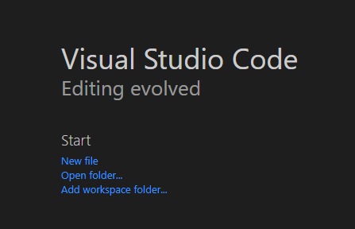

Click "Open folder..."

In the window that opens up, create a new folder called "SampleApp" in your "Documents" or "Desktop" folder, then select it to open it in Visual Studio Code.

Next, you'll need to open a terminal into this folder. Click on the "View" menu, then click "Terminal"

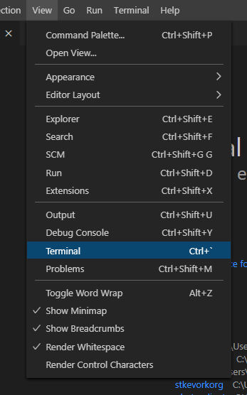

You'll see a Terminal pop up on the bottom half of the screen. You'll use this to type in commands from this guide.

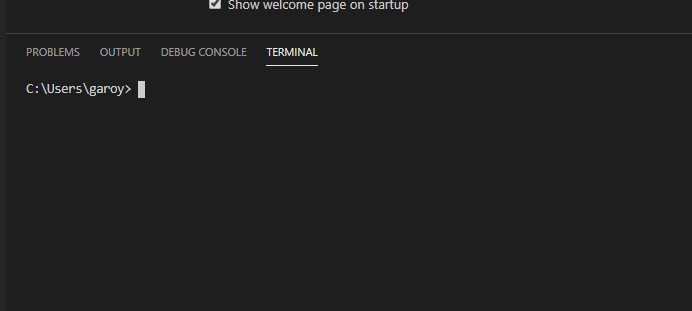

To see if everything is working, try running this command:

```sh
npm -v
```

You should see a response like this (your version *might* differ, but not by much):

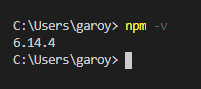

Now you're ready to do the next steps and setup Firebase.

## Setup Firebase ##

Firebase is a Google service that can host your applications and data. It is connected with your Google account on Google Cloud. You may not be able to use a "School" account for this, but try it out anyway and see what happens. Once you no longer have access to that School account, you will no longer have access to the Google Cloud resources, so be careful about what account you plan on using.

There are overall instructions here: https://firebase.google.com/docs/web/setup, but we're going to hit the highlights.

You'll need to create the cloud resources for Firebase before you can get started with the sample application. This will configure your access to the resources and setup the "free" tier of the service so you don't get billed (but you'll also get limited on how much you can use).

Navigate to the Firebase site in your browser: https://console.firebase.google.com/

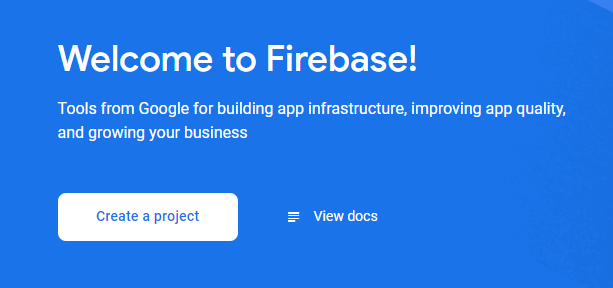

Click "Create a project".

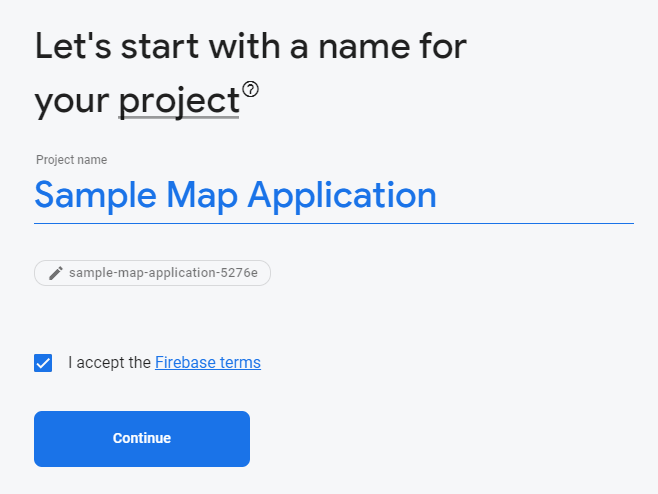

Give your project a name: "Sample Map Application" in this case, check the box to accept the terms, and click "Continue" to create the project.

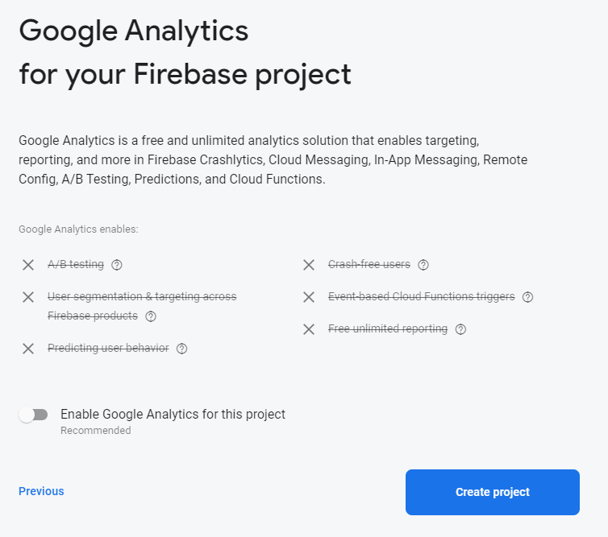

Turn off Google Analytics for now (we can add it later), then click "Create project".

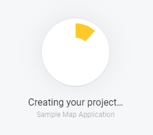

You'll see the progress indication (it may take a minute or so). Wait for it to complete, then click "Continue".

This will start your application on the "Spark plan" which is a "Free" tier with limitations. Since you're not scaling this out to a ton of users (yet), it's ok.

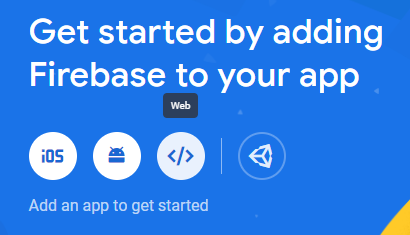

Click on the "Web" icon: `</>` to get started.

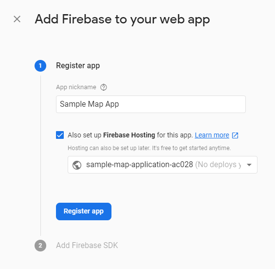

Enter a nickname for your app ("Sample Map App" in this case), then check the box to setup "Firebase Hosting" that will allow Firebase to host your HTML and JavaScript files. Click "Register app".

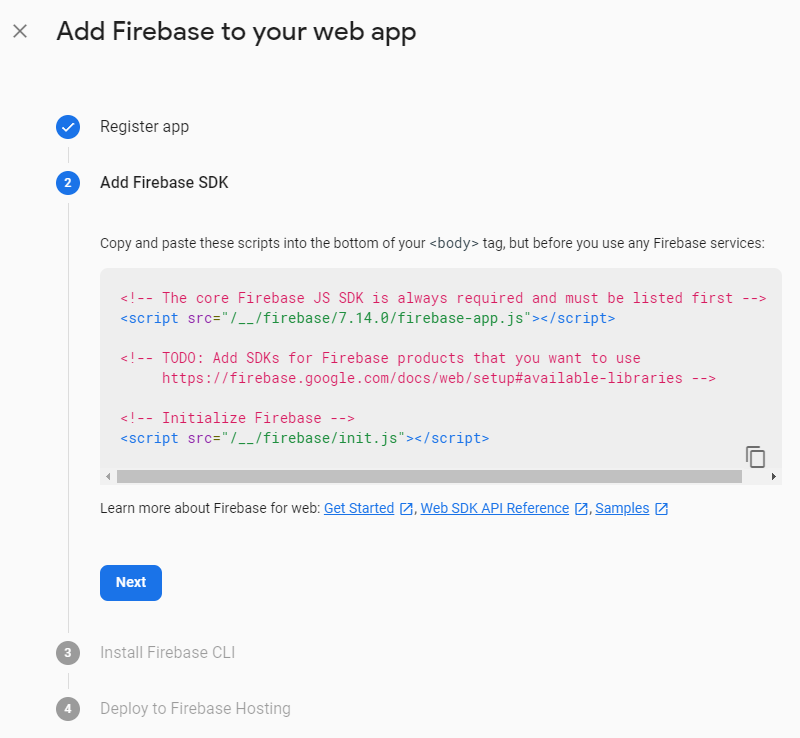

We'll do this later on, so click "Next".

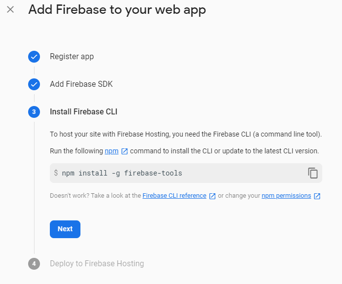

We will need to install these tools. So navigate to your terminal or command prompt window and run the following command:

```sh
npm install -g firebase-tools
```

It will take a minute to download all the necessary pieces.

Once complete, go back to the browser and click "Next"

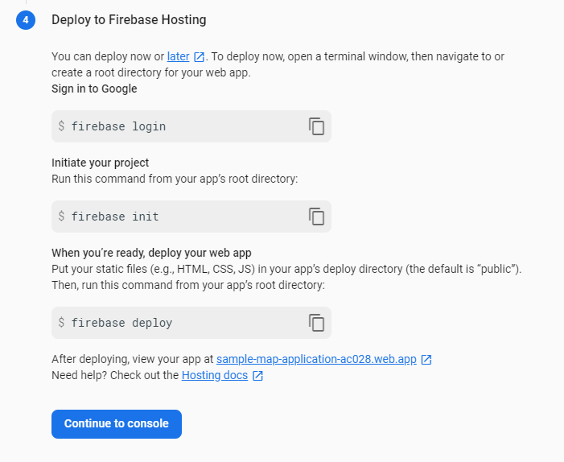

From the terminal, run this command:

```sh
firebase login
```

It will ask if you want to enable usage reporting, you can safely say "n" here for "no"

```
? Allow Firebase to collect CLI usage and error reporting information? (Y/n) 
```

It will open a web browser and ask you to login to your Google account that you want to use for Cloud. Follow the prompts to grant permission for Firebase to access your account, then close the browser tab.

You should see a "success" message on the terminal or command prompt.

At this point, we are building a sample app from scratch, so you'll run the initialization command:

```sh
firebase init
```

You'll see a prompt asking if you're ready:

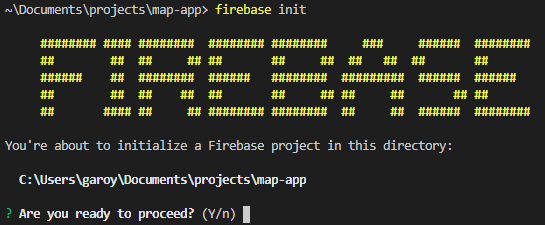

Type "y" and press "Enter" to start.

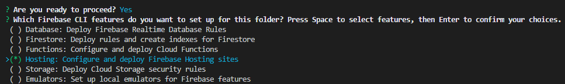

Use the arrow keys and press the spacebar to select "Hosting", then press "Enter" (we'll setup "Firestore" later).

Select "Use an existing project" and press "Enter"

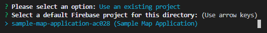

There will be only one project if this is your first one, press "Enter" to continue.

 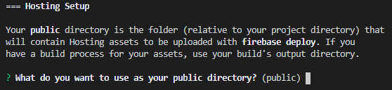

Press "Enter" to accept the default directory name "public".

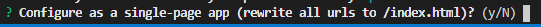

Press "Enter" to NOT configure as a single-page app (we're not using that feature at the moment).

At this point, you'll have a template setup and ready to go. We can try it out right now by using the Firebase tool to run the application locally. Use this command:

```sh
firebase serve
```

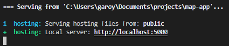

You can see your application here: http://localhost:5000

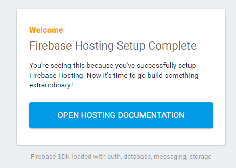

To stop the application, go back to your command prompt or terminal window and press "CTRL" + "C" to stop it. If it asks to terminate a batch job, just press "Y" and press "Enter" to continue.

Back in your other browser tab that was setting up the Firebase project, click "Continue to console" to go back and see the overall application. You can use this console later to add new features to the application.

## Seeing the Files in Visual Studio Code ##

From the command prompt or terminal window, run Visual Studio Code like this:

```sh
code .
```

This will launch "Visual Studio Code" in the current folder where your project is.

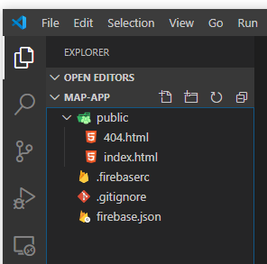

On the left side, you'll see all your files.

* `public`: this folder contains all your web page files that will be shown to the world!
  * `404.html`: this page is what shows up when you hit a broken link or someone tries to access a page that doesn't exist.
  * `index.html`: the main page for your website that shows up first (right now it has some template content from Firebase).
* `.firebaserc`: this contains files that point to where your project is hosted. It references the project name which is tied to a specific Google account. This file doesn't contain anything sensitive, because users won't be able to access the project details without logging in using `firebase login` first.
* `.gitignore`: when you start to use Git for tracking changes and saving them in the cloud, this has a list of default files to be ignored.
* `firebase.json`: configuration file for your Firebase project. Right now, it just contains hosting information, but it will later contain database details as well.

To deploy your application to the cloud, go back to your command prompt or terminal window and run this command:

```sh
firebase deploy
```

You'll see two links, one for the project console and one for the live online hosted site:

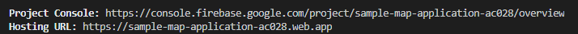

You can copy the "Hosting URL" into your browser and see the live site:

(spoiler: it looks the same as the one you ran locally, but see the URL, it's out on the internet and you can get to it from your phone too). You can use my sample link here: https://sample-map-application-ac028.web.app/ (though at the point you're reading this, that will contain the whole sample 🤓 )

## Today I Learned ##

Getting setup with Firebase is not that terrible. Their "Free" tier offerings are pretty generous and the command line tooling is reasonably straight-forward to get started. Just hosting static content is nice, and without any other processing, you can get by for a small project (1GB storage, 10GB download). If you stick with the CDN hosted JavaScript libraries, you won't get anywhere near that 10GB for a while.

As I was trying to gear this article to complete beginners, I found there's a lot of things that I take for granted explaining to someone who has gone through a few more programming classes versus complete beginners. There are some skills you'll need to pick up like working in a command-line / terminal environment.
