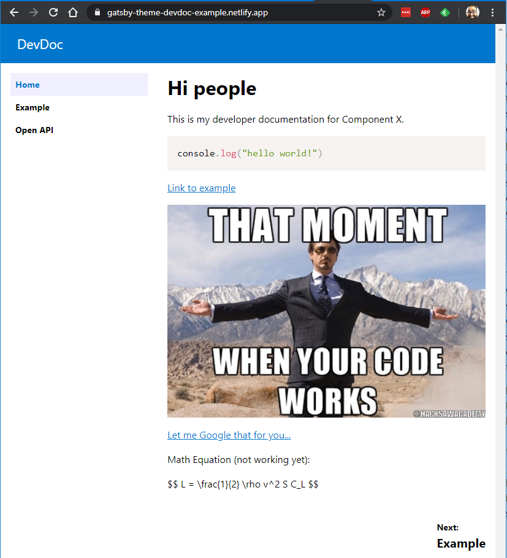

## Gatsby JS and MDX

I'm a fan of nice documentation. You know the kind: it has the right examples for all the complicated stuff, sane organization of all the topics, and isn't just an autogenerated list of all the function names or API actions. Solid documentation is one of those rare vintages that you slowly imbibe and learn every nuance and tasting note of it. I'm sure I'm not the only one, you can confide in me (and the Internet). I'm going to let my documentation freak flag fly high and proud!

<!--truncate-->

Not surprisingly, when I thought about putting together a way to generate standalone, statically hostable documentation, I turned to the tool that has its own well-organized, example-laden, good to the last drop documentation site: [Gatsby](https://www.gatsby.org/docs/). If you haven't heard, Gatsby is:

> Gatsby is a free and open source framework based on React that helps developers build blazing fast **websites** and **apps**

This very blog (at least at the time of this writing) is generated from Gatsby. The TLDR version: Gatsby uses JavaScript modules to convert content of various dispositions and sources (both file-based or service-based) and generate React-based, statically hostable websites (there's GraphQL baked in there as well to glue it all together). You can do some weird stuff if you wanted, for example: correlate your Google Calendar with your Twitter feed and create a timeline of all the tweets that you missed during your busy calendar times, then format it into mobile-friendly web page. Wow. So useful.

However, it does have some redeeming qualities, primarily the MDX JS library. MDX is Markdown + JSX and lets you write Markdown files that can also contain JSX code and markup. If you want to know more gory details, head over to the [MDX](https://mdxjs.com/) page.

## Gatsby-Theme-DevDoc

I'm not going to go into how a Gatsby theme works or how you too can make one. That information is generously hosted over on [Gatsby: Themes](https://www.gatsby.org/docs/themes/). Instead, I'll focus on what the sample project looks like and how you can use it. You can jump into the example site here: https://gatsby-theme-devdoc-example.netlify.app/, and look at the source code that generated it here: https://github.com/garoyeri/gatsby-theme-devdoc/tree/master/example (the theme itself is in that same repository).

Here's a screenshot if you're impatient:



To generate this site, we start with a template like this one: https://github.com/garoyeri/gatsby-starter-devdoc. If you want to run it on your own, you can clone it into a new folder, then:

```shell
npm install
npm run develop
```

And after the entire Internet is downloaded into your `node_modules` folder, you'll get a local site running on http://localhost:8000. But let's take a deeper dive into what's in there.

### package.json

A plain, ordinary `package.json` file, nothing terribly fancy. It has some dependencies that we should review:

* `gatsby`: the Gatsby (`gatsby`) command line tool used for compiling the site, it's similar to `react-scripts` in that it will manage the WebPack configuration and provide baseline tools.
* `gatsby-theme-devdoc`: this is the theme that includes all the plugins and configuration for building up the documentation site.
* `react` and `react-dom`: you need to pull these in at the top level to force the rest of the environment to use the version of React that YOU want to use.

The scripts are pretty simple too:

* `develop`: build up the development site, watch for changes and regenerate, hosted on http://localhost:8000.
* `build`: build the statically hostable version of the site and dump it into the `public` folder.
* `clean`: delete the `.cache` folder that Gatsby generates and any intermediate build content. Sometimes things get out of whack and you need to reset them to start from a clean slate.
* `serve`: after running the `build` task, serve up the static folder on http://localhost:9000.

Most of the time, you'll be running `develop` and building up your content. For your deployment into your web host, you'll run `build` once and deploy the contents of the `public` folder.

If you're a fan of `yarn`, go ahead and delete the `package-lock.json` file and run: `yarn install` to setup for `yarn`. (I haven't tried it with yarn v2.x yet).

### gatsby-config.js

This file is picked up by Gatsby during the build process. It must be named `gatsby-config.js` and most of them will have a similar look and feel.

```javascript
module.exports = {
	// define your site title, description,
    // and author information that 
    // will get embedded into the header
    siteMetadata: {
        title: "DevDoc Starter",
        description: "Use this site to communicate the details of your API",
        author: "@garoyeri",
    },
    plugins: [
        // include the main theme (there are no options
        // yet, but there may be in the future)
        {
            resolve: `gatsby-theme-devdoc`,
            options: {},
        },
        // make sure to capture the pages as a file source,
        // the main effect here is to capture any images or
        // other files you put alongside the pages
        {
            resolve: `gatsby-source-filesystem`,
            options: {
                name: `pages`,
                path: `${__dirname}/src/pages`,
            },
        },
        // any images that you want to refer to as part
        // of the header or metadata should go here
        {
            resolve: `gatsby-source-filesystem`,
            options: {
                name: `images`,
                path: `${__dirname}/src/images`,
            },
        },
        // setup your site to be ready to be a PWA. This
        // helps when you bookmark the page as a home
        // screen icon on a phone.
        {
            resolve: `gatsby-plugin-manifest`,
            options: {
                name: "gatsby-starter-devdoc",
                short_name: "DevDoc Starter",
                start_url: "/",
                background_color: "#07C",
                theme_color: "#07C",
                display: "browser",
                icon: "src/images/gatsby-icon.png", // This path is relative to the root of the site.
            },
        },
    ],
};
```

If you look at the `gatsby-theme-devdoc` repository, you'll notice it has its own `gatsby-config.js` file (that has a LOT more stuff). When you include other plugins, Gatsby will include their configuration files as well. The order of plugins is important, and they will be processed from top to bottom. Some plugins on the [Gatsby Plugins Library](https://www.gatsby.org/plugins/) will have some warnings about which plugins need to come before or after other plugins.

### src/gatsby-theme-devdoc/sidebar.mdx

Your intuition is not deceiving you, it is not a coincidence that the folder name is `gatsby-theme-devdoc`. Gatsby themes support a mechanism called ["Shadowing"](https://www.gatsby.org/docs/themes/shadowing/) that allows you to override files from a parent theme (or plugin).

**BEWARE:** if your theme or plugin doesn't start with the text: `gatsby-`, then the Shadowing WILL NOT WORK. The Gatsby build process puts special consideration towards anything that starts with its own name and treats it particularly well. This is also a good indicator of libraries that can't just be included, but must be configured in a `gatsby-config.js` somehow.

Ok, so the MDX file is just a simple unordered list of links. This file will end up on the left side of the website as a menu of page links, but will also inform the "Previous Page" / "Next Page" links at the bottom of the page. You can add other content to the sidebar as well.

### src/pages/whatever.mdx (or .md)

Any Markdown pages (either .mdx or .md) you place in this folder will get converted into documentation pages. For example:

```mdx
---
title: My Special Documentation Page
---

Let me tell you all about how my documentation got twist-turned upside down...
```

The hyphenated section at the top (the [frontmatter](https://www.gatsby.org/docs/mdx/writing-pages/#using-frontmatter-in-mdx)), has an optional `title` tag that can override the title of the page in the HTML header. If you leave it off, it won't hurt anything. You can add extra content to the frontmatter if you want, and add some regular Gatsby pages (or MDX) to do something with it. [MDX supports embedding GraphQL](https://www.gatsby.org/docs/mdx/writing-pages/#graphql-queries) queries that you can use to either pull metadata content about the site, or act on other input sources that you add in your own site or are already generated from the theme or other plugins. To see what you could mess around with, run `npm run develop`, then access the GraphQL console: http://localhost:8000/__graphql. The Gatsby documentation is a great source of guidance on some of the possibilities.

The GraphQL querying typically happens at compile time. In fact, most of the site generation voodoo happens at compile time to make runtime as fast as possible.

### Markdown: PrismJS

PrismJS is configured and included to all syntax coloring to your preformatted Markdown blocks. Just include your language name ([Prism JS Supported Languages](https://prismjs.com/#supported-languages)) and it will do its best to render the text nicely. If you use the `bash` language, you can make a shell prompt example. See here for more info on what other qualifiers you can add to the block: https://www.gatsbyjs.org/packages/gatsby-remark-prismjs/. Line numbers are not turned on, and I've included the default theme for now.

### Markdown: Mermaid

If you need to make some diagrams in your documentation and don't want to paste images from whatever tool you're using, you can write up those diagrams in [Mermaid](https://mermaid-js.github.io/mermaid/#/). To embed the diagram in the site, just create a preformatted block using the `mermaid` language tag, and describe the diagram you want. If you want to see how it looks, you can use the [Mermaid Live Editor](https://mermaid-js.github.io/mermaid-live-editor/) to draw it out and see examples.

### Markdown: Equations and Maths

I'm working on adding support for `katex` to embed mathematical equations and formulae into the site using MathML. The first time I tried it, things didn't work out very well, but with fresher eyes, I think I can get it to work properly. Once done, it will allow you to create blocks of mathematical equations that will be beautifully rendered on the page.

### Markdown: Swagger UI

When working on API documentation, it's pretty much required to have an interactive tool to make calls into your API and show the developers how the data is structured. To add Swagger UI to your markdown, you need to first import your JSON or YAML API specification (or you can reference a URL for the content, it will fetch the content and generate the documentation). 

```mdx
---
title: API Specification
---

import ApiSpec from './api-example.yml'

Use this page to exercise the API and test out the different actions.

<SwaggerUI spec={ApiSpec} docExpansion="list" />
```

You can also see the example code [here](https://github.com/garoyeri/gatsby-starter-devdoc/blob/master/src/pages/openapi.mdx). And see it in action [here](https://gatsby-theme-devdoc-example.netlify.app/openapi). The tag for `<SwaggerUI>` takes the parameters specified in the [Swagger UI documentation](https://github.com/swagger-api/swagger-ui/blob/master/docs/usage/configuration.md). Note: the `import` statement should be at the top of the page after the frontmatter. If you put the `import` first, it will ignore the frontmatter.

## Today I Learned

Taking the "starter" example can help start building up a documentation site fairly quickly (the default template is not terribly ugly). However, learning the basics of Gatsby and how to navigate the tooling is essential.

MDX is super flexible allowing us to plug in custom tags along side regular Markdown and regular HTML tags as well. The Gatsby documentation has a LOT of examples.

Reading the MDX documentation, while exhaustive, is a LOT more technical and harder to grasp without a firm understanding of React and JSX.

To get started, head over to the [gatsby-starter-devdoc repository](https://github.com/garoyeri/gatsby-starter-devdoc) and clone it. Mess with it all you want. To see how things work, head over to the [gatsby-theme-devdoc repository](https://github.com/garoyeri/gatsby-theme-devdoc) and clone it. It has a yarn workspace that includes the theme and the example together to let you quickly iterate on changes to the theme.

