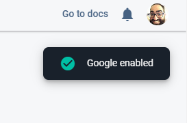

## Overview

In the last segment, we setup a database and reviewed all the code that interacts with it. This time, we'll setup authentication so we can lock down the security of the system and the database, and add a few user-centric capabilities like editing and deleting comments.

If you're just seeing this, you should start with the first article in the series instead: [Sample JavaScript Application Introduction](/2020-04/sample-javascript-application-introduction).

These instructions assume you're starting from the application we setup in the previous article: [Sample JavaScript Application Part 3 - The Database](/2020-04/sample-javascript-application-database). If you don't have that handy, you'll need to follow the instructions in the previous articles to get a project configured that points to your own Firebase project on Google Cloud.

<!--truncate-->

## Authentication and Authorization

Most non-trivial software services include authentication and authorization. While these two terms sound similar, they are actually quite different:

* **Authentication:** Who I am
* **Authorization:** What I can do

For example, I can log into my account in Google using my email address and password (Authentication), but it will only allow me to access the services and resources that I am allowed to see, such as my email, my online storage, and my contact list (Authorization). Similarly, students who use Google Classroom will Authenticate with their email address and password and are only Authorized to see the classrooms for the classes they are enrolled in. Furthermore, they can only perform those actions of a "student" and not a "teacher".

Sometimes Authentication requires a second factor (known as Two-Factor Authentication) where you combine something you know (a password) with something you have (a specific phone that can receive text messages). Your banks, social network accounts, and other important services will urge you to setup a second factor to better identify who you are, so that unauthorized people will be kept out of those accounts.

Google offers a solid Authentication solution that other services can use to log customers in. You may have seen a lot of places other than Google.com where you can log in using your Google account. When this happens, the websites establish a way to trust Google, then redirect the customer to log into Google's site with a specific "reply URL" which tells Google where to call back once the login is complete. When it calls back, a special bit of code is added that the service can then use to identify the user.


Software services can create their own Authentication solution, or they can leverage the big ones that are available: Microsoft, Google, Facebook (to name a few). It is rarely useful to setup your own authentication solution because it ends up being one more account that your users have to remember the password for and you have to be extra careful with how you store those passwords. If you want to see the dangers of improperly storing passwords or personal information, look no further than here: [Have I Been Pwned](https://haveibeenpwned.com/).

## Setting Up Google Authentication

Just like with the Cloud Firestore database, we add Authentication to our Firebase application using the Firebase Console: https://console.firebase.google.com/. Click on your application, then find the "Authentication" option on the menu.


You'll see this screen:


Click "Set up sign-in method".


Click "Google".


Set a "public-facing name" for the project, this will show up when you try and authenticate.

Choose your "Project support email" from the dropdown (it will be your email address).

The rest of the settings you won't need to change.

Click "Save".



SUCCESS!

Scroll down and look for "Authorized Domains":


These are the websites that will use your Google Authentication and that Google trusts with sending the information back. You'll see three items here:

* `localhost`: this is used for local testing, you'll remember accessing your web application using `localhost` whenever you launch your site using `firebase serve`.
* `sample-map-application-ac028.firebaseapp.com`: After using `firebase deploy`, you app will show up here (and one more place)
* `sample-map-application-ac028.web.app`: After using `firebase deploy`, you app will show up here (and one more place)

These settings are defined automatically. If you added your own custom domain name, you would add it here.

## Adding Authentication to the Application

For convenience, I've updated the code in GitHub so you can copy it back down. Similar to the last article, you can access the code from here: https://github.com/garoyeri/sample-javascript-map-app/tree/tutorial/part-4, then click "Clone or download", then "Download ZIP" to get a copy of the code. Unzip this into its own folder, then change the `.firebaserc` file to match your project name in Firebase Console.

This time, we don't need to mess with `firebase init` or setup anything else in the application, we'll just add the necessary libraries and start using the authentication. In general, you can read about how Firebase Authentication for websites works here: https://firebase.google.com/docs/auth/web/start. I'll talk through the simple parts and what code changes were made to support it.

At this point, go ahead and deploy the application to your account:

```shell
firebase deploy
```

This will apply the rules to your application and make the example work correctly. You can access your application from the URL that is displayed after you deploy it.

### Script Includes

Once again, at the top of `index.html`, we need to update the script includes for the page:

```javascript
<!-- update the version number as needed -->
<script defer src="/__/firebase/7.14.3/firebase-app.js"></script>
<script defer src="/__/firebase/7.14.3/firebase-firestore.js"></script>
<script defer src="/__/firebase/7.14.3/firebase-auth.js"></script>
<!-- initialize the SDK after all desired features are loaded -->
<script defer src="/__/firebase/init.js"></script>
```

You'll notice that, yet again, we've updated the version of the Firebase scripts. This time, it's a patch version increment. Between 7.14.2 and 7.14.3, there is one bugfix:


We're not using the`onSnapshot()` listeners, so this doesn't affect us, but a patch update is usually low-risk, so we'll go ahead and do it.

What we've added is the link to `firebase-auth.js` which allows us to use the Firebase authentication scripts.

### Styles and Body

I had to make some tweaks to the body content and the styles due to some weird behavior that was driving me slowly insane. The new body content looks like this:

```html
<div class="mapcontainer">
    <div id="controls">
        <label for="search">Search:</label>
        <input type="text" id="search" />
        <button onclick="searchMap()">Search</button>
        <button onclick="showComments()">Find All Comments</button>
        <button id="signInButton" onclick="signIn()">Sign In</button>
        <button id="signOutButton" onclick="signOut()">Sign Out</button>
        <span id="userEmail"></span>
    </div>
    <div id="map"></div>
</div>
```

We've removed the `<form>` tag that used to be there and added an identifier to the `<div>` that's in the map container. This allows us to apply the same margins that we had before, without hitting the weird behavior that happened with the `<form>` tag. I noticed that, at times, the markers would not appear on the map at the correct time, and sometimes they would appear then disappear. What I realized was that this was due to the strange behavior of the `<form>` that was being submitted at inopportune times and reloading the page. To resolve this, we've removed the `<form>` and just added the `onclick` event to the button itself to search the map. This means that you can't press ENTER after typing in the search box to search, but that's a small price to pay for what's left of my mental state.

Two shiny new buttons were added: Sign In and Sign Out. When you're signed out, you'll see:


And when you're signed in, you'll see:


The styles will hide the Sign Out button by default and show the Sign In button. These styles are a little counter-intuitive:

```css
#signInButton {
    display: inline;
}

#signOutButton {
    display: none;
}
```

Your gut reaction would be to use the `visible` style to show and hide, but that has a funny effect: when it hides (i.e. set `visibility` to `hidden`), it will not collapse the other elements around it, it will hide it in place and keep the spacing (try it out and see).

Instead, we use the `display` style which can be set to [multiple values](https://developer.mozilla.org/en-US/docs/Web/CSS/display), but in this app we'll only use:

* `inline`: show the item inline with the elements around it (instead of putting the element on its own line: `block`)
* `none`: don't show the item, act as if the item does not exist, don't buy it a gift on its birthday

Finally, there's a short `<span>` tag now with suspiciously no content in it ... yet. You'll notice that there is an `id` attribute on it, which we can use to manipulate its content at runtime, more on that later.

### Initialization Section

Let's look at the initialization section (the one surrounded by all the fire 🔥🔥🔥). We want to use this space to initialize the authentication code so we can use it everywhere else. 

```javascript
try {
    let app = firebase.app();

    // listen for changes to the signed in state of the user
    firebase.auth().onAuthStateChanged(onAuthStateChanged);

    // create a new Google authentication provider
    provider = new firebase.auth.GoogleAuthProvider();

    showComments();
} catch (e) {
    console.error(e);
}
```

We've added two new lines, the first one will listen for changes to the authentication state of the page. We pass a function in that will be called when a user is signed in or signed out, regardless of where on the page the action happens.

The second new line will setup the `GoogleAuthProvider` which tells Firebase that we will just be using Google to authenticate. You'll notice (hopefully) that there's no `var`, `let` or `const` in front of `provider`. This is on purpose. To keep all the authentication code together, the declaration of the variable is much further down. This doesn't cause an error because variables in JavaScript are moved to the top of the scope in which they are declared (this is called [hoisting](https://developer.mozilla.org/en-US/docs/Glossary/Hoisting)). This is the way reason that you can create function's in the code after where you call them, and JavaScript will "do the right thing". The function definition will be moved to the top of the scope so that everyone can call it.

Scroll down to the bottom of the `index.html` and you'll see where the provider is setup:

```javascript
let provider;
```

This will declare the variable, but set it to `undefined`, which is OK because we'll initialize it after the web page is loaded.

### Sign In and Sign Out

These two functions will force the user to sign in and sign out of the application.

```javascript
/**
 * Sign in using your Google account (if not already signed in)
 */
function signIn() {
    // sign in using a redirect (instead of a popup)
    firebase.auth().signInWithRedirect(provider);
}

/**
 * Sign out of your account (if signed in)
 */
function signOut() {
    return firebase
        .auth()
        .signOut()
        .then(() => alert("Signed Out!"));
}
```

The `signIn()` function uses the [Firebase Auth](https://firebase.google.com/docs/reference/js/firebase.auth.Auth) object and calls `signInWithRedirect()`. We pass the provider into the function call to tell it which provider to use (in this case, Google authentication). Recall when you were looking at the setup of the authentication system, there were about 10 different choices of how to authenticate. If you chose a different path there (or multiple paths), then you can choose which login screen to show to the user by choosing the appropriate provider. If you don't have a provider configured in your Firebase Console, it will not work correctly when you try to call it.

There are two ways to sign in: with redirect, and with popup. For mobile devices, the redirect method is preferred: it will make the right hops and possibility open up an app on the mobile browser, then eventually redirect back to the right place where you started. The popup mode tends to cause issues if it gets blocked by an overzealous ad blocking tool.

It is important to note that the redirect function will be called, but its return value will not be seen most likely. This is because of the way the redirect works:

1. On the source page, the user clicks Sign In

2. The page calls `signInWithRedirect()`

3. The browser is redirecting to the Google Login screen:

   

4. The user logs in
5. The user is redirected back to the application page (here's the page reload!)

In this case, the sign-in happens outside your application, then the credentials are sent to your application. Any code that happens after the `signInWithRedirect()` will most likely not be run. This is why we added the listener for `onAuthStateChanged`. This way, when the page is loaded, the authentication state is updated and the callback is executed. In our case, it will update the controls at the top of the window to switch between the signed in and signed out states:

```javascript
/**
 * Listen for changes to the authentication state
 *  (i.e. when the page is redirected)
 * @param {Object} user - the user object when the authentication state
 *  is changed
 */
function onAuthStateChanged(user) {
    if (user) {
        // User is signed in
        document.getElementById("signInButton").style.display = "none";
        document.getElementById("signOutButton").style.display = "inline";
        document.getElementById("userEmail")
            .textContent = `${user.displayName} (${user.email})`;
    } else {
        // User is not signed in
        document.getElementById("signInButton").style.display = "inline";
        document.getElementById("signOutButton").style.display = "none";
        document.getElementById("userEmail").textContent = "";
    }
}
```

Think back to the discussion about the changes to the `<body>` content. We added the "Sign In" and "Sign Out" buttons with `id` attributes set so that we could easily locate them and manipulate them. In this case, we'll update their styles.

When you use `document.getElementById()`, you'll get the same basic JavaScript DOM object, but depending on the type of element, you'll get some extra properties too: [HTMLButtonElement](https://developer.mozilla.org/en-US/docs/Web/API/HTMLButtonElement). You can manipulate the styles of an element, or some of the attributes of the tag as well.

For the `"userEmail"` element, we use a different manipulation: `textContent`. This will change the contents of the element to the desired text. In this case, I wanted to show the name and email address of the logged in user when there is a user logged in.

## Editing and Deleting Comments

Recall our User Flows from Part 2, we want the logged in user to be able to edit and delete their own comments, but no others. First, let's show the code to see what it looks like, then we'll show how we enforce those rules in the database.

### Show Popup

The popup we show when the marker is clicked needed to change to show "Edit" and "Delete" buttons for comments that we own.

```javascript
/**
 * Show a location popup with the given location, title, comments, and marker
 *
 * @param {LatLng} location - the Leaflet LatLng for the target
 * @param {string} title - the title for the location box
 * @param {Array} comments - the list of comments to show
 * @param {string} [markerId] - the optional marker ID (if available)
 */
function showPopup(location, title, comments, markerId) {
    const user = firebase.auth().currentUser;
    comments = comments || [];
    comments = comments.map(
        (c) => `
<li>
${cleanText(c.message)}${" "}
${
        (user && c.userid === user.uid && `
<br />
<button onClick="editComment('${markerId}', '${c.id}')">Edit</button>
<button onClick="deleteComment('${markerId}', '${c.id}')">Delete</button>
`) || ""
}
</li>
`
    );

    // Create a new popup with a dynamically generated HTML component
    //  the `` string can stretch multiple lines of code and can be
    //  used with the ${} for substitutions
	/* (this code wasn't changed since last time) */
}
```

This code gets super messy and ugly because we're doing a lot of template manipulation. Recall that when we use the backtick (\`) strings, we can do multiline templates and use the `${}` for executing code inside those templates. This code takes that a bit further.

At the top of the function, you'll see this line:

```javascript
const user = firebase.auth().currentUser;
```

This is the incantation to get the current user information from Firebase Authentication. You can see more details about it here: [Firebase Auth Current User](https://firebase.google.com/docs/reference/js/firebase.auth.Auth#currentuser). This property might return a null (or false-y value) or the `User` object. We can do a check to see which it is with a simple `if` statement.

The first section here creates the list item `<li>` template:

```javascript
comments = comments.map(
    (c) => `
<li>
${cleanText(c.message)}${" "}
${
    (user && c.userid === user.uid && `
<br />
<button onClick="editComment('${markerId}', '${c.id}')">Edit</button>
<button onClick="deleteComment('${markerId}', '${c.id}')">Delete</button>
`) || ""
    }
</li>
`
);
```

There's a lot to unpack here and the line-spacing is not helping much. The first two lines are the same as last time, we want to take each comment object we get and convert it to a template string. The basic string we want at the end will look like this if the logged in user created the comment:

```html
<li>
	This is my comment message<br />
	<button onClick="editComment('ABCD', 'EFGH')">Edit</button>
    <button onClick="deleteComment('ABCD', 'EFGH')">Delete</button>
</li>
```

and like this if the logged in user did not create the comment:

```html
<li>
	This is my comment message
</li>
```

There's a juicy morsel in here too. When you're dealing with HTML, the browser tends to remove all the whitespace at the beginning and ends of lines to simplify parsing. This means that if you put a space at the end of the line, it won't render. To add an explicit space, we'll use this funny notation:

```javascript
${" "}
```

This will inject a space into the template.

To check if the comment belongs to us, we do this:

```javascript
(user && c.userid === user.uid && /* ... */
```

At a glance, this looks like an incomplete line, but you have to follow it all the way to the end to see what is happening. The line of code without all the template text looks like this:

```javascript
(user && c.userid === user.uid && `(template)` || "")
```

In JavaScript, the `&&` and `||` operators do some interesting things and don't necessarily return a `true` or `false` like in other languages. Instead, they return either the left side or the right side of the operator depending on what's going on. Also, keep in mind that the `&&` operators are processed before the `||` and that the similar operators are processed left to right. You can read this line of code as:

> If the user is not undefined, and the comment's `userid` is exactly equal to the user's `uid`, then return this template, otherwise, return an empty string.

As you work with JavaScript more often, you'll find yourself more comfortable with "weird" statements like this and embrace them. If you find it TOO weird, then add a little comment to help the next reader of your code (probably also you) to remember what the heck is going on here.

Also of note, the two new buttons in the template are calling the `editComment()` and `deleteComment()` functions and passing some parameters. When you're working with templates and trying to make them do interesting things with JavaScript, you must be careful that the template ends up generating valid JavaScript.

```html
<button onClick="editComment('${markerId}', '${c.id}')">Edit</button>
```

Notice the single-quotes around `${markerId}` and `${c.id}` in the text above. This is super important because both `markerId` and `c.id` will resolve as strings, and the values of those strings will be inserted into the code at runtime (it will not use the variables here). This means that you have to be sure the generated text looks like a JavaScript string. If you left off the single-quotes, it would generate a script error when it tries to run the code.

### Edit a Comment

After clicking the Edit button, the user will be asked to update the comment (showing them the existing one first), and a new comment will be sent to the database.

```javascript
/**
 * Edit the specified comment (prompt first)
 * @param {string} markerId - the marker whose comment to edit
 * @param {string} commentId - the comment ID to edit
 */
function editComment(markerId, commentId) {
    const db = firebase.firestore();

    // first get the comment to have the original text
    db.collection("markers")
        .doc(markerId)
        .collection("comments")
        .doc(commentId)
        .get()
        .then((comment) => {
        	// ask for a new comment (old comment as default text)
	        const newComment = prompt(
    	        "Edit Comment:",
        	    comment.data().message || ""
        	);
        	if (!newComment) return;

	        // use the document reference to chain an "update" command
    	    comment.ref
        	    .update({
            		message: newComment,
            		timestamp: new Date(),
	        	})
    	        .then(() => {
        	    	showPopupForMarker(markerId);
        		})
	            .catch((err) => {
    	        	console.log("Could not update comment", err);
        	    	alert("Could not edit comment for some reason");
        		});
    	});
}
```

This function looks similar to our other database related functions, except we need to make two requests happen:

1. Get the existing comment so we can show the current message to the user
2. Update the comment

The first half of the function (that finds the existing comment) is the same as we did before. It is a simple `get()` to find a single comment document from the database. Once we have that, we need to do perform a second operation on the same comment, so we use the `ref` property to get the document reference.

The `get()` function returns a Promise that resolves to a [Firebase DocumentSnapshot](https://firebase.google.com/docs/reference/js/firebase.firestore.DocumentSnapshot) which lets you access the data properties. It also has a nifty `ref` property ([link](https://firebase.google.com/docs/reference/js/firebase.firestore.DocumentSnapshot#ref)) that you can use to access the [Firebase DocumentReference](https://firebase.google.com/docs/reference/js/firebase.firestore.DocumentReference) that you used to get the document in the first place.

Once we have the DocumentReference, we can call `update()` to apply changes to the fields that we provide. Once the comment is updated, we redisplay the popup which will fetch the new comments from the database. Since we are refreshing the timestamp on this comment, it will pop to the top of the list. If you want to change this behavior, then you can avoid updating the timestamp for the comment and it will remain where it is in the position.

The important thing to remember about `update()` is that it will change the fields that you provide in the parameter to the function call. For example, if you document has these properties / values:

* one = 10
* two = 20
* three = 30

Then you call:

```javascript
update({
	one: 11,
	two: 22
})
```

The result will be:

* one = 11
* two = 22,
* three = 30

If you want to remove a property, you would do this:

```javascript
update({
	three: firebase.firestore.FieldValue.delete()
})
```

The result will be:

* one = 11
* two = 22

You can find a lot more examples of how to use the `update()` function here: [Firestore Adding Data : Update Data](https://cloud.google.com/firestore/docs/manage-data/add-data#update-data).

### Delete a Comment

Deleting a comment is more straightforward. We just need to find the comment and remove it from the database entirely.

```javascript
/**
 * Delete the specified comment (prompt first)
 * @param {string} markerId - the marker whose comment to delete
 * @param {string} commentId - the comment ID to delete
 */
function deleteComment(markerId, commentId) {
    const result = confirm("Delete this comment?");
    if (!result) return;

    const db = firebase.firestore();

    db.collection("markers")
        .doc(markerId)
        .collection("comments")
        .doc(commentId)
        .delete()
        .then(() => {
        	showPopupForMarker(markerId);
    	}).catch((err) => {
        	console.log("Could not delete comment", err);
        	alert("Could not delete comment for some reason");
    	});
}
```

To ask the user to confirm they want to delete a comment, we use the `confirm()` function: [Confirm](https://developer.mozilla.org/en-US/docs/Web/API/Window/confirm). This function will show a message, then result either a `true` if they click "OK" or a `false` if they click "Cancel". If the user clicks "Cancel", we just return from the function early and do nothing.

Once we are ready to delete, we find the appropriate DocumentReference for the comment in the usual way, then instead of calling `get()` or `update()`, we call `delete()`. After deleting the comment, we redisplay the popup which should now have removed that comment. Since we are pulling the five most recent comments, deleting a comment may show a hidden one from before.

## Securing the Database

Last time we looked at the sample application, we had a big caveat that the database is not configured securely, and that anyone in the world would be allowed to make changes to anything in the database at any time. Now that we have added authentication to the mix, we can configure our Cloud Firestore rules to secure the data and allow only those actions we want to allow, and block everything else.

Cloud Firestore uses the `firebase.rules` file to define the security rules of the database. Here's what the new file looks like:

```javascript
rules_version = '2';
service cloud.firestore {
  match /databases/{database}/documents {
    // only the markers collection is available
    match /markers/{document=**} {
      // allow anyone to read (logged in or not)
      allow read: if true
      // allow logged in users to create markers
      //  (but not edit or delete them)
      allow create: if request.auth.uid != null;
    }

    // extra rules for comments
    match /markers/{marker}/comments/{document=**} {
      // allow editing and deleting comments
      //  that are tagged with our own uid
      allow update, delete:
      	if request.auth.uid != null &&
           resource.data.userid == request.auth.uid;
    }
  }
}
```

Let's go rule by rule and see what the effect is. All rules files have the same outside part that defines it as a Cloud Firestore rules file:

```javascript
rules_version = '2';
service cloud.firestore {
  match /databases/{database}/documents {
	// rules go in here
  }
}
```

The first rule in the file allows everyone to read the markers and comments, and to create new markers or comments if they are logged in.

```javascript
match /markers/{document=**} {
    // allow anyone to read (logged in or not)
    allow read: if true
    // allow logged in users to create markers
    //  (but not edit or delete them)
    allow create: if request.auth.uid != null;
}
```

The `match` statement here applies to all the documents `{documents=**}` in the `markers` collection. 

Allow `read` operations all the time. The `if true` works the same as a `if (true) {}` in JavaScript and will always execute.

Allow `create` operations when the user is logged in. The `request` object represents the request coming from the user. The `request.auth` object represents the authentication parameters sent with the request. The `request.auth.uid` value is the unique identifier assigned to the user. If you want to see these identifiers, you can look at the Users panel in your Firebase Console: 


The "User UID" column here corresponds to the `request.auth.uid` value that is sent with the request. When the value of `request.auth.uid` is not `null`, then there is a valid signed in user sending the request. When it is `null`, then a user is not signed in at all.

The second set of rules applies the finer-grained security to the comments.

```javascript
// extra rules for comments
match /markers/{marker}/comments/{document=**} {
    // allow editing and deleting comments
    //  that are tagged with our own uid
    allow update, delete: if request.auth.uid != null &&
    	resource.data.userid == request.auth.uid;
}

```

This rule matches all the `comment` documents inside of any `marker` document. We want this rule to apply specifically to comments and not to anything else (so far).

We want to allow `update` and `delete`  operations when the user is signed in AND the user's identifier matches the `userid` property on the document being updated or deleted. Here, `resource` refers to the document being acted upon, `resource.data` refers to the properties of the document being acted upon, and `resource.data.userid` refers to the `userid` property on the document being acted upon. This means that we need to ensure that the `userid` property on the comments is set to the `uid` of the user who created it. To do this, we made a change to the `addCommentToMarker()` function:

```javascript
/**
 * Add a comment to an existing marker.
 *
 * @param {string} id - the marker ID to add a comment to
 * @param {string} comment - the comment to be added
 * @returns {Promise} - resolves when the comment is saved to the database
 */
function addCommentToMarker(id, comment) {
    const db = firebase.firestore();
    const user = firebase.auth().currentUser;
    if (!user) return;

    return db
        .collection("markers")
        .doc(id)
        .collection("comments")
        .add({
        	message: comment,
	        timestamp: new Date(),
        	// new code: associate the user with this comment
	        userid: user.uid,
    	});
}
```

Here we need to ensure that the user is logged in, so we check the `firebase.auth().currentUser` object to ensure it exists. Then, when we are creating the comment, we add a new property called `userid` that is set to the `user.uid`. This will ensure that the comment is added to the database with a link back to the user that created it.

If you had created other comments in your database from the previous application, those comments will be uneditable by any user. You can manually delete those comments from the database or manually set the `userid` property of each comment to your user ID.

## Wrapping it Up (and TIL)

This is the full example of a reasonably complete real-world web application. It isn't particularly pretty, but it is functional and reasonably secure. Think about how you could extend this application. For example, the marker names don't really propagate well from the Nominatim search results, and it would be interesting to allow renaming of markers. We never really addressed the "Superuser" or "Administrator" mode of the application, you can get a hint (a guide, actually) here: [Secure data access for users and groups](https://firebase.google.com/docs/firestore/solutions/role-based-access). Finally, if you're willing to put a credit card in somewhere, you can try the different [map providers](https://leafletjs.com/plugins.html#basemap-providers) in Leaflet or use the [Google Places API](https://developers.google.com/places/web-service/intro) to do searches and bring back more detailed location data (instead of Nominatim).

There's a LOT of intermediate to advanced JavaScript going on in this solution and we've just scratched the surface. Getting more comfortable with the JavaScript operators like `&&` and `||` and `?:` will make it easier for you to read code and try things out. You'll need to get extra confident with [Promises](https://developer.mozilla.org/en-US/docs/Web/JavaScript/Reference/Global_Objects/Promise) (you can tell I'm serious about this because I've linked to the MDN Promises site in almost every article in this series). Almost all modern JavaScript libraries deal with Promises in some way, and you need to get comfortable working with them. The same MDN site has a great overview of [Asynchronous JavaScript](https://developer.mozilla.org/en-US/docs/Learn/JavaScript/Asynchronous) and leads into Promises, Async/Await, Timers, and a lot of other things.

Finally, keep in mind that this sample application is just that, a sample, and it definitely isn't perfect. If you find a better, clearer, cleaner way to express your code, do it! (and tell me about it)!